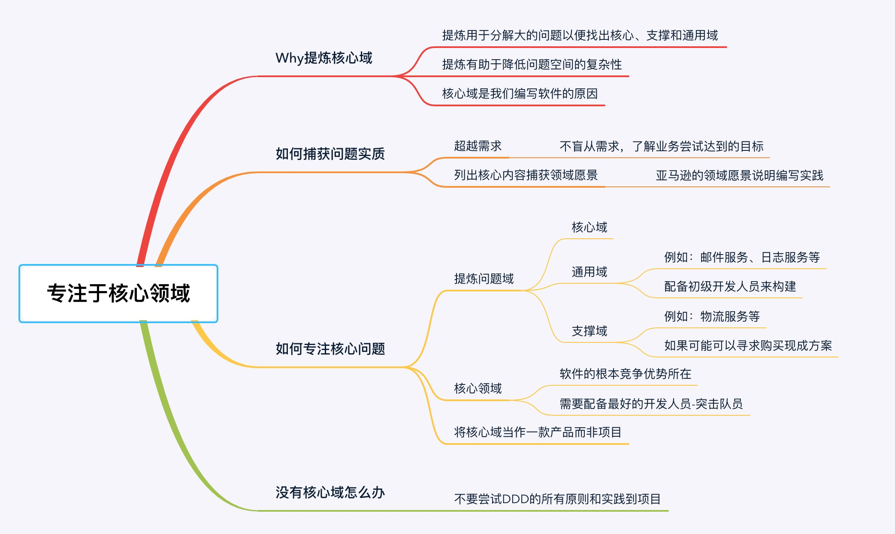

#领域驱动设计

## 一、什么是领域驱动设计

### 1.1 软件架构模式的演进

* 第一阶段是单机架构：采用面向过程的设计方法，系统包括客户端UI层和数据库两层，采用C/S架构模式，整个系统围绕数据库驱动设计和开发，并且总是从设计数据库和字段开始。
* 第二阶段是集中式架构：采用面向对象的设计方法，系统包括业务接入层、业务逻辑层和数据库层，采用经典的三层架构，也有部分应用采用传统的SOA架构。这种架构容易使系统变得臃肿，可扩展性和弹性伸缩性差。
* 第三阶段是分布式微服务架构：随着微服务架构理念的提出，集中式架构正向分布式微服务架构演进。微服务架构可以很好地实现应用之间的解耦，解决单体应用扩展性和弹性伸缩能力不足的问题。

### 1.2 DDD是个啥

* DDD是一种开发思想体系，**它是模式（战略模式、战术模式）、原则和实践的集合**，可以被应用到软件设计中以**管理复杂性**。
* DDD并非一种模式语言，它是专注于交付的一种协作思想体系，其中**通信起核心作用**，而要高效通信，就需要使用公共语言。

### 1.3 DDD的所有部分

 

### 1.4 DDD的侧重点

* 核心领域
* 协作
* 与领域专家探讨
* 实验研究以生成更有用的模型
* 对各种上下文的理解

### 1.5 DDD设计过程

* 下图展示了一个演进的领域驱动设计过程：

* 面对客户的业务需求，由领域专家与开发团队展开充分的交流，经过需求分析与知识提炼，以获得清晰的问题域。通过对问题域进行分析和建模，识别限界上下文，利用它划分相对独立的领域，再通过上下文映射建立它们之间的关系，辅以分层架构与六边形架构划分系统的逻辑边界与物理边界，界定领域与技术之间的界限。之后，进入战术设计阶段，深入到限界上下文内对领域进行建模，并以领域模型指导程序设计与编码实现。若在实现过程中，发现领域模型存在重复、错位或缺失时，再进而对已有模型进行重构，甚至重新划分限界上下文。

### 1.6 DDD适合谁

* 将DDD应用到重要的、复杂的场景中，对于哪些可以轻易替换的、简单的业务场景中，没必要使用DDD。给下面进行打分，如果>=7分，就要用DDD了。

| 如果你的项目                                                 | 得分 | 备注                                                         | 你的打分 |
| :----------------------------------------------------------- | :--- | :----------------------------------------------------------- | :------- |
| 如果你的项目太简单，只需要CRUD，那么你没有必要浪费金钱和时间使用DDD。 | 0    |                                                              |          |
| 当你的业务操作只有25-30个时，也就是你的用例流不超过30个时，你只需要快速开发出来，不需要使用DDD。 | 1    | 25-30个业务方法，而不是接口                                  |          |
| 你有30-40个业务操作或用例流的时候，你就需要考虑使用DDD了。   | 2    | 这时候你仍然可以不使用DDD，但随着迭代业务变得复杂，你可能会后悔的。 |          |
| 项目目前不复杂，但是之后会变得复杂，使用DDD吧。              | 3    | 当领域专家要加入复杂功能时有做2期、3期的想法                 |          |
| 接下来几年项目将不断变化，你预期不了会有哪些变化，你必须要用DDD了。 | 4    | 使用DDD管理复杂度，并不断重构。                              |          |
| 你不了解这个领域，你的团队中没人做过这个领域的开发工作，讨论复杂度，用DDD了。 | 5    | 和领域专家一起工作吧。                                       |          |

## 二、提炼问题域

### 2.1 领域

- 领域就是用来确定范围的，范围即边界，这也是DDD在设计中不断强调边界的原因。
- 在研究和解决业务问题时，DDD会按照一定的规则将业务领域进行细分，当领域细分到一定的程度后，DDD会将问题范围限定在特定的边界内，在这个边界内建立领域模型，进而用代码实现该领域模型，解决相应的业务问题。简言之，DDD的领域就是这个边界内要解决的业务问题域。
- 领域可以进一步划分为子领域。我们把划分出来的多个子领域称为子域，每个子域对应一个更小的问题域或更小的业务范围。

### 2.2 提炼问题域

* DDD的研究方法与自然科学的研究方法类似。当人们在自然科学研究中遇到复杂问题时，通常的做法就是将问题一步一步地细分，再针对细分出来的问题域，逐个深入研究，探索和建立所有子域的知识体系。当所有问题子域完成研究时，我们就建立了全部领域的完整知识体系了。

##三、专注于核心领域

### 3.1 子域的划分

- 一个大的领域可以通过细分的方法划分成不同的子域，如果直播领域划分为了房间、礼物、用户、大厅四个子域，礼物子域下面又有礼物墙、送礼等等更细分的子域。
- 根据子域重要性和功能属性的不同，我们可以将他们分类到三类子域：核心域、通用域和支撑域。
- 即使是同样的领域，不同的企业对于核心域的定义也是有可能不一样，结合公司战略重点和商业模式确定核心域。

> **核心域：决定产品和公司核心竞争力的子域是核心域，它是业务成功的主要因素和公司的核心竞争力。比如直播中的开关播和送礼。**
>
> **通用域：没有太多个性化的诉求，同时被多个子域使用的通用功能子域是通用域，比如直播中的用户、资源，我理解这一类这是最容易做成中台的。**
>
> **支撑域：既不包含决定产品和公司核心竞争力的功能，也不包含通用功能的子域，它就是支撑域，比如运营后台。**

拿一个在线拍卖网站来说，可以见下图所示划分了核心域、支撑域和通用域：

### 3.2 How Do

* 知识提炼是一个持续协作达成共识以创建有用模型的过程，而如何实践好这个过程，介绍了一些最佳实践：比如专注于最有意思的对话、从用例开始、提出有力的问题等等。

## 四、模型驱动设计和通用语言

### 4.1 模型驱动设计和通用语言

- **模型驱动设计**是将分析模型（业务模型）绑定到代码实现模型并确保这两个模型保持协同并可用的过程。

- **通用语言**定义上下文含义，限界上下文则定义领域边界，以确保每个上下文含义在它特定的边界内都具有唯一的含义，领域模型则存在于这个边界之内。

    > **在事件风暴过程中，通过团队交流达成共识的，能够简单、清晰、准确描述业务涵义和规则的语言就是通用语言。**

### 4.2 关系

- 模型驱动设计专注于实现以及对于初始模型可能需要修改的约束，领域驱动设计则专注于语言、协作和领域知识，他们是一个彼此互补的关系。而要实现协作，就需要使用通用语言，借助通用语言可以将分析模型和代码模型绑定在一起，并最终实现团队建模。实践UL是一个持续的过程，多个迭代后会不断对UL进行验证和改进，以便实现更好的协作。
- 由于时间和精力都有限，只有仅仅为核心域应用模型驱动设计和创建UL才能带来最大的价值，而不需要将这些实践应用到整个应用程序之中。

## 五、有界上下文

### 5.1 什么是有界上下文

- 通常情况下，尝试将单个模型用于复杂问题域通常会导致代码变成大泥球，而且会增加团队之间的协作成本并降低交付业务价值的效率。有界上下文就是划分和破除这种大模型的有效方式，一个有界上下文就是一个语言边界，它可以隔离模型以避免领域术语在不同上下文中的歧义。
- 而我们常常提到的微服务，更像是有界上下文的一种技术实现途径之一，有界上下文中具有较高的自主性，拥有从展现层、领域逻辑层再到持久化层的完整代码堆栈，正应对了我们的每一个微服务的应用程序，也具有较高的独立性，拥有自己的数据库和一套完成的垂直切片的架构模式

### 5.2 上下文映射

* 上下文映射用来捕获各个有界上下文之间的技术与组织关系，它最大的作用就是保持模型的完整性。在战略设计阶段，针对问题域，通过引入限界上下文和上下文映射可以对问题域进行合理的分解，识别出核心领域和子领域，并确定领域的边界以及他们之间的关系，从而维持模型的完整性。

## 六、领域模型实现模式

## 七、应用程序架构

* **DDD不需要特殊的架构，只要是能将技术问题与业务问题分离的架构即可**

## 八、团队开始应用DDD通常会遇到的问题

- DDD的战术模式虽然可以指导我们创建有效领域模型，但这并非DDD的真正价值所在。因为，DDD其实并非编码这么简单，与领域专家的协作以进行知识提炼，以及在通用语言中表述的问题域达成共识才是DDD的支柱。
- 在现实中，团队在应用DDD时通常会低估应用DDD的成本，应用DDD需要一个愿意学习该领域的聪明专注的团队，还需要领域专家的参与，没有他们，团队就无法揭示更深层的见解。

## 九、应用DDD的原则、实践与模式

