# Channel 介绍

_____

## 什么是CSP

* CSP 经常被认为是 Go 在并发编程上成功的关键因素。CSP 全称是 “Communicating Sequential Processes”，这也是 Tony Hoare 在 1978 年发表在 ACM 的一篇论文。论文里指出一门编程语言应该重视 input 和 output 的原语，尤其是并发编程的代码。[官方教材](http://www.usingcsp.com/cspbook.pdf)
___
* 在文章中，CSP 也是一门自定义的编程语言，作者定义了输入输出语句，用于 processes 间的通信（communicatiton）。processes 被认为是需要输入驱动，并且产生输出，供其他 processes 消费，processes 可以是进程、线程、甚至是代码块。输入命令是：!，用来向 processes 写入；输出是：?，用来从 processes 读出

#### 从代数的角度来说
* **Communication**：是一种特殊的Event，用二元组c.v表示，c是channel的名字，v是传递过来的message的值

* process P可以写入和读取channel的messge集合表示为：
  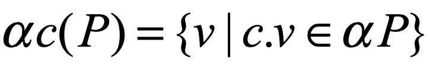

* P从c读取和写入分别定义为：

* output:

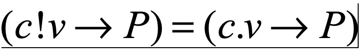

* input:
  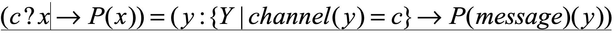

* Sequential Process：为了区分process是STOP(不再响应事件，有可能是死锁)还是terminate successfully，引入符号“√”，表示正常终结，而Sequential Process就是表示正常终结的process们。


* 你们眼里的并发模型，应该是指Communication和Sequential Process部分，它们只是CSP代数系统的special case, 或者说是具体特化场景

#### 从程序员的角度来说
[PPT](https://www.cs.kent.ac.uk/projects/ofa/jcsp/cpa2007-jcsp.pdf)

1. Go 是第一个将 CSP 的这些思想引入，并且发扬光大的语言。仅管内存同步访问控制（原文是 memory access synchronization）在某些情况下大有用处，Go 里也有相应的 sync 包支持，但是这在大型程序很容易出错。
* Go 一开始就把 CSP 的思想融入到语言的核心里，所以并发编程成为 Go 的一个独特的优势，而且很容易理解。
* 大多数的编程语言的并发编程模型是基于线程和内存同步访问控制，Go 的并发编程的模型则用 goroutine 和 channel 来替代。Goroutine 和线程类似，channel 和 mutex (用于内存同步访问控制)类似。
* Goroutine 解放了程序员，让我们更能贴近业务去思考问题。而不用考虑各种像线程库、线程开销、线程调度等等这些繁琐的底层问题，goroutine 天生替你解决好了。
* Channel 则天生就可以和其他 channel 组合。我们可以把收集各种子系统结果的 channel 输入到同一个 channel。Channel 还可以和 select, cancel, timeout 结合起来。而 mutex 就没有这些功能。
* Go 的并发原则非常优秀，目标就是简单：尽量使用 channel；把 goroutine 当作免费的资源，随便用。

## Go Channel
* go并发的核心是使用CSP的编程思想，使用Goroutine代替线程，channel和mutex用于内存访问控制。Channel 则天生就可以和其他 channel 组合。我们可以把收集各种子系统结果的 channel 输入到同一个 channel。Channel 还可以和 select, cancel, timeout 结合起来。 

### 什么是channel
* Goroutine 和 channel 是 Go 语言并发编程的 两大基石。Goroutine 用于执行并发任务，channel 用于 goroutine 之间的同步、通信。
```    
    chan T // 声明一个双向通道
    chan<- T // 声明一个只能用于发送的通道
    <-chan T // 声明一个只能用于接收的通道
```

* 复制代码单向通道的声明，用 <- 来表示，它指明通道的方向。你只要明白，代码的书写顺序是从左到右就马上能掌握通道的方向是怎样的。
* 因为 channel 是一个引用类型，所以在它被初始化之前，它的值是 nil，channel 使用 make 函数进行初始化。可以向它传递一个 int 值，代表 channel 缓冲区的大小（容量），构造出来的是一个缓冲型的 channel；不传或传 0 的，构造的就是一个非缓冲型的 channel。
* 两者有一些差别：非缓冲型 channel 无法缓冲元素，对它的操作一定顺序是“发送-> 接收 -> 发送 -> 接收 -> ……”，**如果连续向一个非缓冲 chan 发送 2 个元素，并且没有接收的话，第二次一定会被阻塞**；对于缓冲型 channel 的操作，则要“宽松”一些，毕竟是带了“缓冲”光环。  
  
### channel 实现原理 
* 对 chan 的发送和接收操作都会在*编译期间*转换成为底层的发送接收函数。
* Channel 分为两种：带缓冲、不带缓冲。对不带缓冲的 channel 进行的操作实际上可以看作“同步模式”，带缓冲的则称为“异步模式”。
* 同步模式下，发送方和接收方要同步就绪，只有在两者都 ready 的情况下，数据才能在两者间传输（后面会看到，实际上就是内存拷贝）。否则，任意一方先行进行发送或接收操作，都会被挂起，等待另一方的出现才能被唤醒。
* 异步模式下，在缓冲槽可用的情况下（有剩余容量），发送和接收操作都可以顺利进行。否则，操作的一方（如写入）同样会被挂起，直到出现相反操作（如接收）才会被唤醒。

#### chan数据结构

```go
type hchan struct {
	qcount   uint                  // chan 里元素数量
	dataqsiz uint                  // chan 底层循环数组的长度
	buf      unsafe.Pointer        // 只针对有缓冲的 channel         
	                               // 指向底层循环数组的指针
	elemsize uint16                // chan 中元素大小
	closed   uint32                // chan 是否被关闭的标志
	elemtype *_type                // element type  
	                               // chan 中元素类型
	sendx    uint                  // send index 
	                               // 已发送元素在循环数组中的索引
	recvx    uint                  // receive index
	                               // 已接收元素在循环数组中的索引
	recvq    waitq                 // list of recv waiters
	                               // 等待接收的 goroutine 队列
	sendq    waitq                 // list of send waiters
	                               // 等待发送的 goroutine 队列
	lock mutex                     // 保护 hchan 中所有字段
}

//waitq 是 sudog 的一个双向链表，而 sudog 实际上是对 goroutine 的一个封装
type waitq struct {
	first *sudog
	last  *sudog
}
```
* 例如，*创建一个容量为 6 的，元素为 int 型的 channel 数据结构如下 ：*
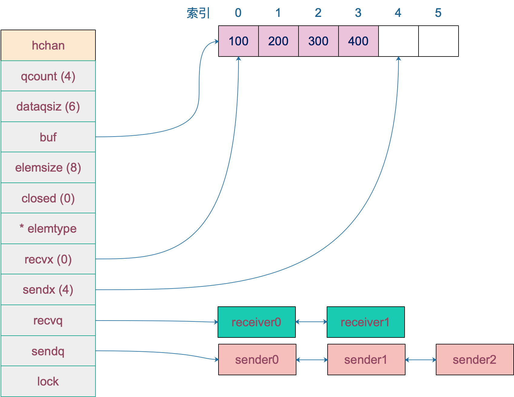


#### 初始化channel
##### 源码 位置src/runtime/chan.go

``` go
const (
	maxAlign  = 8
	hchanSize = unsafe.Sizeof(hchan{}) + uintptr(-int(unsafe.Sizeof(hchan{}))&(maxAlign-1))
	debugChan = false
)
const (
	maxAlloc = (1 << heapAddrBits) - (1-_64bit)*1
	// WebAssembly currently has a limit of 4GB linear memory.
	heapAddrBits = (_64bit*(1-sys.GoarchWasm)*(1-sys.GoosAix))*48 + (1-_64bit+sys.GoarchWasm)*(32-(sys.GoarchMips+sys.GoarchMipsle)) + 60*sys.GoosAix

)
func makechan(t *chantype, size int) *hchan {
	elem := t.elem

	// 计算chan中元素的大小，超过了65535就抛出异常
	if elem.size >= 1<<16 {
		throw("makechan: invalid channel element type")
	}
	// 检测chan是否进行了字节对齐 元素的对齐是否大于最大的对齐比例
	if hchanSize%maxAlign != 0 || elem.align > maxAlign {
		throw("makechan: bad alignment")
	}

	//检测申请的内存是否超过了限制
	//overflow := b > MaxUintptr/a  申请的大小，超过了系统对这次提供的最多的元素个数
	//计算的 a*b 的大小，超过了虚拟内存最大的-每个hchan的基础内存，也是超出了限制
	mem, overflow := math.MulUintptr(elem.size, uintptr(size))
	if overflow || mem > maxAlloc-hchanSize || size < 0 {
		panic(plainError("makechan: size out of range"))
	}
	//当数据存在缓冲区，且不包含指针时，不要GC
	var c *hchan
	switch {
	case mem == 0:
		//无缓冲获取元素的大小为0只申请hchan结构体大小
		c = (*hchan)(mallocgc(hchanSize, nil, true))
		// Race detector uses this location for synchronization.
		c.buf = c.raceaddr()
	//判断不是指针的话
	case elem.kind&kindNoPointers != 0:
		// 只分配 hchan结构体大小 + 需要的内存
		c = (*hchan)(mallocgc(hchanSize+mem, nil, true))
		c.buf = add(unsafe.Pointer(c), hchanSize)
	default:
		// 其它的情况，数据项为指针类型，hchan和buf分开分配内存，GC中指针类型判断reachable and unreadchable.
		c = new(hchan)
		c.buf = mallocgc(mem, elem, true)
	}

	c.elemsize = uint16(elem.size)
	c.elemtype = elem
	c.dataqsiz = uint(size)

	if debugChan {
		print("makechan: chan=", c, "; elemsize=", elem.size, "; elemalg=", elem.alg, "; dataqsiz=", size, "\n")
	}
	return c
}
```

##### 逻辑流程图
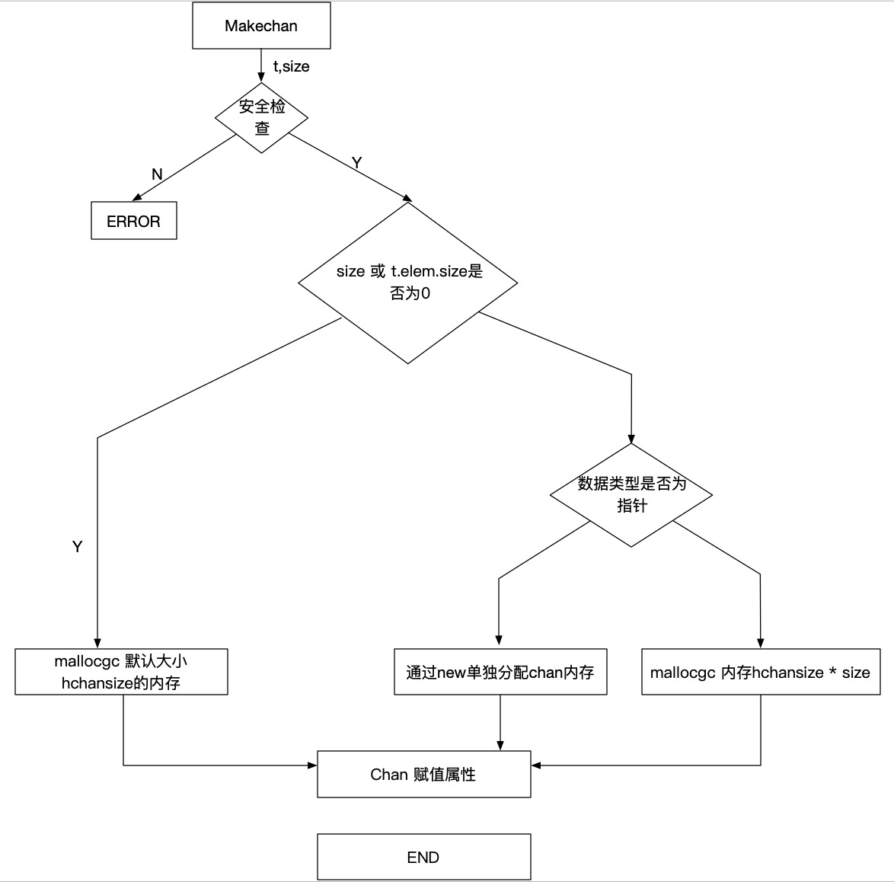


#### 接收数据
* 接收操作有两种写法，一种带 "ok"，反应 channel 是否关闭；一种不带 "ok"，这种写法，当接收到相应类型的零值时无法知道是真实的发送者发送过来的值，还是 channel 被关闭后，返回给接收者的默认类型的零值。两种写法，都有各自的应用场景。
##### 源码分析（经过编译器的处理后，两种写法会调用两个函数）

```go
// entry points for <- c from compiled code
//go:nosplit
func chanrecv1(c *hchan, elem unsafe.Pointer) {
	chanrecv(c, elem, true)
}

//go:nosplit
func chanrecv2(c *hchan, elem unsafe.Pointer) (received bool) {
	_, received = chanrecv(c, elem, true)
	return
}
```

##### 接收数据
``` go
// chanrecv 函数接收 channel c 的元素并将其写入 ep 所指向的内存地址。
// 如果 ep 是 nil，说明忽略了接收值。
// 如果 block == false，即非阻塞型接收，在没有数据可接收的情况下，返回 (false, false)
// 否则，如果 c 处于关闭状态，将 ep 指向的地址清零，返回 (true, false)
// 否则，用返回值填充 ep 指向的内存地址。返回 (true, true)
// 如果 ep 非空，则应该指向堆或者函数调用者的栈
func chanrecv(c *hchan, ep unsafe.Pointer, block bool) (selected, received bool) {
	if debugChan {
		print("chanrecv: chan=", c, "\n")
	}

	if c == nil {
		if !block {
			return
		}
		//将 goroutine挂起 //这个go会永远的挂起，消耗资源
		gopark(nil, nil, waitReasonChanReceiveNilChan, traceEvGoStop, 2)
		throw("unreachable")
	}

	//在非阻塞的情况下 
	//非缓冲型的chan并且发送队列没有等待发送的go
	//缓冲型chan，但是buf为0
	//并且chan并没有关闭的情况 返回FF
	if !block && (c.dataqsiz == 0 && c.sendq.first == nil ||
		c.dataqsiz > 0 && atomic.Loaduint(&c.qcount) == 0) &&
		atomic.Load(&c.closed) == 0 {
		return
	}

	var t0 int64
	if blockprofilerate > 0 {
		t0 = cputicks()
	}

	//大锁 粒度大
	lock(&c.lock)

	//如果chan关闭了，并且buf为0
	if c.closed != 0 && c.qcount == 0 {
		if raceenabled {
			raceacquire(c.raceaddr())
		}
		unlock(&c.lock)
		if ep != nil {
			// typedmemclr 根据类型清理相应地址的内存
			typedmemclr(c.elemtype, ep)
		}
		return true, false
	}

	//发送的队列里面存在goroutine
	//带buf的，buf满了    接收到循环数组头部的元素，并将发送者的元素放到循环数据的尾部
	//获取是非缓冲的chan   直接进行内存拷贝(s gor -> recv gor)
	if sg := c.sendq.dequeue(); sg != nil {
		recv(c, sg, ep, func() { unlock(&c.lock) }, 3)
		return true, true
	}

	//缓冲型， buf中有元素
	if c.qcount > 0 {
		// 从循环数组中拿元素
		qp := chanbuf(c, c.recvx)
		if raceenabled {
			raceacquire(qp)
			racerelease(qp)
		}
		if ep != nil {
			//清除内存地址
			typedmemmove(c.elemtype, ep, qp)
		}
		//清理循环数组里相应位置的值
		typedmemclr(c.elemtype, qp)
		//接收游标前移
		c.recvx++
		//如果接收到循环数组的尾部了 归零
		if c.recvx == c.dataqsiz {
			c.recvx = 0
		}
		//buf -1
		c.qcount--
		unlock(&c.lock)
		return true, true
	}
	//selected(非阻塞接收)返回false，因为没有接收到值
	if !block {
		unlock(&c.lock)
		return false, false
	}

	// 阻塞接收的情况
	// 构造一个 sudog 每一个发送和接收 都是维护了一个goroutine的列表
	// 列表的实现是sudog，是对g的一个封装
	gp := getg()
	mysg := acquireSudog()
	mysg.releasetime = 0
	if t0 != 0 {
		mysg.releasetime = -1
	}
	// 待接收数据的地址保存下来
	mysg.elem = ep
	mysg.waitlink = nil
	gp.waiting = mysg
	mysg.g = gp
	mysg.isSelect = false
	mysg.c = c
	gp.param = nil
	// 进入channel 的等待接收队列
	c.recvq.enqueue(mysg)
	// 将当前 goroutine 挂起
	goparkunlock(&c.lock, waitReasonChanReceive, traceEvGoBlockRecv, 3)

	// 被唤醒了，接着从这里继续执行一些扫尾工作
	if mysg != gp.waiting {
		throw("G waiting list is corrupted")
	}
	gp.waiting = nil
	if mysg.releasetime > 0 {
		blockevent(mysg.releasetime-t0, 2)
	}
	closed := gp.param == nil
	gp.param = nil
	mysg.c = nil
	releaseSudog(mysg)
	return true, !closed
}
```

##### 正常接收调用 recv 函数：
```go
func recv(c *hchan, sg *sudog, ep unsafe.Pointer, unlockf func(), skip int) {
	// 非缓冲chan
	if c.dataqsiz == 0 {
		if raceenabled {
			racesync(c, sg)
		}
		if ep != nil {
			// 直接拷贝数据，从 sender goroutine -> receiver goroutine
			// 直接从发送者的栈拷贝到接收者的栈
			recvDirect(c.elemtype, sg, ep)
		}
	} else {
		// 缓冲型的 channel，但 buf 已满。
		// 将循环数组 buf 队首的元素拷贝到接收数据的地址
		// 将发送者的数据入队。实际上这时 revx 和 sendx 值相等
		// 找到接收游标
		qp := chanbuf(c, c.recvx)
		if raceenabled {
			raceacquire(qp)
			racerelease(qp)
			raceacquireg(sg.g, qp)
			racereleaseg(sg.g, qp)
		}
		// // 将接收游标处的数据拷贝给接收者
		if ep != nil {
			typedmemmove(c.elemtype, ep, qp)
		}
		// // 将发送者数据拷贝到 buf
		typedmemmove(c.elemtype, qp, sg.elem)
		c.recvx++
		if c.recvx == c.dataqsiz {
			c.recvx = 0
		}
		c.sendx = c.recvx // c.sendx = (c.sendx+1) % c.dataqsiz
	}
	sg.elem = nil
	gp := sg.g
	unlockf()
	gp.param = unsafe.Pointer(sg)
	if sg.releasetime != 0 {
		sg.releasetime = cputicks()
	}
	// 唤醒发送的 goroutine。需要等到调度器的光临
	goready(gp, skip+1)
}
```
###### Demo
``` go
func goroutineA(a <-chan int) {
	val := <- a
	fmt.Println("G1 received data: ", val)
	return
}

func goroutineB(b <-chan int) {
	val := <- b
	fmt.Println("G2 received data: ", val)
	return
}

func main() {
	ch := make(chan int)
	go goroutineA(ch)
	go goroutineB(ch)
	ch <- 3
	time.Sleep(time.Second)
}
```

* 在执行到**ch <- 3**之前，recvq 的数据结构如下：


* 可以看到recvq 里挂了两个 goroutine，也就是前面启动的 G1 和 G2。因为没有 goroutine 接收，而 channel 又是无缓冲类型，所以 1 和 G2 被阻塞。

* G1 和 G2 被挂起了，状态是 `WAITING`，一个内核线程可以管理多个 goroutine，当其中一个 goroutine 阻塞时，内核线程可以调度其他的 goroutine 来运行，内核线程本身不会阻塞。这就是通常我们说的 `M:N` 模型，`M:N`模型通常由三部分构成：M、P、G。M 是内核线程，负责运行 goroutine；P 是 context，保存 goroutine 运行所需要的上下文，它还维护了可运行（runnable）的 goroutine 列表；G 则是待运行的 goroutine。M 和 P 是 G 运行的基础。

  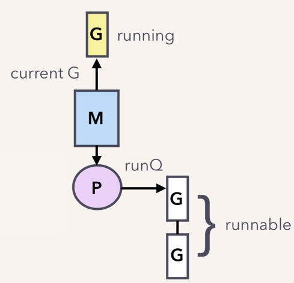
  
  ​		1. 假设我们只有一个 M，当 G1（`go goroutineA(ch)`） 运行到 `val := <- a` 时，它由本来的 running 状态变成了 waiting 状态（调用了 gopark 之后的结果）：

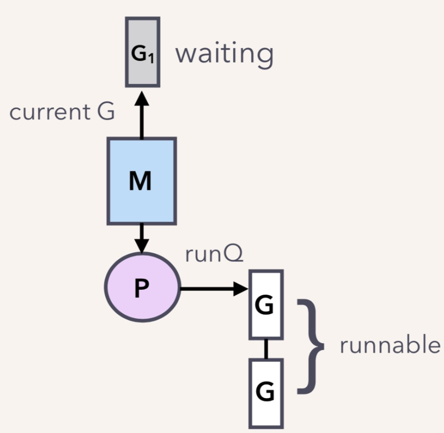

​			2. G1 脱离与 M 的关系，但调度器可不会让 M 闲着，所以会接着调度另一个 goroutine 来运行：

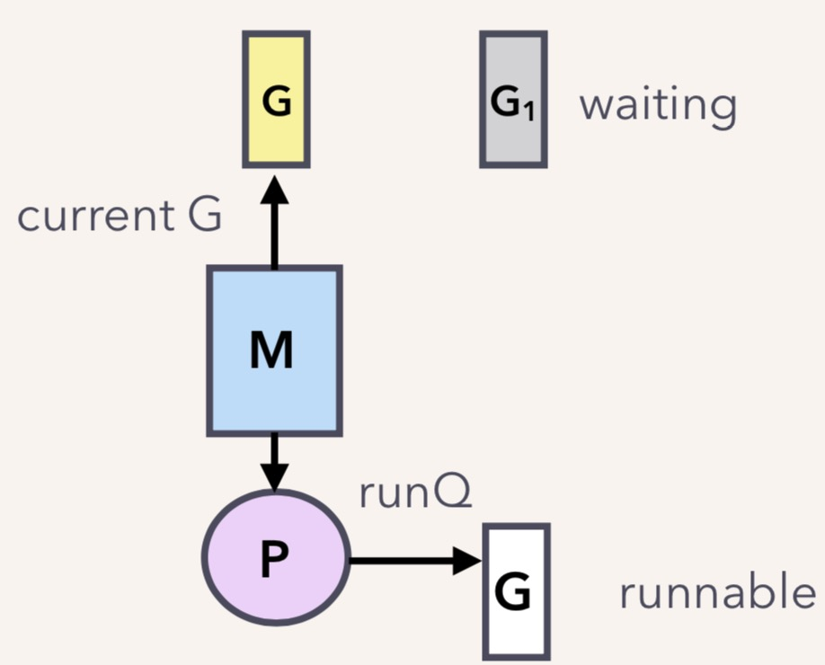

​			3. G2 也是同样的遭遇。现在 G1 和 G2 都被挂起了，等待着一个 sender 往 channel 里发送数据，才能得到解救。


#### 发送数据

##### 在发送一个数据后，会调用系统的**chansend**函数
###### 源码：(src/runtime/chan.go)
``` go
func chansend(c *hchan, ep unsafe.Pointer, block bool, callerpc uintptr) bool {
	if c == nil {
		// 非阻塞，直接返回F，未发送成功
		if !block {
			return false
		}
		//挂起当前go
		gopark(nil, nil, waitReasonChanSendNilChan, traceEvGoStop, 2)
		throw("unreachable")
	}
	//debug 日志
	if debugChan {
		print("chansend: chan=", c, "\n")
	}

	if raceenabled {
		racereadpc(c.raceaddr(), callerpc, funcPC(chansend))
	}

	// 非阻塞下
	// 如果 channel 未关闭且 channel 没有多余的缓冲空间。这可能是：
	// 1. channel 是非缓冲型的，且等待接收队列里没有 goroutine
	// 2. channel 是缓冲型的，但循环数组已经装满了元素
	// 直接返回F
	if !block && c.closed == 0 && ((c.dataqsiz == 0 && c.recvq.first == nil) ||
		(c.dataqsiz > 0 && c.qcount == c.dataqsiz)) {
		return false
	}

	var t0 int64
	if blockprofilerate > 0 {
		t0 = cputicks()
	}

	lock(&c.lock)

	// chan已经关闭，写数据panic
	if c.closed != 0 {
		unlock(&c.lock)
		panic(plainError("send on closed channel"))
	}

	// 接收的队列里面有go在等待，直接拷贝发送的数据到等待的go上面
	if sg := c.recvq.dequeue(); sg != nil {
		send(c, sg, ep, func() { unlock(&c.lock) }, 3)
		return true
	}

	// 如果缓冲型 buf没有满，
	if c.qcount < c.dataqsiz {
		// qp指向了buf发送的 sendx位置
		qp := chanbuf(c, c.sendx)
		if raceenabled {
			raceacquire(qp)
			racerelease(qp)
		}
		// 数据从ep 拷贝到qp上
		typedmemmove(c.elemtype, qp, ep)
		c.sendx++
		if c.sendx == c.dataqsiz {
			c.sendx = 0
		}
		c.qcount++
		unlock(&c.lock)
		return true
	}

	// 如果不需要阻塞，则直接返回
	if !block {
		unlock(&c.lock)
		return false
	}

	// channel 满了，发送方会被阻塞。接下来会构造一个 sudog
	// 获取当前 goroutine 的指针
	gp := getg()
	mysg := acquireSudog()
	mysg.releasetime = 0
	if t0 != 0 {
		mysg.releasetime = -1
	}
	// No stack splits between assigning elem and enqueuing mysg
	// on gp.waiting where copystack can find it.
	mysg.elem = ep
	mysg.waitlink = nil
	mysg.g = gp
	mysg.isSelect = false
	mysg.c = c
	gp.waiting = mysg
	gp.param = nil
	// 当前 goroutine 进入发送等待队列
	c.sendq.enqueue(mysg)
	// 当前 goroutine 被挂起
	goparkunlock(&c.lock, waitReasonChanSend, traceEvGoBlockSend, 3)
	// Ensure the value being sent is kept alive until the
	// receiver copies it out. The sudog has a pointer to the
	// stack object, but sudogs aren't considered as roots of the
	// stack tracer.
	KeepAlive(ep)

	// // 从这里开始被唤醒了（channel 有机会可以发送了）
	if mysg != gp.waiting {
		throw("G waiting list is corrupted")
	}
	gp.waiting = nil
	if gp.param == nil {
		if c.closed == 0 {
			throw("chansend: spurious wakeup")
		}
		// 被唤醒后，channel 关闭了 panic
		panic(plainError("send on closed channel"))
	}
	gp.param = nil
	if mysg.releasetime > 0 {
		blockevent(mysg.releasetime-t0, 2)
	}
	mysg.c = nil
	releaseSudog(mysg)
	return true
}
```

* 总结一下

  1. 如果检测到channel是空的，当前的goroutine会被挂起

  2. 对于非阻塞的发送，如果chan未关闭并且没有多余的 buf，可以快速的判断是否发送失败

  3. 对于阻塞的情况，如果chan关闭了，直接panic

  4. 如果接收等待的recvq有go在等待，直接取出来一个，进行语速的栈拷贝进行操作，调用send函数

###### send 函数
```go
// send 函数处理向一个空的 channel 发送操作
// ep 指向被发送的元素，会被直接拷贝到接收的goroutine之后，接收的goroutine会被唤醒
// c 必须是空的没有数据（因为等待队列里有goroutine，肯定是空的）
// c 必须被上锁，发送操作执行完后,会使用unlockf函数解锁
// sg 必须已经从等待队列里取出来了
// ep 必须是非空，并且它指向堆或调用者的栈
func send(c *hchan, sg *sudog, ep unsafe.Pointer, unlockf func(), skip int) {
	// race 相关的暂时不用
	if raceenabled {
		if c.dataqsiz == 0 {
			racesync(c, sg)
		} else {
			// Pretend we go through the buffer, even though
			// we copy directly. Note that we need to increment
			// the head/tail locations only when raceenabled.
			qp := chanbuf(c, c.recvx)
			raceacquire(qp)
			racerelease(qp)
			raceacquireg(sg.g, qp)
			racereleaseg(sg.g, qp)
			c.recvx++
			if c.recvx == c.dataqsiz {
				c.recvx = 0
			}
			c.sendx = c.recvx // c.sendx = (c.sendx+1) % c.dataqsiz
		}
	}
	// sg.elem指向接收到的值存放的位置，如val<-ch，指的就是&val
	if sg.elem != nil {
		sendDirect(c.elemtype, sg, ep)
		sg.elem = nil
	}
	gp := sg.g
	unlockf()
	gp.param = unsafe.Pointer(sg)
	if sg.releasetime != 0 {
		sg.releasetime = cputicks()
	}
	// 唤醒接收的goroutine,skip和打印栈相关暂时不理会
	goready(gp, skip+1)
}
```
###### sendDirect函数
```go
// 向一个非缓冲型的 channel 发送数据、从一个无元素的（非缓冲型或缓冲型但空）的 channel
// 接收数据，都会导致一个 goroutine 直接操作另一个 goroutine 的栈
// 由于 GC 假设对栈的写操作只能发生在 goroutine 正在运行中并且由当前 goroutine 来写
// 所以这里实际上违反了这个假设。可能会造成一些问题，所以需要用到写屏障来规避
func sendDirect(t *_type, sg *sudog, src unsafe.Pointer) {
	// src 在当前 goroutine 的栈上，dst 是另一个 goroutine 的栈
	// 直接进行内存"搬迁"
	// 如果目标地址的栈发生了栈收缩，当我们读出了 sg.elem 后
	// 就不能修改真正的 dst 位置的值了
	// 因此需要在读和写之前加上一个屏障
	dst := sg.elem
	typeBitsBulkBarrier(t, uintptr(dst), uintptr(src), t.size)
	// No need for cgo write barrier checks because dst is always
	// Go memory.
	memmove(dst, src, t.size)
}
```

* 总结：
  1. 调用send函数，涉及到一个go直接写另一个go栈的操作，一般而言，不通的go的栈是各自独有的。这种操作也违法了GC的一些假设，为了保证不出问题，增加了写屏障(*在目标的栈缩容时，找不到目标*)。好处是减少了一次内存copy，不用先拷贝到channel的buf，直接由发送者到接收者，提升效率。
  2. 继续后续流程，如果有缓冲区，且缓冲区没有满，直接通过函数取出待发送元素该去的位置，拷贝数据，返回
  3. 如果channel满了，将go挂起，具体是构造一个sudog，将其入队，调用**goparkunlock**挂起，等待合适的机会在唤醒。
  4. 唤醒之后会从**goparkunlock**下一行代码开始执行，通过一些绑定操作，sudog通过g绑定goroutine，goroutine通过waiting绑定sudog，sudog通过elem字段绑定待发送元素的地址，以及c字段绑定此处的channel。所以，待发送的元素地址其实是存储在sudog的结构体里，也就是当前的goroutine。    
____
* 在第17行执行ch <- 3，协程向ch发送了一个元素3。sender 发现 ch 的 recvq 里有 receiver 在等待着接收，就会出队一个 sudog，把 recvq 里 first 指针的 sudo “推举”出来了，并将其加入到 P 的可运行 goroutine 队列中。然后，sender 把发送元素拷贝到 sudog 的 elem 地址处，最后会调用 goready 将 G1 唤醒，状态变为 runnable。

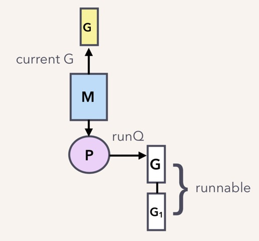

* 当调度器光顾 G1 时，将 G1 变成 running 状态，执行 goroutineA 接下来的代码。G 表示其他可能有的 goroutine。这里其实涉及到一个协程写另一个协程栈的操作。直接从源地址把数据 copy 到目的地址就可以了，效率高啊！

  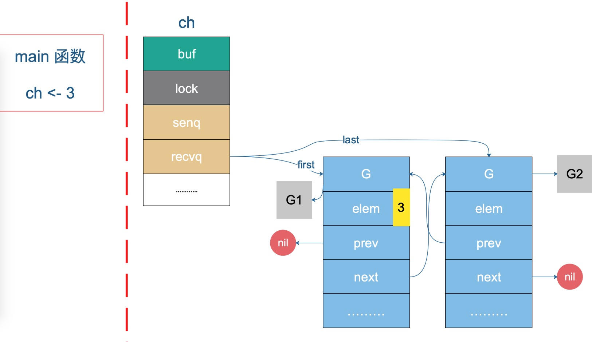

#### 关闭

##### 当关闭某个channel，会执行函数closechan

###### closechan源码
```go
func closechan(c *hchan) {
	// 如果chan为空，直接panic
	if c == nil {
		panic(plainError("close of nil channel"))
	}

	lock(&c.lock)
	if c.closed != 0 {
		// 如果 channel 已经关闭
		unlock(&c.lock)
		panic(plainError("close of closed channel"))
	}

	if raceenabled {
		callerpc := getcallerpc()
		racewritepc(c.raceaddr(), callerpc, funcPC(closechan))
		racerelease(c.raceaddr())
	}

	// 修改关闭状态
	c.closed = 1

	var glist gList

	// 将channel所有等待接收队列的里sudog释放
	for {
		// 从接收队列里出队一个 sudog
		sg := c.recvq.dequeue()
		// 完成跳出
		if sg == nil {
			break
		}
		// 如果elem不为空，说明此receiver未忽略接收数据 
		// 给它赋一个相应类型的零值
		if sg.elem != nil {
			typedmemclr(c.elemtype, sg.elem)
			sg.elem = nil
		}
		if sg.releasetime != 0 {
			sg.releasetime = cputicks()
		}
		// 取出 goroutine
		gp := sg.g
		gp.param = nil
		if raceenabled {
			raceacquireg(gp, c.raceaddr())
		}
		// push到go的队列里面
		glist.push(gp)
	}

	// 将channel等待发送队列里的sudog释放
	// 如果存在，这些goroutine将会panic
	for {
		sg := c.sendq.dequeue()
		if sg == nil {
			break
		}
		sg.elem = nil
		if sg.releasetime != 0 {
			sg.releasetime = cputicks()
		}
		gp := sg.g
		gp.param = nil
		if raceenabled {
			raceacquireg(gp, c.raceaddr())
		}
		glist.push(gp)
	}
	unlock(&c.lock)

	// Ready all Gs now that we've dropped the channel lock.
	for !glist.empty() {
		gp := glist.pop()
		gp.schedlink = 0
		goready(gp, 3)
	}
}
```
* close 逻辑比较简单，对于一个 channel，recvq 和 sendq 中分别保存了阻塞的发送者和接收者。关闭 channel 后，对于等待接收者而言，会收到一个相应类型的零值。对于等待发送者，会直接 panic。所以，在不了解 channel 还有没有接收者的情况下，不能贸然关闭 channel。

* 关闭chan会加一把大锁，将所有的sender和reciver都加的队列李阿敏，循环处理。

* 唤醒之后，该干嘛干嘛。sender 会继续执行 chansend 函数里 goparkunlock 函数之后的代码，很不幸，检测到 channel 已经关闭了，panic。receiver 则比较幸运，进行一些扫尾工作后，返回。

### channel的操作结果
* 总结一下操作 channel 的结果：

    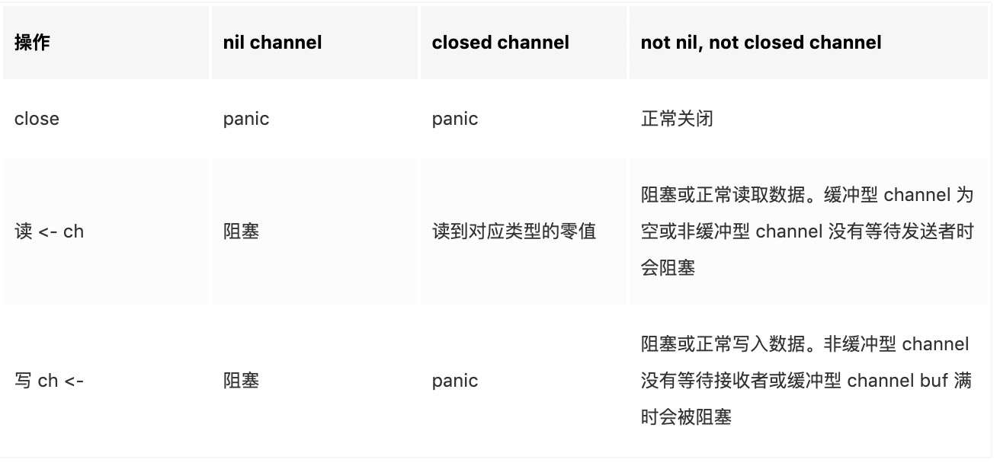

    **注意点：**

    1. 总结一下，发生 panic 的情况有三种：向一个关闭的 channel 进行写操作；关闭一个 nil 的 channel；重复关闭一个 channel。
    2. 读、写一个 nil channel 都会被阻塞。

##Channel进阶

### 发送和接收元素的本质

* Channel 发送和接收元素的本质是什么？就是说 channel 的发送和接收操作本质上都是 “值的拷贝”，无论是从 sender goroutine 的栈到 chan buf，还是从 chan buf 到 receiver goroutine，或者是直接从 sender goroutine 到 receiver goroutine。
#### Demo:
```go
type user struct {
	name string
	age int8
}

var u = user{name: "Ankur", age: 25}
var g = &u

func modifyUser(pu *user) {
	fmt.Println("modifyUser Received Vaule", pu)
	pu.name = "Anand"
}

func printUser(u <-chan *user) {
	time.Sleep(2 * time.Second)
	fmt.Println("printUser goRoutine called", <-u)
}

func main() {
	c := make(chan *user, 5)
	c <- g
	fmt.Println(g)
	// modify g
	g = &user{name: "Ankur Anand", age: 100}
	go printUser(c)
	go modifyUser(g)
	time.Sleep(5 * time.Second)
	fmt.Println(g)
}
```
#### 运行结果
```shell
&{Ankur 25}
modifyUser Received Vaule &{Ankur Anand 100}
printUser goRoutine called &{Ankur 25}
&{Anand 100}
```

* 这里就是一个很好的 `share memory by communicating` 的例子:

    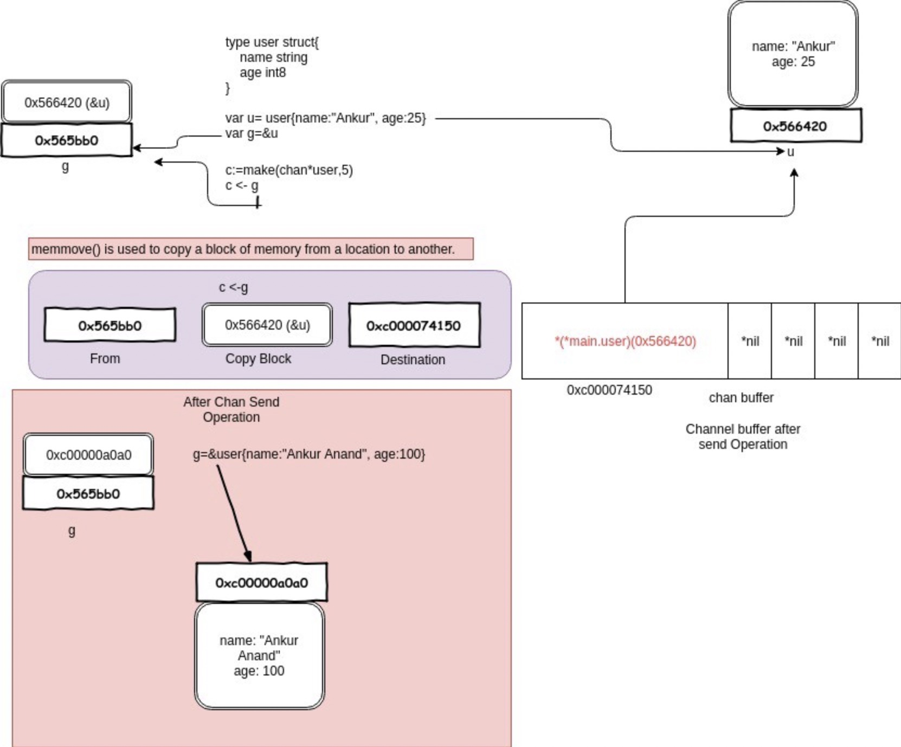

1. 一开始构造一个结构体 u，地址是 0x56420，图中地址上方就是它的内容。接着把 `&u`赋值给指针`g`，g 的地址是 0x565bb0，它的内容就是一个地址，指向 u。
2. main 程序里，先把 g 发送到 c，根据 `copy value`的本质，进入到 chan buf 里的就是 `0x56420`，它是指针 g 的值（不是它指向的内容），所以打印从 channel 接收到的元素时，它就是 `&{Ankur 25}`。因此，这里并不是将指针 g “发送” 到了 channel 里，只是拷贝它的值而已。

### 资源泄漏

Channel可能会引起goroutine泄漏

* 泄漏的原因是 goroutine 操作 channel 后，处于发送或接收阻塞状态，而 channel 处于满或空的状态，一直得不到改变。同时，垃圾回收器也不会回收此类资源，进而导致 gouroutine 会一直处于等待队列中，不见天日。

### happened before
* 简单来说就是如果事件 a 和事件 b 存在 happened-before 关系，即 a -> b，那么 a，b 完成后的结果一定要体现这种关系。由于现代编译器、CPU 会做各种优化，包括编译器重排、内存重排等等，在并发代码里，happened-before 限制就非常重要了。
* 关于 channel 的发送（send）、发送完成（send finished）、接收（receive）、接收完成（receive finished）的 happened-before 关系如下：
    1.第 n 个 send 一定 happened before 第 n 个 receive finished，无论是缓冲型还是非缓冲型的 channel。
    2.对于容量为 m 的缓冲型 channel，第 n 个 receive 一定 happened before 第 n+m 个 send finished。
    3..对于非缓冲型的 channel，第 n 个 receive 一定 happened before 第 n 个 send finished
    4.channel close 一定 happened before receiver 得到通知。 
#### 对上面逐条解释一下
    第一条，我们从源码的角度看也是对的，send 不一定是 happened before receive，因为有时候是先 receive，然后 goroutine 被挂起，之后被 sender 唤醒，send happened after receive。但不管怎样，要想完成接收，一定是要先有发送。
    第二条，缓冲型的 channel，当第 n+m 个 send 发生后，有下面两种情况：若第 n 个 receive 没发生。这时，channel 被填满了，send 就会被阻塞。那当第 n 个 receive 发生时，sender goroutine 会被唤醒，之后再继续发送过程。这样，第 n 个 receive 一定 happened before 第 n+m 个 send finished。若第 n 个 receive 已经发生过了，这直接就符合了要求。
    第三条，也是比较好理解的。第 n 个 send 如果被阻塞，sender goroutine 挂起，第 n 个 receive 这时到来，先于第 n 个 send finished。如果第 n 个 send 未被阻塞，说明第 n 个 receive 早就在那等着了，它不仅 happened before send finished，它还 happened before send。
    第四条，回忆一下源码，先设置完 closed = 1，再唤醒等待的 receiver，并将零值拷贝给 receiver。
######Demo

```go
var done = make(chan bool)
var msg string

func aGoroutine() {
	msg = "hello, world"
	done <- true
}

func main() {
	go aGoroutine()
	<-done
	println(msg)
}
```
    先定义了一个 done channel 和一个待打印的字符串。在 main 函数里，启动一个 goroutine，等待从 done 里接收到一个值后，执行打印 msg 的操作。如果 main 函数中没有 <-done 这行代码，打印出来的 msg 为空，因为 aGoroutine 来不及被调度，还来不及给 msg 赋值，主程序就会退出。而在 Go 语言里，主协程退出时不会等待其他协程。
    加了 <-done 这行代码后，就会阻塞在此。等 aGoroutine 里向 done 发送了一个值之后，才会被唤醒，继续执行打印 msg 的操作。而这在之前，msg 已经被赋值过了，所以会打印出 hello, world。
    这里依赖的 happened before 就是前面讲的第一条。第一个 send 一定 happened before 第一个 receive finished，即 done <- true 先于 <-done 发生，这意味着 main 函数里执行完 <-done 后接着执行 println(msg) 这一行代码时，msg 已经被赋过值了，所以会打印出想要的结果。
######又进一步利用前面提到的第 3 条 happened before 规则，修改了一下代码：

```go
var done = make(chan bool)
var msg string

func aGoroutine() {
	msg = "hello, world"
	<-done
}

func main() {
	go aGoroutine()
	done <- true
	println(msg)
}
```
    同样可以得到相同的结果，为什么？根据第三条规则，对于非缓冲型的 channel，第一个 receive 一定 happened before 第一个 send finished。也就是说，在 done <- true 完成之前，<-done 就已经发生了，也就意味着 msg 已经被赋上值了，最终也会打印出 hello, world。
###如何优雅地关闭 channel

* 关于 channel 的使用，有几点不方便的地方：
1. 在不改变 channel 自身状态的情况下，无法获知一个 channel 是否关闭。

2. 关闭一个 closed channel 会导致 panic。所以，如果关闭 channel 的一方在不知道 channel 是否处于关闭状态时就去贸然关闭 channel 是很危险的事情。

3. 向一个 closed channel 发送数据会导致 panic。所以，如果向 channel 发送数据的一方不知道 channel 是否处于关闭状态时就去贸然向 channel 发送数据是很危险的事情。

######检查 channel 是否关闭的函数：

```go
func IsClosed(ch <-chan T) bool {
	select {
	case <-ch:
		return true
	default:
	}

	return false
}

func main() {
	c := make(chan T)
	fmt.Println(IsClosed(c)) // false
	close(c)
	fmt.Println(IsClosed(c)) // true
}
```
    看一下代码，其实存在很多问题。首先，IsClosed 函数是一个有副作用的函数。每调用一次，都会读出 channel 里的一个元素，改变了 channel 的状态。这不是一个好的函数，干活就干活，还顺手牵羊！
    其次，IsClosed 函数返回的结果仅代表调用那个瞬间，并不能保证调用之后会不会有其他 goroutine 对它进行了一些操作，改变了它的这种状态。例如，IsClosed 函数返回 true，但这时有另一个 goroutine 关闭了 channel，而你还拿着这个过时的 “channel 未关闭”的信息，向其发送数据，就会导致 panic 的发生。当然，一个 channel 不会被重复关闭两次，如果 IsClosed 函数返回的结果是 true，说明 channel 是真的关闭了。
#####广为流传的关闭channel原则：

1. 不要从一个 receiver 侧关闭 channel，也不要在有多个 sender 时，关闭 channel。
        *比较好理解，向 channel 发送元素的就是 sender，因此 sender 可以决定何时不发送数据，并且关闭 channel。但是如果有多个 sender，某个 sender 同样没法确定其他 sender 的情况，这时也不能贸然关闭 channel。*
   
2. 不要向已经关闭的channel执行关闭操作和发送数据。

#####不优雅的关闭channel方法：

1. 使用 defer-recover 机制，放心大胆地关闭 channel 或者向 channel 发送数据。即使发生了 panic，有 defer-recover 在兜底。
2. 使用 sync.Once 来保证只关闭一次。
#####如何优雅的关闭channel
######根据 sender 和 receiver 的个数，分下面几种情况：
    一个 sender，一个 receiver
    一个 sender， M 个 receiver
    N 个 sender，一个 reciver
    N 个 sender， M 个 receiver
* 对于 1，2，只有一个 sender 的情况就不用说了，直接从 sender 端关闭就好了，没有问题。重点关注第 3，4 种情况。
* 第 3 种情形下，优雅关闭 channel 的方法是：the only receiver says "please stop sending more" by closing an additional signal channel。
######解决方案
* *增加一个传递关闭信号的 channel，receiver 通过信号 channel 下达关闭数据 channel 指令。senders 监听到关闭信号后，停止发送数据。*
```go
func main() {
	rand.Seed(time.Now().UnixNano())

	const Max = 100000
	const NumSenders = 1000

	dataCh := make(chan int, 100)
	stopCh := make(chan struct{})

	// senders
	for i := 0; i < NumSenders; i++ {
		go func() {
			for {
				select {
				case <- stopCh:
					return
				case dataCh <- rand.Intn(Max):
				}
			}
		}()
	}

	// the receiver
	go func() {
		for value := range dataCh {
			if value == Max-1 {
				fmt.Println("send stop signal to senders.")
				close(stopCh)
				return
			}

			fmt.Println(value)
		}
	}()

	select {
	case <- time.After(time.Hour):
	}
}
```
    这里的 stopCh 就是信号 channel，它本身只有一个 sender，因此可以直接关闭它。senders 收到了关闭信号后，select 分支 “case <- stopCh” 被选中，退出函数，不再发送数据。
    需要说明的是，上面的代码并没有明确关闭 dataCh。在 Go 语言中，对于一个 channel，如果最终没有任何 goroutine 引用它，不管 channel 有没有被关闭，最终都会被 gc 回收。所以，在这种情形下，所谓的优雅地关闭 channel 就是不关闭 channel，让 gc 代劳。

* 最后一种情况，优雅关闭 channel 的方法是：any one of them says "let's end the game" by notifying a moderator to close an additional signal channel。
######解决方案
* *和第 3 种情况不同，这里有 M 个 receiver，如果直接还是采取第 3 种解决方案，由 receiver 直接关闭 stopCh 的话，就会重复关闭一个 channel，导致 panic。因此需要增加一个中间人，M 个 receiver 都向它发送关闭 dataCh 的“请求”，中间人收到第一个请求后，就会直接下达关闭 dataCh 的指令（通过关闭 stopCh，这时就不会发生重复关闭的情况，因为 stopCh 的发送方只有中间人一个）。另外，这里的 N 个 sender 也可以向中间人发送关闭 dataCh 的请求。*
```go
func main() {
	rand.Seed(time.Now().UnixNano())
	const Max = 100000
	const NumReceivers = 10
	const NumSenders = 1000

	dataCh := make(chan int, 100)
	stopCh := make(chan struct{})

	// It must be a buffered channel.
	toStop := make(chan string, 1)

	var stoppedBy string

	// moderator
	go func() {
		stoppedBy = <-toStop
		close(stopCh)
	}()

	// senders
	for i := 0; i < NumSenders; i++ {
		go func(id string) {
			for {
				value := rand.Intn(Max)
				if value == 0 {
					select {
					case toStop <- "sender#" + id:
					default:
					}
					return
				}

				select {
				case <- stopCh:
					return
				case dataCh <- value:
				}
			}
		}(strconv.Itoa(i))
	}

	// receivers
	for i := 0; i < NumReceivers; i++ {
		go func(id string) {
			for {
				select {
				case <- stopCh:
					return
				case value := <-dataCh:
					if value == Max-1 {
						select {
						case toStop <- "receiver#" + id:
						default:
						}
						return
					}
					fmt.Println(value)
				}
			}
		}(strconv.Itoa(i))
	}
	select {
	case <- time.After(time.Hour):
	}
}
```
```go
代码里 toStop 就是中间人的角色，使用它来接收 senders 和 receivers 发送过来的关闭 dataCh 请求。
这里将 toStop 声明成了一个 缓冲型的 channel。假设 toStop 声明的是一个非缓冲型的 channel，那么第一个发送的关闭 dataCh 请求可能会丢失。因为无论是 sender 还是 receiver 都是通过 select 语句来发送请求，如果中间人所在的 goroutine 没有准备好，那 select 语句就不会选中，直接走 default 选项，什么也不做。这样，第一个关闭 dataCh 的请求就会丢失。
```

* *如果，我们把 toStop 的容量声明成 Num(senders) + Num(receivers)，那发送 dataCh 请求的部分可以改成更简洁的形式：*
```go
...
toStop := make(chan string, NumReceivers + NumSenders)
...
			value := rand.Intn(Max)
			if value == 0 {
				toStop <- "sender#" + id
				return
			}
...
				if value == Max-1 {
					toStop <- "receiver#" + id
					return
				}
...
```
    直接向 toStop 发送请求，因为 toStop 容量足够大，所以不用担心阻塞，自然也就不用 select 语句再加一个 default case 来避免阻塞。
    可以看到，这里同样没有真正关闭 dataCh，原样同第 3 种情况。
###关闭的 channel 仍能读出数据

* *从一个有缓冲的 channel 里读数据，当 channel 被关闭，依然能读出有效值。只有当返回的 ok 为 false 时，读出的数据才是无效的。*
#####demo:
```go
func main() {
	ch := make(chan int, 5)
	ch <- 18
	close(ch)
	x, ok := <-ch
	if ok {
		fmt.Println("received: ", x)
	}

	x, ok = <-ch
	if !ok {
		fmt.Println("channel closed, data invalid.")
	}
}
```
```shell
received:  18
channel closed, data invalid.
```
    先创建了一个有缓冲的 channel，向其发送一个元素，然后关闭此 channel。之后两次尝试从 channel 中读取数据，第一次仍然能正常读出值。第二次返回的 ok 为 false，说明 channel 已关闭，且通道里没有数据。
##Channel应用

* **Channel 和 goroutine 的结合是 Go 并发编程的大杀器。而 Channel 的实际应用也经常让人眼前一亮，通过与 select，cancel，timer 等结合，它能实现各种各样的功能。接下来，我们就要梳理一下 channel 的应用。**

### 停止信号

*  channel 用于停止信号的场景还是挺多的，经常是关闭某个 channel 或者向 channel 发送一个元素，使得接收 channel 的那一方获知道此信息，进而做一些其他的操作。

### 定时任务

* 与 timer 结合，一般有两种玩法：实现超时控制，实现定期执行某个任务。

* 有时候，需要执行某项操作，但又不想它耗费太长时间，上一个定时器就可以搞定：
```go
select {
	case <-time.After(100 * time.Millisecond):
	case <-s.stopc:
		return false
}
```
    等待 100 ms 后，如果 s.stopc 还没有读出数据或者被关闭，就直接结束。这是来自 etcd 源码里的一个例子，这样的写法随处可见。
```go
func worker() {
	ticker := time.Tick(1 * time.Second)
	for {
		select {
		case <- ticker:
			// 执行定时任务
			fmt.Println("执行 1s 定时任务")
		}
	}
```
    每隔 1 秒种，执行一次定时任务。
###解耦生产方和消费方

* *服务启动时，启动 n 个 worker，作为工作协程池，这些协程工作在一个 for {} 无限循环里，从某个 channel 消费工作任务并执行：*
```go
func main() {
	taskCh := make(chan int, 100)
	go worker(taskCh)

    // 塞任务
	for i := 0; i < 10; i++ {
		taskCh <- i
	}

    // 等待 1 小时 
	select {
	case <-time.After(time.Hour):
	}
}

func worker(taskCh <-chan int) {
	const N = 5
	// 启动 5 个工作协程
	for i := 0; i < N; i++ {
		go func(id int) {
			for {
				task := <- taskCh
				fmt.Printf("finish task: %d by worker %d\n", task, id)
				time.Sleep(time.Second)
			}
		}(i)
	}
}
```
    5 个工作协程在不断地从工作队列里取任务，生产方只管往 channel 发送任务即可，解耦生产方和消费方。
#####程序输出：

```shell
finish task: 1 by worker 4
finish task: 2 by worker 2
finish task: 4 by worker 3
finish task: 3 by worker 1
finish task: 0 by worker 0
finish task: 6 by worker 0
finish task: 8 by worker 3
finish task: 9 by worker 1
finish task: 7 by worker 4
finish task: 5 by worker 2
```
### 控制并发数

* *有时需要定时执行几百个任务，例如每天定时按城市来执行一些离线计算的任务。但是并发数又不能太高，因为任务执行过程依赖第三方的一些资源，对请求的速率有限制。这时就可以通过 channel 来控制并发数。*
```go
var limit = make(chan int, 3)

func main() {
    // …………
    for _, w := range work {
        go func() {
            limit <- 1
            w()
            <-limit
        }()
    }
    // …………
}
```
    构建一个缓冲型的 channel，容量为 3。接着遍历任务列表，每个任务启动一个 goroutine 去完成。真正执行任务，访问第三方的动作在 w() 中完成，在执行 w() 之前，先要从 limit 中拿“许可证”，拿到许可证之后，才能执行 w()，并且在执行完任务，要将“许可证”归还。这样就可以控制同时运行的 goroutine 数。
    还有一点要注意的是，如果 w() 发生 panic，那“许可证”可能就还不回去了，因此需要使用 defer 来保证。

## 参考资料

[深度解密Go语言之channel](https://juejin.im/post/5d350e70f265da1b897b0cbe)

