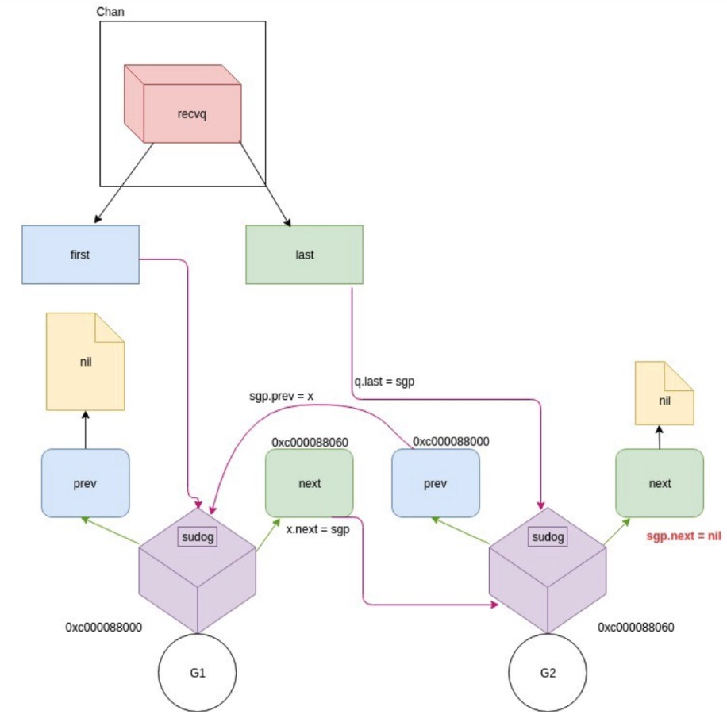

# Channel 介绍

_____

## 什么是CSP

* CSP 经常被认为是 Go 在并发编程上成功的关键因素。CSP 全称是 “Communicating Sequential Processes”，这也是 Tony Hoare 在 1978 年发表在 ACM 的一篇论文。论文里指出一门编程语言应该重视 input 和 output 的原语，尤其是并发编程的代码。[官方教材](http://www.usingcsp.com/cspbook.pdf)
___
* 在文章中，CSP 也是一门自定义的编程语言，作者定义了输入输出语句，用于 processes 间的通信（communicatiton）。processes 被认为是需要输入驱动，并且产生输出，供其他 processes 消费，processes 可以是进程、线程、甚至是代码块。输入命令是：!，用来向 processes 写入；输出是：?，用来从 processes 读出

#### 从代数的角度来说
* **Communication**：是一种特殊的Event，用二元组c.v表示，c是channel的名字，v是传递过来的message的值

* process P可以写入和读取channel的messge集合表示为：
  

* P从c读取和写入分别定义为：

* output:

  

* input:
  

* Sequential Process：为了区分process是STOP(不再响应事件，有可能是死锁)还是terminate successfully，引入符号“√”，表示正常终结，而Sequential Process就是表示正常终结的process们。


* 你们眼里的并发模型，应该是指Communication和Sequential Process部分，它们只是CSP代数系统的special case, 或者说是具体特化场景

#### 从程序员的角度来说
[PPT](https://www.cs.kent.ac.uk/projects/ofa/jcsp/cpa2007-jcsp.pdf)

1. Go 是第一个将 CSP 的这些思想引入，并且发扬光大的语言。仅管内存同步访问控制（原文是 memory access synchronization）在某些情况下大有用处，Go 里也有相应的 sync 包支持，但是这在大型程序很容易出错。
* Go 一开始就把 CSP 的思想融入到语言的核心里，所以并发编程成为 Go 的一个独特的优势，而且很容易理解。
* 大多数的编程语言的并发编程模型是基于线程和内存同步访问控制，Go 的并发编程的模型则用 goroutine 和 channel 来替代。Goroutine 和线程类似，channel 和 mutex (用于内存同步访问控制)类似。
* Goroutine 解放了程序员，让我们更能贴近业务去思考问题。而不用考虑各种像线程库、线程开销、线程调度等等这些繁琐的底层问题，goroutine 天生替你解决好了。
* Channel 则天生就可以和其他 channel 组合。我们可以把收集各种子系统结果的 channel 输入到同一个 channel。Channel 还可以和 select, cancel, timeout 结合起来。而 mutex 就没有这些功能。
* Go 的并发原则非常优秀，目标就是简单：尽量使用 channel；把 goroutine 当作免费的资源，随便用。

## Go Channel
* go并发的核心是使用CSP的编程思想，使用Goroutine代替线程，channel和mutex用于内存访问控制。Channel 则天生就可以和其他 channel 组合。我们可以把收集各种子系统结果的 channel 输入到同一个 channel。Channel 还可以和 select, cancel, timeout 结合起来。 

### 什么是channel
* Goroutine 和 channel 是 Go 语言并发编程的 两大基石。Goroutine 用于执行并发任务，channel 用于 goroutine 之间的同步、通信。
```    
    chan T // 声明一个双向通道
    chan<- T // 声明一个只能用于发送的通道
    <-chan T // 声明一个只能用于接收的通道
```

* 复制代码单向通道的声明，用 <- 来表示，它指明通道的方向。你只要明白，代码的书写顺序是从左到右就马上能掌握通道的方向是怎样的。
* 因为 channel 是一个引用类型，所以在它被初始化之前，它的值是 nil，channel 使用 make 函数进行初始化。可以向它传递一个 int 值，代表 channel 缓冲区的大小（容量），构造出来的是一个缓冲型的 channel；不传或传 0 的，构造的就是一个非缓冲型的 channel。
* 两者有一些差别：非缓冲型 channel 无法缓冲元素，对它的操作一定顺序是“发送-> 接收 -> 发送 -> 接收 -> ……”，**如果连续向一个非缓冲 chan 发送 2 个元素，并且没有接收的话，第二次一定会被阻塞**；对于缓冲型 channel 的操作，则要“宽松”一些，毕竟是带了“缓冲”光环。  
  
### channel 实现原理 
* 对 chan 的发送和接收操作都会在*编译期间*转换成为底层的发送接收函数。
* Channel 分为两种：带缓冲、不带缓冲。对不带缓冲的 channel 进行的操作实际上可以看作“同步模式”，带缓冲的则称为“异步模式”。
* 同步模式下，发送方和接收方要同步就绪，只有在两者都 ready 的情况下，数据才能在两者间传输（后面会看到，实际上就是内存拷贝）。否则，任意一方先行进行发送或接收操作，都会被挂起，等待另一方的出现才能被唤醒。
* 异步模式下，在缓冲槽可用的情况下（有剩余容量），发送和接收操作都可以顺利进行。否则，操作的一方（如写入）同样会被挂起，直到出现相反操作（如接收）才会被唤醒。

#### chan数据结构

```go
type hchan struct {
	qcount   uint                  // chan 里元素数量
	dataqsiz uint                  // chan 底层循环数组的长度
	buf      unsafe.Pointer        // 只针对有缓冲的 channel         
	                               // 指向底层循环数组的指针
	elemsize uint16                // chan 中元素大小
	closed   uint32                // chan 是否被关闭的标志
	elemtype *_type                // element type  
	                               // chan 中元素类型
	sendx    uint                  // send index 
	                               // 已发送元素在循环数组中的索引
	recvx    uint                  // receive index
	                               // 已接收元素在循环数组中的索引
	recvq    waitq                 // list of recv waiters
	                               // 等待接收的 goroutine 队列
	sendq    waitq                 // list of send waiters
	                               // 等待发送的 goroutine 队列
	lock mutex                     // 保护 hchan 中所有字段
}

//waitq 是 sudog 的一个双向链表，而 sudog 实际上是对 goroutine 的一个封装
type waitq struct {
	first *sudog
	last  *sudog
}
```
* 例如，*创建一个容量为 6 的，元素为 int 型的 channel 数据结构如下 ：*


#### 初始化channel
##### 源码 位置src/runtime/chan.go

``` go
const (
	maxAlign  = 8
	hchanSize = unsafe.Sizeof(hchan{}) + uintptr(-int(unsafe.Sizeof(hchan{}))&(maxAlign-1))
	debugChan = false
)
const (
	maxAlloc = (1 << heapAddrBits) - (1-_64bit)*1
	// WebAssembly currently has a limit of 4GB linear memory.
	heapAddrBits = (_64bit*(1-sys.GoarchWasm)*(1-sys.GoosAix))*48 + (1-_64bit+sys.GoarchWasm)*(32-(sys.GoarchMips+sys.GoarchMipsle)) + 60*sys.GoosAix

)
func makechan(t *chantype, size int) *hchan {
	elem := t.elem

	// 计算chan中元素的大小，超过了65535就抛出异常
	if elem.size >= 1<<16 {
		throw("makechan: invalid channel element type")
	}
	// 检测chan是否进行了字节对齐 元素的对齐是否大于最大的对齐比例
	if hchanSize%maxAlign != 0 || elem.align > maxAlign {
		throw("makechan: bad alignment")
	}

	//检测申请的内存是否超过了限制
	//overflow := b > MaxUintptr/a  申请的大小，超过了系统对这次提供的最多的元素个数
	//计算的 a*b 的大小，超过了虚拟内存最大的-每个hchan的基础内存，也是超出了限制
	mem, overflow := math.MulUintptr(elem.size, uintptr(size))
	if overflow || mem > maxAlloc-hchanSize || size < 0 {
		panic(plainError("makechan: size out of range"))
	}
	//当数据存在缓冲区，且不包含指针时，不要GC
	var c *hchan
	switch {
	case mem == 0:
		//无缓冲获取元素的大小为0只申请hchan结构体大小
		c = (*hchan)(mallocgc(hchanSize, nil, true))
		// Race detector uses this location for synchronization.
		c.buf = c.raceaddr()
	//判断不是指针的话
	case elem.kind&kindNoPointers != 0:
		// 只分配 hchan结构体大小 + 需要的内存
		c = (*hchan)(mallocgc(hchanSize+mem, nil, true))
		c.buf = add(unsafe.Pointer(c), hchanSize)
	default:
		// 其它的情况，数据项为指针类型，hchan和buf分开分配内存，GC中指针类型判断reachable and unreadchable.
		c = new(hchan)
		c.buf = mallocgc(mem, elem, true)
	}

	c.elemsize = uint16(elem.size)
	c.elemtype = elem
	c.dataqsiz = uint(size)

	if debugChan {
		print("makechan: chan=", c, "; elemsize=", elem.size, "; elemalg=", elem.alg, "; dataqsiz=", size, "\n")
	}
	return c
}
```

##### 逻辑流程图


#### 接收数据
* 接收操作有两种写法，一种带 "ok"，反应 channel 是否关闭；一种不带 "ok"，这种写法，当接收到相应类型的零值时无法知道是真实的发送者发送过来的值，还是 channel 被关闭后，返回给接收者的默认类型的零值。两种写法，都有各自的应用场景。
##### 源码分析（经过编译器的处理后，两种写法会调用两个函数）

```go
// entry points for <- c from compiled code
//go:nosplit
func chanrecv1(c *hchan, elem unsafe.Pointer) {
	chanrecv(c, elem, true)
}

//go:nosplit
func chanrecv2(c *hchan, elem unsafe.Pointer) (received bool) {
	_, received = chanrecv(c, elem, true)
	return
}
```

##### 接收数据
``` go
// chanrecv 函数接收 channel c 的元素并将其写入 ep 所指向的内存地址。
// 如果 ep 是 nil，说明忽略了接收值。
// 如果 block == false，即非阻塞型接收，在没有数据可接收的情况下，返回 (false, false)
// 否则，如果 c 处于关闭状态，将 ep 指向的地址清零，返回 (true, false)
// 否则，用返回值填充 ep 指向的内存地址。返回 (true, true)
// 如果 ep 非空，则应该指向堆或者函数调用者的栈
func chanrecv(c *hchan, ep unsafe.Pointer, block bool) (selected, received bool) {
	if debugChan {
		print("chanrecv: chan=", c, "\n")
	}

	if c == nil {
		if !block {
			return
		}
		//将 goroutine挂起 //这个go会永远的挂起，消耗资源
		gopark(nil, nil, waitReasonChanReceiveNilChan, traceEvGoStop, 2)
		throw("unreachable")
	}

	//在非阻塞的情况下 
	//非缓冲型的chan并且发送队列没有等待发送的go
	//缓冲型chan，但是buf为0
	//并且chan并没有关闭的情况 返回FF
	if !block && (c.dataqsiz == 0 && c.sendq.first == nil ||
		c.dataqsiz > 0 && atomic.Loaduint(&c.qcount) == 0) &&
		atomic.Load(&c.closed) == 0 {
		return
	}

	var t0 int64
	if blockprofilerate > 0 {
		t0 = cputicks()
	}

	//大锁 粒度大
	lock(&c.lock)

	//如果chan关闭了，并且buf为0
	if c.closed != 0 && c.qcount == 0 {
		if raceenabled {
			raceacquire(c.raceaddr())
		}
		unlock(&c.lock)
		if ep != nil {
			// typedmemclr 根据类型清理相应地址的内存
			typedmemclr(c.elemtype, ep)
		}
		return true, false
	}

	//发送的队列里面存在goroutine
	//带buf的，buf满了    接收到循环数组头部的元素，并将发送者的元素放到循环数据的尾部
	//获取是非缓冲的chan   直接进行内存拷贝(s gor -> recv gor)
	if sg := c.sendq.dequeue(); sg != nil {
		recv(c, sg, ep, func() { unlock(&c.lock) }, 3)
		return true, true
	}

	//缓冲型， buf中有元素
	if c.qcount > 0 {
		// 从循环数组中拿元素
		qp := chanbuf(c, c.recvx)
		if raceenabled {
			raceacquire(qp)
			racerelease(qp)
		}
		if ep != nil {
			//清除内存地址
			typedmemmove(c.elemtype, ep, qp)
		}
		//清理循环数组里相应位置的值
		typedmemclr(c.elemtype, qp)
		//接收游标前移
		c.recvx++
		//如果接收到循环数组的尾部了 归零
		if c.recvx == c.dataqsiz {
			c.recvx = 0
		}
		//buf -1
		c.qcount--
		unlock(&c.lock)
		return true, true
	}
	//selected(非阻塞接收)返回false，因为没有接收到值
	if !block {
		unlock(&c.lock)
		return false, false
	}

	// 阻塞接收的情况
	// 构造一个 sudog 每一个发送和接收 都是维护了一个goroutine的列表
	// 列表的实现是sudog，是对g的一个封装
	gp := getg()
	mysg := acquireSudog()
	mysg.releasetime = 0
	if t0 != 0 {
		mysg.releasetime = -1
	}
	// 待接收数据的地址保存下来
	mysg.elem = ep
	mysg.waitlink = nil
	gp.waiting = mysg
	mysg.g = gp
	mysg.isSelect = false
	mysg.c = c
	gp.param = nil
	// 进入channel 的等待接收队列
	c.recvq.enqueue(mysg)
	// 将当前 goroutine 挂起
	goparkunlock(&c.lock, waitReasonChanReceive, traceEvGoBlockRecv, 3)

	// 被唤醒了，接着从这里继续执行一些扫尾工作
	if mysg != gp.waiting {
		throw("G waiting list is corrupted")
	}
	gp.waiting = nil
	if mysg.releasetime > 0 {
		blockevent(mysg.releasetime-t0, 2)
	}
	closed := gp.param == nil
	gp.param = nil
	mysg.c = nil
	releaseSudog(mysg)
	return true, !closed
}
```

##### 正常接收调用 recv 函数：
```go
func recv(c *hchan, sg *sudog, ep unsafe.Pointer, unlockf func(), skip int) {
	// 非缓冲chan
	if c.dataqsiz == 0 {
		if raceenabled {
			racesync(c, sg)
		}
		if ep != nil {
			// 直接拷贝数据，从 sender goroutine -> receiver goroutine
			// 直接从发送者的栈拷贝到接收者的栈
			recvDirect(c.elemtype, sg, ep)
		}
	} else {
		// 缓冲型的 channel，但 buf 已满。
		// 将循环数组 buf 队首的元素拷贝到接收数据的地址
		// 将发送者的数据入队。实际上这时 revx 和 sendx 值相等
		// 找到接收游标
		qp := chanbuf(c, c.recvx)
		if raceenabled {
			raceacquire(qp)
			racerelease(qp)
			raceacquireg(sg.g, qp)
			racereleaseg(sg.g, qp)
		}
		// // 将接收游标处的数据拷贝给接收者
		if ep != nil {
			typedmemmove(c.elemtype, ep, qp)
		}
		// // 将发送者数据拷贝到 buf
		typedmemmove(c.elemtype, qp, sg.elem)
		c.recvx++
		if c.recvx == c.dataqsiz {
			c.recvx = 0
		}
		c.sendx = c.recvx // c.sendx = (c.sendx+1) % c.dataqsiz
	}
	sg.elem = nil
	gp := sg.g
	unlockf()
	gp.param = unsafe.Pointer(sg)
	if sg.releasetime != 0 {
		sg.releasetime = cputicks()
	}
	// 唤醒发送的 goroutine。需要等到调度器的光临
	goready(gp, skip+1)
}
```
###### Demo
``` go
func goroutineA(a <-chan int) {
	val := <- a
	fmt.Println("G1 received data: ", val)
	return
}

func goroutineB(b <-chan int) {
	val := <- b
	fmt.Println("G2 received data: ", val)
	return
}

func main() {
	ch := make(chan int)
	go goroutineA(ch)
	go goroutineB(ch)
	ch <- 3
	time.Sleep(time.Second)
}
```

* 在执行到**ch <- 3**之前，recvq 的数据结构如下：



* 可以看到recvq 里挂了两个 goroutine，也就是前面启动的 G1 和 G2。因为没有 goroutine 接收，而 channel 又是无缓冲类型，所以 1 和 G2 被阻塞。

* G1 和 G2 被挂起了，状态是 `WAITING`，一个内核线程可以管理多个 goroutine，当其中一个 goroutine 阻塞时，内核线程可以调度其他的 goroutine 来运行，内核线程本身不会阻塞。这就是通常我们说的 `M:N` 模型，`M:N`模型通常由三部分构成：M、P、G。M 是内核线程，负责运行 goroutine；P 是 context，保存 goroutine 运行所需要的上下文，它还维护了可运行（runnable）的 goroutine 列表；G 则是待运行的 goroutine。M 和 P 是 G 运行的基础。

  
  
  ​		1. 假设我们只有一个 M，当 G1（`go goroutineA(ch)`） 运行到 `val := <- a` 时，它由本来的 running 状态变成了 waiting 状态（调用了 gopark 之后的结果）：


​			2. G1 脱离与 M 的关系，但调度器可不会让 M 闲着，所以会接着调度另一个 goroutine 来运行：


​			3. G2 也是同样的遭遇。现在 G1 和 G2 都被挂起了，等待着一个 sender 往 channel 里发送数据，才能得到解救。


#### 发送数据

##### 在发送一个数据后，会调用系统的**chansend**函数
###### 源码：(src/runtime/chan.go)
``` go
func chansend(c *hchan, ep unsafe.Pointer, block bool, callerpc uintptr) bool {
	if c == nil {
		// 非阻塞，直接返回F，未发送成功
		if !block {
			return false
		}
		//挂起当前go
		gopark(nil, nil, waitReasonChanSendNilChan, traceEvGoStop, 2)
		throw("unreachable")
	}
	//debug 日志
	if debugChan {
		print("chansend: chan=", c, "\n")
	}

	if raceenabled {
		racereadpc(c.raceaddr(), callerpc, funcPC(chansend))
	}

	// 非阻塞下
	// 如果 channel 未关闭且 channel 没有多余的缓冲空间。这可能是：
	// 1. channel 是非缓冲型的，且等待接收队列里没有 goroutine
	// 2. channel 是缓冲型的，但循环数组已经装满了元素
	// 直接返回F
	if !block && c.closed == 0 && ((c.dataqsiz == 0 && c.recvq.first == nil) ||
		(c.dataqsiz > 0 && c.qcount == c.dataqsiz)) {
		return false
	}

	var t0 int64
	if blockprofilerate > 0 {
		t0 = cputicks()
	}

	lock(&c.lock)

	// chan已经关闭，写数据panic
	if c.closed != 0 {
		unlock(&c.lock)
		panic(plainError("send on closed channel"))
	}

	// 接收的队列里面有go在等待，直接拷贝发送的数据到等待的go上面
	if sg := c.recvq.dequeue(); sg != nil {
		send(c, sg, ep, func() { unlock(&c.lock) }, 3)
		return true
	}

	// 如果缓冲型 buf没有满，
	if c.qcount < c.dataqsiz {
		// qp指向了buf发送的 sendx位置
		qp := chanbuf(c, c.sendx)
		if raceenabled {
			raceacquire(qp)
			racerelease(qp)
		}
		// 数据从ep 拷贝到qp上
		typedmemmove(c.elemtype, qp, ep)
		c.sendx++
		if c.sendx == c.dataqsiz {
			c.sendx = 0
		}
		c.qcount++
		unlock(&c.lock)
		return true
	}

	// 如果不需要阻塞，则直接返回
	if !block {
		unlock(&c.lock)
		return false
	}

	// channel 满了，发送方会被阻塞。接下来会构造一个 sudog
	// 获取当前 goroutine 的指针
	gp := getg()
	mysg := acquireSudog()
	mysg.releasetime = 0
	if t0 != 0 {
		mysg.releasetime = -1
	}
	// No stack splits between assigning elem and enqueuing mysg
	// on gp.waiting where copystack can find it.
	mysg.elem = ep
	mysg.waitlink = nil
	mysg.g = gp
	mysg.isSelect = false
	mysg.c = c
	gp.waiting = mysg
	gp.param = nil
	// 当前 goroutine 进入发送等待队列
	c.sendq.enqueue(mysg)
	// 当前 goroutine 被挂起
	goparkunlock(&c.lock, waitReasonChanSend, traceEvGoBlockSend, 3)
	// Ensure the value being sent is kept alive until the
	// receiver copies it out. The sudog has a pointer to the
	// stack object, but sudogs aren't considered as roots of the
	// stack tracer.
	KeepAlive(ep)

	// // 从这里开始被唤醒了（channel 有机会可以发送了）
	if mysg != gp.waiting {
		throw("G waiting list is corrupted")
	}
	gp.waiting = nil
	if gp.param == nil {
		if c.closed == 0 {
			throw("chansend: spurious wakeup")
		}
		// 被唤醒后，channel 关闭了 panic
		panic(plainError("send on closed channel"))
	}
	gp.param = nil
	if mysg.releasetime > 0 {
		blockevent(mysg.releasetime-t0, 2)
	}
	mysg.c = nil
	releaseSudog(mysg)
	return true
}
```

* 总结一下

  1. 如果检测到channel是空的，当前的goroutine会被挂起

  2. 对于非阻塞的发送，如果chan未关闭并且没有多余的 buf，可以快速的判断是否发送失败

  3. 对于阻塞的情况，如果chan关闭了，直接panic

  4. 如果接收等待的recvq有go在等待，直接取出来一个，进行语速的栈拷贝进行操作，调用send函数

###### send 函数
```go
// send 函数处理向一个空的 channel 发送操作
// ep 指向被发送的元素，会被直接拷贝到接收的goroutine之后，接收的goroutine会被唤醒
// c 必须是空的没有数据（因为等待队列里有goroutine，肯定是空的）
// c 必须被上锁，发送操作执行完后,会使用unlockf函数解锁
// sg 必须已经从等待队列里取出来了
// ep 必须是非空，并且它指向堆或调用者的栈
func send(c *hchan, sg *sudog, ep unsafe.Pointer, unlockf func(), skip int) {
	// race 相关的暂时不用
	if raceenabled {
		if c.dataqsiz == 0 {
			racesync(c, sg)
		} else {
			// Pretend we go through the buffer, even though
			// we copy directly. Note that we need to increment
			// the head/tail locations only when raceenabled.
			qp := chanbuf(c, c.recvx)
			raceacquire(qp)
			racerelease(qp)
			raceacquireg(sg.g, qp)
			racereleaseg(sg.g, qp)
			c.recvx++
			if c.recvx == c.dataqsiz {
				c.recvx = 0
			}
			c.sendx = c.recvx // c.sendx = (c.sendx+1) % c.dataqsiz
		}
	}
	// sg.elem指向接收到的值存放的位置，如val<-ch，指的就是&val
	if sg.elem != nil {
		sendDirect(c.elemtype, sg, ep)
		sg.elem = nil
	}
	gp := sg.g
	unlockf()
	gp.param = unsafe.Pointer(sg)
	if sg.releasetime != 0 {
		sg.releasetime = cputicks()
	}
	// 唤醒接收的goroutine,skip和打印栈相关暂时不理会
	goready(gp, skip+1)
}
```
###### sendDirect函数
```go
// 向一个非缓冲型的 channel 发送数据、从一个无元素的（非缓冲型或缓冲型但空）的 channel
// 接收数据，都会导致一个 goroutine 直接操作另一个 goroutine 的栈
// 由于 GC 假设对栈的写操作只能发生在 goroutine 正在运行中并且由当前 goroutine 来写
// 所以这里实际上违反了这个假设。可能会造成一些问题，所以需要用到写屏障来规避
func sendDirect(t *_type, sg *sudog, src unsafe.Pointer) {
	// src 在当前 goroutine 的栈上，dst 是另一个 goroutine 的栈
	// 直接进行内存"搬迁"
	// 如果目标地址的栈发生了栈收缩，当我们读出了 sg.elem 后
	// 就不能修改真正的 dst 位置的值了
	// 因此需要在读和写之前加上一个屏障
	dst := sg.elem
	typeBitsBulkBarrier(t, uintptr(dst), uintptr(src), t.size)
	// No need for cgo write barrier checks because dst is always
	// Go memory.
	memmove(dst, src, t.size)
}
```

* 总结：
  1. 调用send函数，涉及到一个go直接写另一个go栈的操作，一般而言，不通的go的栈是各自独有的。这种操作也违法了GC的一些假设，为了保证不出问题，增加了写屏障(*在目标的栈缩容时，找不到目标*)。好处是减少了一次内存copy，不用先拷贝到channel的buf，直接由发送者到接收者，提升效率。
  2. 继续后续流程，如果有缓冲区，且缓冲区没有满，直接通过函数取出待发送元素该去的位置，拷贝数据，返回
  3. 如果channel满了，将go挂起，具体是构造一个sudog，将其入队，调用**goparkunlock**挂起，等待合适的机会在唤醒。
  4. 唤醒之后会从**goparkunlock**下一行代码开始执行，通过一些绑定操作，sudog通过g绑定goroutine，goroutine通过waiting绑定sudog，sudog通过elem字段绑定待发送元素的地址，以及c字段绑定此处的channel。所以，待发送的元素地址其实是存储在sudog的结构体里，也就是当前的goroutine。    
____
* 在第17行执行ch <- 3，协程向ch发送了一个元素3。sender 发现 ch 的 recvq 里有 receiver 在等待着接收，就会出队一个 sudog，把 recvq 里 first 指针的 sudo “推举”出来了，并将其加入到 P 的可运行 goroutine 队列中。然后，sender 把发送元素拷贝到 sudog 的 elem 地址处，最后会调用 goready 将 G1 唤醒，状态变为 runnable。


* 当调度器光顾 G1 时，将 G1 变成 running 状态，执行 goroutineA 接下来的代码。G 表示其他可能有的 goroutine。这里其实涉及到一个协程写另一个协程栈的操作。直接从源地址把数据 copy 到目的地址就可以了，效率高啊！

  

#### 关闭

##### 当关闭某个channel，会执行函数closechan

###### closechan源码
```go
func closechan(c *hchan) {
	// 如果chan为空，直接panic
	if c == nil {
		panic(plainError("close of nil channel"))
	}

	lock(&c.lock)
	if c.closed != 0 {
		// 如果 channel 已经关闭
		unlock(&c.lock)
		panic(plainError("close of closed channel"))
	}

	if raceenabled {
		callerpc := getcallerpc()
		racewritepc(c.raceaddr(), callerpc, funcPC(closechan))
		racerelease(c.raceaddr())
	}

	// 修改关闭状态
	c.closed = 1

	var glist gList

	// 将channel所有等待接收队列的里sudog释放
	for {
		// 从接收队列里出队一个 sudog
		sg := c.recvq.dequeue()
		// 完成跳出
		if sg == nil {
			break
		}
		// 如果elem不为空，说明此receiver未忽略接收数据 
		// 给它赋一个相应类型的零值
		if sg.elem != nil {
			typedmemclr(c.elemtype, sg.elem)
			sg.elem = nil
		}
		if sg.releasetime != 0 {
			sg.releasetime = cputicks()
		}
		// 取出 goroutine
		gp := sg.g
		gp.param = nil
		if raceenabled {
			raceacquireg(gp, c.raceaddr())
		}
		// push到go的队列里面
		glist.push(gp)
	}

	// 将channel等待发送队列里的sudog释放
	// 如果存在，这些goroutine将会panic
	for {
		sg := c.sendq.dequeue()
		if sg == nil {
			break
		}
		sg.elem = nil
		if sg.releasetime != 0 {
			sg.releasetime = cputicks()
		}
		gp := sg.g
		gp.param = nil
		if raceenabled {
			raceacquireg(gp, c.raceaddr())
		}
		glist.push(gp)
	}
	unlock(&c.lock)

	// Ready all Gs now that we've dropped the channel lock.
	for !glist.empty() {
		gp := glist.pop()
		gp.schedlink = 0
		goready(gp, 3)
	}
}
```
* close 逻辑比较简单，对于一个 channel，recvq 和 sendq 中分别保存了阻塞的发送者和接收者。关闭 channel 后，对于等待接收者而言，会收到一个相应类型的零值。对于等待发送者，会直接 panic。所以，在不了解 channel 还有没有接收者的情况下，不能贸然关闭 channel。

* 关闭chan会加一把大锁，将所有的sender和reciver都加的队列李阿敏，循环处理。

* 唤醒之后，该干嘛干嘛。sender 会继续执行 chansend 函数里 goparkunlock 函数之后的代码，很不幸，检测到 channel 已经关闭了，panic。receiver 则比较幸运，进行一些扫尾工作后，返回。

### channel的操作结果
* 总结一下操作 channel 的结果：

    

    **注意点：**

    1. 总结一下，发生 panic 的情况有三种：向一个关闭的 channel 进行写操作；关闭一个 nil 的 channel；重复关闭一个 channel。
    2. 读、写一个 nil channel 都会被阻塞。

##Channel进阶

### 发送和接收元素的本质

* Channel 发送和接收元素的本质是什么？就是说 channel 的发送和接收操作本质上都是 “值的拷贝”，无论是从 sender goroutine 的栈到 chan buf，还是从 chan buf 到 receiver goroutine，或者是直接从 sender goroutine 到 receiver goroutine。
#### Demo:
```go
type user struct {
	name string
	age int8
}

var u = user{name: "Ankur", age: 25}
var g = &u

func modifyUser(pu *user) {
	fmt.Println("modifyUser Received Vaule", pu)
	pu.name = "Anand"
}

func printUser(u <-chan *user) {
	time.Sleep(2 * time.Second)
	fmt.Println("printUser goRoutine called", <-u)
}

func main() {
	c := make(chan *user, 5)
	c <- g
	fmt.Println(g)
	// modify g
	g = &user{name: "Ankur Anand", age: 100}
	go printUser(c)
	go modifyUser(g)
	time.Sleep(5 * time.Second)
	fmt.Println(g)
}
```
#### 运行结果
```shell
&{Ankur 25}
modifyUser Received Vaule &{Ankur Anand 100}
printUser goRoutine called &{Ankur 25}
&{Anand 100}
```

* 这里就是一个很好的 `share memory by communicating` 的例子:

    

1. 一开始构造一个结构体 u，地址是 0x56420，图中地址上方就是它的内容。接着把 `&u`赋值给指针`g`，g 的地址是 0x565bb0，它的内容就是一个地址，指向 u。
2. main 程序里，先把 g 发送到 c，根据 `copy value`的本质，进入到 chan buf 里的就是 `0x56420`，它是指针 g 的值（不是它指向的内容），所以打印从 channel 接收到的元素时，它就是 `&{Ankur 25}`。因此，这里并不是将指针 g “发送” 到了 channel 里，只是拷贝它的值而已。
### 资源泄漏
