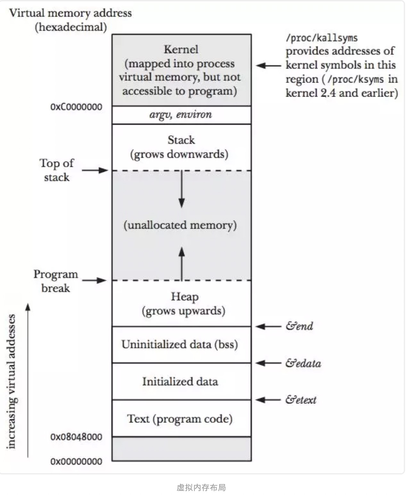
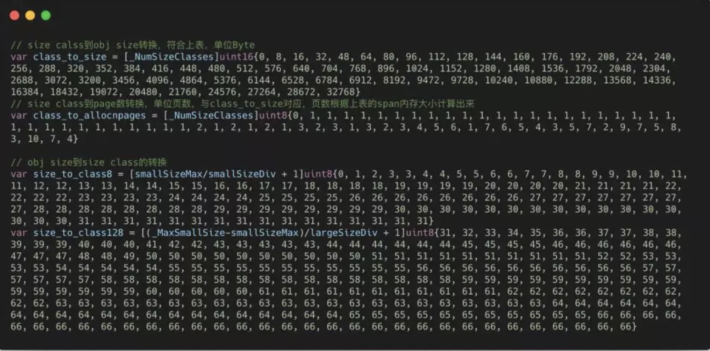

# Go内存分配

____


## 一、 基础知识回顾

### 1.1. 储存金字塔


这幅图表达了计算机的存储体系，从上至下依次是：

- CPU寄存器
- Cache
- 内存
- 硬盘等辅助存储设备
- 鼠标等外接设备

​        从上至下，访问速度越来越慢，访问时间越来越长。CPU速度很快，但硬盘等持久存储很慢，如果CPU直接访问磁盘，磁盘可以拉低CPU的速度，机器整体性能就会低下，为了弥补这2个硬件之间的速率差异，所以在CPU和磁盘之间增加了比磁盘快很多的内存。


- 然而，CPU跟内存的速率也不是相同的，从上图可以看到，CPU的速率提高的很快（摩尔定律），然而内存速率增长的很慢，*虽然CPU的速率现在增加的很慢了，但是内存的速率也没增加多少，速率差距很大*，从1980年开始CPU和内存速率差距在不断拉大，为了弥补这2个硬件之间的速率差异，所以在CPU跟内存之间增加了比内存更快的Cache，Cache是内存数据的缓存，可以降低CPU访问内存的时间。

- 不要以为有了Cache就万事大吉了，CPU的速率还在不断增大，Cache也在不断改变，从最初的1级，到后来的2级，到当代的3级Cache，*（有兴趣看cache历史）*。三级Cache分别是L1、L2、L3，它们的速率是三个不同的层级，L1速率最快，与CPU速率最接近，是RAM速率的100倍，L2速率就降到了RAM的25倍，L3的速率更靠近RAM的速率。

**自顶向下，速率越来越低，访问时间越来越长，从磁盘到CPU寄存器，上一层都可以看做是下一层的缓存。**

### 1.2. 虚拟内存

​        虚拟内存是当代操作系统必备的一项重要功能了，它向进程屏蔽了底层了RAM和磁盘，并向进程提供了远超物理内存大小的内存空间。看一下虚拟内存的**分层设计**。


- 上图展示了某进程访问数据，当Cache没有命中的时候，访问虚拟内存获取数据的过程。

​        访问内存，实际访问的是虚拟内存，虚拟内存通过页表查看，当前要访问的虚拟内存地址，是否已经加载到了物理内存，如果已经在物理内存，则取物理内存数据，如果没有对应的物理内存，则从磁盘加载数据到物理内存，并把物理内存地址和虚拟内存地址更新到页表。

- 有没有Get到：**物理内存就是磁盘存储缓存层**。

​        另外，在没有虚拟内存的时代，物理内存对所有进程是共享的，多进程同时访问同一个物理内存存在并发访问问题。**引入虚拟内存后，每个进程都要各自的虚拟内存，内存的并发访问问题的粒度从多进程级别，可以降低到多线程级别**。

### 1.3. 栈和堆

​    我们现在从虚拟内存，再进一层，看虚拟内存中的栈和堆，也就是进程对内存的管理。



​        上图展示了一个进程的虚拟内存划分，代码中使用的内存地址都是虚拟内存地址，而不是实际的物理内存地址。栈和堆只是虚拟内存上2块不同功能的内存区域：

- 栈在高地址，从高地址向低地址增长。
- 堆在低地址，从低地址向高地址增长。

**栈和堆相比有这么几个好处**：

1. 栈的内存管理简单，分配比堆上快。
2. 栈的内存不需要回收，而堆需要，无论是主动free，还是被动的垃圾回收，这都需要花费额外的CPU。
3. 栈上的内存有更好的局部性，堆上内存访问就不那么友好了，CPU访问的2块数据可能在不同的页上，CPU访问数据的时间可能就上去了。

### 1.4. 堆内存管理


​    我们再进一层，当我们说内存管理的时候，主要是指堆内存的管理，因为栈的内存管理不需要程序去操心。如上图所示主要是3部分：**分配内存块，回收内存块和组织内存块**。

- 在一个最简单的内存管理中，堆内存最初会是一个完整的大块，即未分配内存，当来申请的时候，就会从未分配内存，分割出一个小内存块(block)，然后用链表把所有内存块连接起来。需要一些信息描述每个内存块的基本信息，比如大小(size)、是否使用中(used)和下一个内存块的地址(next)，内存块实际数据存储在data中。


- 一个内存块包含了3类信息，如下图所示，元数据、用户数据和对齐字段，内存对齐是为了提高访问效率。下图申请5Byte内存的时候，就需要进行内存对齐。


- 释放内存实质是把使用的内存块从链表中取出来，然后标记为未使用，当分配内存块的时候，可以从未使用内存块中有先查找大小相近的内存块，如果找不到，再从未分配的内存中分配内存。

​        上面这个简单的设计中还没考虑内存碎片的问题，因为随着内存不断的申请和释放，内存上会存在大量的碎片，降低内存的使用率。为了解决内存碎片，可以将2个连续的未使用的内存块合并，减少碎片。

## 二、 TCMalloc

- **TCMalloc是Thread Cache Malloc的简称，是Go内存管理的起源**，Go的内存管理是借鉴了TCMalloc，随着Go的迭代，Go的内存管理与TCMalloc不一致地方在不断扩大，但**其主要思想、原理和概念都是和TCMalloc一致的**

- 在Linux里，其实有不少的内存管理库，比如glibc的ptmalloc，FreeBSD的jemalloc，Google的tcmalloc等等，为何会出现这么多的内存管理库？本质都是**在多线程编程下，追求更高内存管理效率**：更快的分配是主要目的。

那如何更快的分配内存？

*我们前面提到：*

> **引入虚拟内存后，让内存的并发访问问题的粒度从多进程级别，降低到多线程级别。**

这是**更快分配内存的第一个层次**。

- 同一进程的所有线程共享相同的内存空间，他们申请内存时需要加锁，如果不加锁就存在同一块内存被2个线程同时访问的问题。

TCMalloc的做法是什么呢？**为每个线程预分配一块缓存，线程申请小内存时，可以从缓存分配内存**，这样有2个好处：

1. 为线程预分配缓存需要进行1次系统调用，后续线程申请小内存时，从缓存分配，都是在用户态执行，没有系统调用，**缩短了内存总体的分配和释放时间，这是快速分配内存的第二个层次**。
2. 多个线程同时申请小内存时，从各自的缓存分配，访问的是不同的地址空间，无需加锁，**把内存并发访问的粒度进一步降低了，这是快速分配内存的第三个层次**。

### 2.1. 基本原理


结合上图，介绍TCMalloc的几个重要概念：

1. **Page**：操作系统对内存管理以页为单位，TCMalloc也是这样，只不过TCMalloc里的Page大小与操作系统里的大小并不一定相等，而是倍数关系。《TCMalloc解密》里称x64下Page大小是8KB。
2. **Span**：一组连续的Page被称为Span，比如可以有2个页大小的Span，也可以有16页大小的Span，Span比Page高一个层级，是为了方便管理一定大小的内存区域，Span是TCMalloc中内存管理的基本单位。
3. **ThreadCache**：每个线程各自的Cache，一个Cache包含多个空闲内存块链表，每个链表连接的都是内存块，同一个链表上内存块的大小是相同的，也可以说按内存块大小，给内存块分了个类，这样可以根据申请的内存大小，快速从合适的链表选择空闲内存块。由于每个线程有自己的ThreadCache，所以ThreadCache访问是无锁的。
4. **CentralCache**：是所有线程共享的缓存，也是保存的空闲内存块链表，链表的数量与ThreadCache中链表数量相同，当ThreadCache内存块不足时，可以从CentralCache取，当ThreadCache内存块多时，可以放回CentralCache。由于CentralCache是共享的，所以它的访问是要加锁的。
5. **PageHeap**：PageHeap是堆内存的抽象，PageHeap存的也是若干链表，链表保存的是Span，当CentralCache没有内存的时，会从PageHeap取，把1个Span拆成若干内存块，添加到对应大小的链表中，当CentralCache内存多的时候，会放回PageHeap。如下图，分别是1页Page的Span链表，2页Page的Span链表等，最后是large span set，这个是用来保存中大对象的。毫无疑问，PageHeap也是要加锁的。


上文提到了小、中、大对象，Go内存管理中也有类似的概念，我们瞄一眼TCMalloc的定义：

1. 小对象大小：0~256KB
2. 中对象大小：257~1MB
3. 大对象大小：>1MB

- 小对象的分配流程：ThreadCache -> CentralCache -> HeapPage，大部分时候，ThreadCache缓存都是足够的，不需要去访问CentralCache和HeapPage，无锁分配加无系统调用，分配效率是非常高的。

- 中对象分配流程：直接在PageHeap中选择适当的大小即可，128 Page的Span所保存的最大内存就是1MB。

- 大对象分配流程：从large span set选择合适数量的页面组成span，用来存储数据。

### 2.2. 相关推荐

本文对于TCMalloc的介绍并不多，**重要的是3个快速分配内存的层次**，如果想了解更多，可阅读下面文章。

1. TCMalloc  http://goog-perftools.sourceforge.net/doc/tcmalloc.html
   **必读**，通过这篇你能掌握TCMalloc的原理和性能，对掌握Go的内存管理有非常大的帮助，虽然如今Go的内存管理与TCMalloc已经相差很大，但是，这是**Go内存管理的起源和“大道”**，这篇文章顶看十几篇Go内存管理的文章。
2. TCMalloc解密  https://wallenwang.com/2018/11/tcmalloc/
   **可选**，**异常详细，包含大量精美图片**，看完得花小时级别，理解就需要更多时间了，看完这篇不需要看其他TCMalloc的文章了。
3. TCMalloc介绍
   **可选**，算是TCMalloc的文档的中文版，多数是从英文版翻译过来的，如果你英文不好，看看。

## 三、 GO内存管理

前文提到**Go内存管理源自TCMalloc，但它比TCMalloc还多了2件东西：逃逸分析和垃圾回收**，这是2项提高生产力的绝佳武器。

这一大章节，我们先介绍Go内存管理和Go内存分配，最后涉及一点垃圾回收和内存释放。

### 3.1. Go内存管理的基本概念

前面计算机基础知识回顾，是一种自上而下，从宏观到微观的介绍方式，把目光引入到今天的主题。

Go内存管理的许多概念在TCMalloc中已经有了，含义是相同的，只是名字有一些变化。先给大家上一幅宏观的图，借助图一起来介绍。


#### 3.1.1 Page

- 与TCMalloc中的Page相同，x64下1个Page的大小是8KB。上图的最下方，1个浅蓝色的长方形代表1个Page。

#### 3.1.2 Span

- 与TCMalloc中的Span相同，**Span是内存管理的基本单位**，代码中为`mspan`，**一组连续的Page组成1个Span**，所以上图一组连续的浅蓝色长方形代表的是一组Page组成的1个Span，另外，1个淡紫色长方形为1个Span。

#### 3.1.3 Mcache

- mcache与TCMalloc中的ThreadCache类似，**mcache保存的是各种大小的Span，并按Span class分类，小对象直接从mcache分配内存，它起到了缓存的作用，并且可以无锁访问**。
- 但mcache与ThreadCache也有不同点，TCMalloc中是每个线程1个ThreadCache，Go中是**每个P拥有1个mcache**，因为在Go程序中，当前最多有GOMAXPROCS个线程在运行，所以最多需要GOMAXPROCS个mcache就可以保证各线程对mcache的无锁访问，线程的运行又是与P绑定的，把mcache交给P刚刚好

#### 3.1.4 Mcentral

- mcentral与TCMalloc中的CentralCache类似，**是所有线程共享的缓存，需要加锁访问**，它按Span class对Span分类，串联成链表，当mcache的某个级别Span的内存被分配光时，它会向mcentral申请1个当前级别的Span。
- 但mcentral与CentralCache也有不同点，CentralCache是每个级别的Span有1个链表，mcache是每个级别的Span有2个链表，这和mcache申请内存有关，稍后我们再解释。

#### 3.1.5 Mheap

- mheap与TCMalloc中的PageHeap类似，**它是堆内存的抽象，把从OS申请出的内存页组织成Span，并保存起来**。当mcentral的Span不够用时会向mheap申请，mheap的Span不够用时会向OS申请，向OS的内存申请是按页来的，然后把申请来的内存页生成Span组织起来，同样也是需要加锁访问的。
- 但mheap与PageHeap也有不同点：mheap把Span组织成了树结构，而不是链表，并且还是2棵树，然后把Span分配到heapArena进行管理，它包含地址映射和span是否包含指针等位图，这样做的主要原因是为了更高效的利用内存：分配、回收和再利用。

#### 3.1.6 大小转换

除了以上内存块组织概念，还有几个重要的大小概念，一定要拿出来讲一下，不要忽视他们的重要性，他们是内存分配、组织和地址转换的基础。


1. **object size**：代码里简称`size`，指申请内存的对象大小。
2. **size class**：代码里简称`class`，它是size的级别，相当于把size归类到一定大小的区间段，比如size[1,8]属于size class 1，size(8,16]属于size class 2。
3. **span class**：指span的级别，但span class的大小与span的大小并没有正比关系。span class主要用来和size class做对应，1个size class对应2个span class，2个span class的span大小相同，只是功能不同，1个用来存放包含指针的对象，一个用来存放不包含指针的对象，不包含指针对象的Span就无需GC扫描了。
4. **num of page**：代码里简称`npage`，代表Page的数量，其实就是Span包含的页数，用来分配内存。

在介绍这几个大小之间的换算前，我们得先看下图这个表，这个表决定了映射关系。

> 最上面2行是我手动加的，前3列分别是size class，object size和span size，根据这3列做size、size class和num of page之间的转换。

*另外，第4列num of objects代表是当前size class级别的Span可以保存多少对象数量，第5列tail waste是span%obj计算的结果，因为span的大小并不一定是对象大小的整数倍。最后一列max waste代表最大浪费的内存百分比，计算方法在printComment函数中，没搞清为何这样计算。*

仔细看一遍这个表，再向下看转换是如何实现的。


- 在Go内存大小转换那幅图中已经标记各大小之间的转换，分别是数组：`class_to_size`，`size_to_class*`和`class_to_allocnpages`，这3个数组内容，就是跟上表的映射关系匹配的。比如`class_to_size`，从上表看class 1对应的保存对象大小为8，所以`class_to_size[1]=8`，span大小为8192Byte，即8KB，为1页，所以`class_to_allocnpages[1]=1`。



**为何不使用函数计算各种转换，而是写成数组？**

​        有1个很重要的原因：**空间换时间**。你如果仔细观察了，上表中的转换，并不能通过简单的公式进行转换，比如size和size class的关系，并不是正比的。这些数据是使用较复杂的公式计算出来的，公式在`makesizeclass.go`中，这其中存在指数运算与for循环，造成每次大小转换的时间复杂度为O(N*2^N)。另外，对一个程序而言，内存的申请和管理操作是很多的，如果不能快速完成，就是非常的低效。把以上大小转换写死到数组里，做到了把大小转换的时间复杂度直接降到O(1)。

###3. 2. Go内存分配

涉及的概念已经讲完了，我们看下Go内存分配原理。

Go中的内存分类并不像TCMalloc那样分成小、中、大对象，但是它的小对象里又细分了一个Tiny对象，Tiny对象指大小在1Byte到16Byte之间并且不包含指针的对象。小对象和大对象只用大小划定，无其他区分。


小对象是在mcache中分配的，而大对象是直接从mheap分配的，从小对象的内存分配看起。

#### 3.2.1 小对象分配


- 大小转换这一小节，我们介绍了转换表，size class从1到66共66个，代码中`_NumSizeClasses=67`代表了实际使用的size class数量，即67个，从0到67，size class 0实际并未使用到。

上文提到1个size class对应2个span class：

```
1numSpanClasses = _NumSizeClasses * 2
```

`numSpanClasses`为span class的数量为134个，所以span class的下标是从0到133，所以上图中mcache标注了的span class是，`span class 0`到`span class 133`。每1个span class都指向1个span，也就是mcache最多有134个span。

-  为对象寻找span

寻找span的流程如下：

1. 计算对象所需内存大小size
2. 根据size到size class映射，计算出所需的size class
3. 根据size class和对象是否包含指针计算出span class
4. 获取该span class指向的span。

以分配一个不包含指针的，大小为24Byte的对象为例。

根据映射表：


size class 3，它的对象大小范围是(16,32]Byte，24Byte刚好在此区间，所以此对象的size class为3。

Size class到span class的计算如下：


```shell
所以，对应的span class为：
span class  = 3 << 1 | 1 = 7
所以该对象需要的是span class 7指向的span。
```

- 从span分配对象空间

Span可以按对象大小切成很多份，这些都可以从映射表上计算出来，以size class 3对应的span为例，span大小是8KB，每个对象实际所占空间为32Byte，这个span就被分成了256块，可以根据span的起始地址计算出每个对象块的内存地址。


随着内存的分配，span中的对象内存块，有些被占用，有些未被占用，比如上图，整体代表1个span，蓝色块代表已被占用内存，绿色块代表未被占用内存。

当分配内存时，只要快速找到第一个可用的绿色块，并计算出内存地址即可，如果需要还可以对内存块数据清零。

- span没有空间怎么分配对象

span内的所有内存块都被占用时，没有剩余空间继续分配对象，mcache会向mcentral申请1个span，mcache拿到span后继续分配对象。

- mcentral向mcache提供span

mcentral和mcache一样，都是0~133这134个span class级别，但每个级别都保存了2个span list，即2个span链表：

1. `nonempty`：这个链表里的span，所有span都至少有1个空闲的对象空间。这些span是mcache释放span时加入到该链表的。
2. `empty`：这个链表里的span，所有的span都不确定里面是否有空闲的对象空间。当一个span交给mcache的时候，就会加入到empty链表。

这2个东西名称一直有点绕，建议直接把empty理解为没有对象空间就好了。


*实际代码中每1个span class对应1个mcentral，图里把所有mcentral抽象成1个整体了。*

mcache向mcentral要span时，mcentral会先从`nonempty`搜索满足条件的span，如果没找到再从`emtpy`搜索满足条件的span，然后把找到的span交给mcache。

- mheap的span管理

mheap里保存了2棵**二叉排序树**，按span的page数量进行排序：

1. `free`：free中保存的span是空闲并且非垃圾回收的span。
2. `scav`：scav中保存的是空闲并且已经垃圾回收的span。

如果是垃圾回收导致的span释放，span会被加入到`scav`，否则加入到`free`，比如刚从OS申请的的内存也组成的Span。


mheap中还有arenas，有一组heapArena组成，每一个heapArena都包含了连续的`pagesPerArena`个span，这个主要是为mheap管理span和垃圾回收服务。

mheap本身是一个全局变量，它其中的数据，也都是从OS直接申请来的内存，并不在mheap所管理的那部分内存内。

- mcentral向mheap要span

mcentral向mcache提供span时，如果`emtpy`里也没有符合条件的span，mcentral会向mheap申请span。

mcentral需要向mheap提供需要的内存页数和span class级别，然后它优先从`free`中搜索可用的span，如果没有找到，会从`scav`中搜索可用的span，如果还没有找到，它会向OS申请内存，再重新搜索2棵树，必然能找到span。如果找到的span比需求的span大，则把span进行分割成2个span，其中1个刚好是需求大小，把剩下的span再加入到`free`中去，然后设置需求span的基本信息，然后交给mcentral。

- mheap向OS申请内存

当mheap没有足够的内存时，mheap会向OS申请内存，把申请的内存页保存到span，然后把span插入到`free`树 。

在32位系统上，mheap还会预留一部分空间，当mheap没有空间时，先从预留空间申请，如果预留空间内存也没有了，才向OS申请。

#### 2.2.2 大对象分配

大对象的分配比小对象省事多了，99%的流程与mcentral向mheap申请内存的相同，所以不重复介绍了，不同的一点在于mheap会记录一点大对象的统计信息，见`mheap.alloc_m()`。

## 四、 Go的栈内存

最后提一下栈内存。从一个宏观的角度看，内存管理不应当只有堆，也应当有栈。

每个goroutine都有自己的栈，栈的初始大小是2KB，100万的goroutine会占用2G，但goroutine的栈会在2KB不够用时自动扩容，当扩容为4KB的时候，百万goroutine会占用4GB。

关于goroutine栈内存管理，有篇很好的文章，饿了么框架技术部的专栏文章：《聊一聊goroutine stack》，把里面的一段内容摘录下：

> 可以看到在rpc调用(*grpc invoke*)时，栈会发生扩容(*runtime.morestack*)，也就意味着在读写routine内的任何rpc调用都会导致栈扩容， 占用的内存空间会扩大为原来的两倍，4kB的栈会变为8kB，100w的连接的内存占用会从8G扩大为16G（全双工，不考虑其他开销），这简直是噩梦。

## 五、 代码讲解

- new一个对象的时候，入口函数是malloc.go中的newobject函数
```go
func newobject(typ *_type) unsafe.Pointer {
    flags := uint32(0)
    if typ.kind&kindNoPointers != 0 {
        flags |= flagNoScan
    }
    return mallocgc(uintptr(typ.size), typ, flags)
}
```

- 这个函数先计算出传入参数的大小，然后调用mallocgc函数，这个函数三个参数，第一个参数是对象类型大小，第二个参数是对象类型，第三个参数是malloc的标志位，这个标志位有两位，一个标志位代表GC不需要扫描这个对象，另一个标志位说明这个对象并不是空内存

```go
const (
    // flags to malloc
    _FlagNoScan = 1 << 0 // GC doesn't have to scan object
    _FlagNoZero = 1 << 1 // don't zero memory
)
//mallocgc函数定义如下：
func mallocgc(size uintptr, typ *_type, flags uint32) unsafe.Pointer
// 基本的条件符合判断 ...
 
// 分配指定object的大小(bytes数)
// 当分配的object大小 <= 32kb  使用每个P本地缓存空闲列表即可
// > 32 kB 直接堆上进行分配.
func mallocgc(size uintptr, typ *_type, needzero bool) unsafe.Pointer {
    // 零长度对象
    if size == 0 {
        return unsafe.Pointer(&zerobase) // 在heap上分配，则都指向预设的同一全局变量(零长度的object的地址均相同)
    }
       // 预分配对象大小 <= 32KB
    if size <= maxSmallSize {
        if noscan && size < maxTinySize {// 微小对象分配
            // 微小对象分配时则会将多个微小内存分配请求合并到一个单独的内存块
            // 当这些子对象变得不可达时，则会被释放掉
            //  这些子对象必须是不可扫描(没有任何关联的指针)，这样能够确保内存浪费的可能性降低.
            //
            // 关于maxTinySize组合后内存大小是可调的，目前默认设置=16bytes，在组合的对象中仅有一个对象是不可达的情况会造成近2倍左右内存浪费
            // 若设置=8bytes将基本不会带来内存浪费，但是合并的可能性就会降低
            // 若设置=32bytes有可能会带来大约4倍的内存浪费，同时也提供更多的组合机会
            // 所以这一块的微小对象组合阈值设定时 最好能够保持是8的倍数:8x
            //
            // 需要注意：从微型分配器获取的对象是不能直接显示释放的
            // 若是想释放获取的对象，则需要该对象的大小 >= maxTinySize.
            //
            // 微型分配器面向的分配对象小的string和单独转义的变量
            // 以json为基准的性能，微型分配器带来了减少12%分配量
            // 并降低了大约20%堆大小
        } else {  // 小对象分配 
            // 代码省略
            // 获取对应class对应size等级=> size和spc
        }
    } else { // 大对象分配
        //  代码省略
        //  一般来说大对象数量相对比较少，生命周期比较长在内存中复用的可能性较低
        // 大对象所占内存不能算作碎片，这也是为嘛把大对象单独提出来处理的原因
        // 在Go中自定义栈大小=1GB，对象的分配默认优先在栈上而非heap堆
        // 在堆上分配时，直接从heap中获取大小合适的内存块，大块内存都是以页为单位
    }
}
 
 
 
// 获取当前goroutine的m结构
mp := acquirem()
// 如果当前的m正在执行分配任务，则抛出错误
if mp.mallocing != 0 {
    throw("malloc deadlock")
}
if mp.gsignal == getg() {
    throw("malloc during signal")
}
// 锁住当前的m进行分配
mp.mallocing = 1
 
shouldhelpgc := false
dataSize := size
// 获取当前goroutine的m的mcache
c := gomcache()
var s *mspan
var x unsafe.Pointer
 
 
// 是微小对象
// 进行微小对象的校准操作
// ...
 
// 如果是微小对象，并且申请的对象微小对象能cover住
if off+size <= maxTinySize && c.tiny != nil {
    // 直接在tiny的块中进行分配就行了
    x = add(c.tiny, off)
    ...
    return x
}
 
// 从mcache中获取对应的span链表
s = c.alloc[tinySizeClass]
v := s.freelist
// 如果这个span链表没有微小对象的空闲span了，从MCache中获取tinySize的链表补充上这个tiny链表
if v.ptr() == nil {
    systemstack(func() {
        mCache_Refill(c, tinySizeClass)
    })
}
s.freelist = v.ptr().next
s.ref++
 
// 预读取指令能加快速度
prefetchnta(uintptr(v.ptr().next))
// 初始化微小结构
x = unsafe.Pointer(v)
(*[2]uint64)(x)[0] = 0
(*[2]uint64)(x)[1] = 0
 
// 对比新旧两个tiny块剩余空间
if size < c.tinyoffset {
    // 如果旧块的剩余空间比新块少，则使用新块替代mcache中的tiny块
    c.tiny = x
    c.tinyoffset = size
}
 
 
// 是小对象
var sizeclass int8
// 计算最接近的size
if size <= 1024-8 {
    sizeclass = size_to_class8[(size+7)>>3]
} else {
    sizeclass = size_to_class128[(size-1024+127)>>7]
}
size = uintptr(class_to_size[sizeclass])
 
// 获取mcache中预先分配的spans链表
s = c.alloc[sizeclass]
v := s.freelist
if v.ptr() == nil {
    // 如果没有链表了，则从mcache中划出对应的spans链表
    systemstack(func() {
        mCache_Refill(c, int32(sizeclass))
    })
}
// 有链表则直接使用
s.freelist = v.ptr().next
s.ref++
 
 
// 如果是大对象，直接去heap中获取数据
systemstack(func() {
    s = largeAlloc(size, uint32(flags))
})
x = unsafe.Pointer(uintptr(s.start << pageShift))
size = uintptr(s.elemsize)
```

总结一下

- 如果要申请的对象是tiny大小，看mcache中的tiny block是否足够，如果足够，直接分配。如果不足够，使用mcache中的tiny class对应的span分配
- 如果要申请的对象是小对象大小，则使用mcache中的对应span链表分配
- 如果对应span链表已经没有空span了，先补充上mcache的对应链表，再分配（mCache_Refill）
- 如果要申请的对象是大对象，直接去heap中获取（largeAlloc）

再仔细看代码，不管是tiny大小的对象还是小对象，他们去mcache中获取对象都是使用mCache_Refill方法为这个对象对应的链表申请内存。

```go
func mCache_Refill(c *mcache, sizeclass int32) *mspan {
    // 获取当时的goroutine
    _g_ := getg()
 
    // 锁上m
    _g_.m.locks++
    // 获取对应sizeclass的span链表，如果对应的链表还有剩余空间，抛出错误
    s := c.alloc[sizeclass]
    if s.freelist.ptr() != nil {
        throw("refill on a nonempty span")
    }
 
    // 从mCentral中获取span链表，并赋值
    s = mCentral_CacheSpan(&mheap_.central[sizeclass].mcentral)
 
    c.alloc[sizeclass] = s
 
    // 打开锁
    _g_.m.locks--
    return s
}
 
//这里实际是使用mCentral_CacheSpan来获取内存，这里需要看下mCentral的结构
type mcentral struct {
    lock      mutex
    sizeclass int32
    nonempty  mspan // list of spans with a free object
    empty     mspan // list of spans with no free objects (or cached in an mcache)
}
//lock: 多个G并发从central申请span，所以需要lock，保证一致性
//spanclass : 每个mcentral管理着一组有相同size class的span列表
//nonempty: 指还有内存可用的span列表
//empty: 指没有内存可用的span列表
//nmalloc: 指累计分配的对象个数
//mcentral有两个链表，一个链表是有空闲的span可以使用，叫noempty，另一个链表是没有空间的span可以使用，叫empty。
//这个时候我们需要获取span，一定是从nonempty链表中取出span来使用。
//这两个链表的机制是这样的，我new一个对象的时候，从nonempty中获取这个空间，放到empty链表中去，当我free一个对象的时候，
//从empty链表中还原到nonempty链表中去。
 
//所以在下面获取空span的时候，会先去empty中查找有没有，如果没有，再去nonempty中查找有没有，
//nonempty中有可能有为资源回收但是却是没有使用的span。
 
func mCentral_CacheSpan(c *mcentral) *mspan {
 
    sg := mheap_.sweepgen
retry:
    var s *mspan
    // 遍历有空间span的链表
    for s = c.nonempty.next; s != &c.nonempty; s = s.next {
        // 如果这个span是需要回收的，那么先回收这个span，转移到empty链表中，再把这个span返回
        if s.sweepgen == sg-2 && cas(&s.sweepgen, sg-2, sg-1) {
            mSpanList_Remove(s)
            mSpanList_InsertBack(&c.empty, s)
            unlock(&c.lock)
            // 垃圾清理
            mSpan_Sweep(s, true)
            goto havespan
        }
 
        // 如果nonempty中有不需要swapping的空间，这个就可以直接使用了
        mSpanList_Remove(s)
        mSpanList_InsertBack(&c.empty, s)
        unlock(&c.lock)
        goto havespan
    }
 
    // 遍历没有空间的span链表，为什么没有空间的span链表也需要遍历呢？
    for s = c.empty.next; s != &c.empty; s = s.next {
        // 如果这个span是需要回收的，回收之
        if s.sweepgen == sg-2 && cas(&s.sweepgen, sg-2, sg-1) {
            mSpanList_Remove(s)
            mSpanList_InsertBack(&c.empty, s)
            unlock(&c.lock)
            mSpan_Sweep(s, true)
            if s.freelist.ptr() != nil {
                goto havespan
            }
            lock(&c.lock)
            goto retry
        }
 
        break
    }
    unlock(&c.lock)
 
    // 到这里就说明central中都没有可以使用的span了，那么，就增长mCentral
    s = mCentral_Grow(c)
    mSpanList_InsertBack(&c.empty, s)
 
havespan:  
    // 找到空span的情况
    cap := int32((s.npages << _PageShift) / s.elemsize)
    n := cap - int32(s.ref)
    if n == 0 {
        throw("empty span")
    }
    if s.freelist.ptr() == nil {
        throw("freelist empty")
    }
    s.incache = true
    return s
}
 
//mCentral判断一个span是否过期是使用
s.sweepgen == sg-2 && cas(&s.sweepgen, sg-2, sg-1)
 
//这个sweepgen是span和mheap中各有一个，根据这两个结构的sweepgen就能判断这个span是否需要进入gc回收了。
// sweep generation:
// if sweepgen == h->sweepgen - 2, the span needs sweeping
// if sweepgen == h->sweepgen - 1, the span is currently being swept
// if sweepgen == h->sweepgen, the span is swept and ready to use
// h->sweepgen is incremented by 2 after every GC
 
//如果mCentral没有可用的span了，就需要调用mCentral_Grow(c)
func mCentral_Grow(c *mcentral) *mspan {
    ...
    // 从heap上进行分配
    s := mHeap_Alloc(&mheap_, npages, c.sizeclass, false, true)
    ...
    // 设置span的bitmap
    heapBitsForSpan(s.base()).initSpan(s.layout())
    return s
}
 
//再进入到mHeap_Alloc
func mHeap_Alloc(h *mheap, npage uintptr, sizeclass int32, large bool, needzero bool) *mspan {
    ...
    systemstack(func() {
        s = mHeap_Alloc_m(h, npage, sizeclass, large)
    })
    ...
}
 
//再进入mHeap_Alloc_m
func mHeap_Alloc_m(h *mheap, npage uintptr, sizeclass int32, large bool) *mspan {
    ...
    s := mHeap_AllocSpanLocked(h, npage)
    ...
 
    return s
}
 
func mHeap_AllocSpanLocked(h *mheap, npage uintptr) *mspan {
    ...
    // 获取Heap中最合适的内存大小
    s = mHeap_AllocLarge(h, npage)
    // 如果mHeap满了
    if s == nil {
        // 增长mHeap大小
        if !mHeap_Grow(h, npage) {
            return nil
        }
        s = mHeap_AllocLarge(h, npage)
        if s == nil {
            return nil
        }
    }
 
HaveSpan:
    // mHeap中有了数据
}
 
//看看如何增长mHeap大小
func mHeap_Grow(h *mheap, npage uintptr) bool {
    ...
    // 调用操作系统分配内存
    v := mHeap_SysAlloc(h, ask)
    ...
}
 
//下面就看到mheap的扩容了，这个之前需要了解heap的结构
type mheap struct {
    lock      mutex
    free      [_MaxMHeapList]mspan // free lists of given length
    freelarge mspan                // free lists length >= _MaxMHeapList
    busy      [_MaxMHeapList]mspan // busy lists of large objects of given length
    busylarge mspan                // busy lists of large objects length >= _MaxMHeapList
    allspans  **mspan              // all spans out there
    gcspans   **mspan              // copy of allspans referenced by gc marker or sweeper
    nspan     uint32
    sweepgen  uint32 // sweep generation, see comment in mspan
    sweepdone uint32 // all spans are swept
    // span lookup
    spans        **mspan
    spans_mapped uintptr
 
    // Proportional sweep
    spanBytesAlloc    uint64  // bytes of spans allocated this cycle; updated atomically
    pagesSwept        uint64  // pages swept this cycle; updated atomically
    sweepPagesPerByte float64 // proportional sweep ratio; written with lock, read without
 
    // Malloc stats.
    largefree  uint64                  // bytes freed for large objects (>maxsmallsize)
    nlargefree uint64                  // number of frees for large objects (>maxsmallsize)
    nsmallfree [_NumSizeClasses]uint64 // number of frees for small objects (<=maxsmallsize)
 
    // range of addresses we might see in the heap
    bitmap         uintptr
    bitmap_mapped  uintptr
    arena_start    uintptr
    arena_used     uintptr // always mHeap_Map{Bits,Spans} before updating
    arena_end      uintptr
    arena_reserved bool
 
    // central free lists for small size classes.
    // the padding makes sure that the MCentrals are
    // spaced CacheLineSize bytes apart, so that each MCentral.lock
    // gets its own cache line.
    central [_NumSizeClasses]struct {
        mcentral mcentral
        pad      [_CacheLineSize]byte
    }
 
    spanalloc             fixalloc // allocator for span*
    cachealloc            fixalloc // allocator for mcache*
    specialfinalizeralloc fixalloc // allocator for specialfinalizer*
    specialprofilealloc   fixalloc // allocator for specialprofile*
    speciallock           mutex    // lock for special record allocators.
}
//spans：映射span -> page
//large：大对象，>32K
//bitmap： gc
//arena： arena区相关信息，pages，堆区
//central：通过size class管理span，每种size class对应两个central
 
//它最重要的结构有三个，spans，指向所有span指针，bitmap是spans的标志位，arena是堆生成区。
+---------------------+---------------+-----------------------------+
| spans 512MB .......| bitmap 32GB | arena 512GB ..................|
+---------------------+---------------+-----------------------------+ +
func mHeap_SysAlloc(h *mheap, n uintptr) unsafe.Pointer {
    // 如果超出了arean预留的区块限制了
    if n > uintptr(h.arena_end)-uintptr(h.arena_used) {
        // 使用一些系统保留的空间
        ...
    }
 
    // 申请的大小在arean范围内
    if n <= uintptr(h.arena_end)-uintptr(h.arena_used) {
        // 使用系统的sysMap申请内存
        sysMap((unsafe.Pointer)(p), n, h.arena_reserved, &memstats.heap_sys)
        mHeap_MapBits(h, p+n)
        mHeap_MapSpans(h, p+n)
        ...
    }
    ...
}
func sysMap(v unsafe.Pointer, n uintptr, reserved bool, sysStat *uint64) {
    ...
    // 最终调用mmap
    p := mmap(v, n, _PROT_READ|_PROT_WRITE, _MAP_ANON|_MAP_FIXED|_MAP_PRIVATE, -1, 0)
    ...
}
```

线程从central获取span步骤如下：

1. 加锁
2. 从nonempty列表获取一个可用span，并将其从链表中删除
3. 将取出的span放入empty链表
4. 将span返回给线程
5. 解锁
6. 线程将该span缓存进cache

线程将span归还步骤如下：

1. 加锁
2. 将span从empty列表删除
3. 将span加入nonempty列表
4. 解锁


## 六、 Go垃圾回收和内存释放

### 6.1 GC

如果只申请和分配内存，内存终将枯竭，Go使用垃圾回收收集不再使用的span，调用`mspan.scavenge()`把span释放给OS（并非真释放，只是告诉OS这片内存的信息无用了，如果你需要的话，收回去好了），然后交给mheap，mheap对span进行span的合并，把合并后的span加入`scav`树中，等待再分配内存时，由mheap进行内存再分配，Go垃圾回收也是一个很强的主题。

### 6.2 逃逸分析

- 什么是逃逸分析

在编译程序优化理论中，逃逸分析是一种确定指针动态范围的方法，简单来说就是分析在程序的哪些地方可以访问到该指针。

再往简单的说，Go是通过在编译器里做逃逸分析（escape analysis）来决定一个对象放栈上还是放堆上，不逃逸的对象放栈上，可能逃逸的放堆上；即我发现`变量`在退出函数后没有用了，那么就把丢到栈上，毕竟栈上的内存分配和回收比堆上快很多；反之，函数内的普通变量经过`逃逸分析`后，发现在函数退出后`变量`还有在其他地方上引用，那就将`变量`分配在堆上，做到按需分配。

- 为何需要逃逸分析

1. 减少`gc`压力，栈上的变量，随着函数退出后系统直接回收，不需要`gc`标记后再清除。
2. 减少内存碎片的产生。
3. 减轻分配堆内存的开销，提高程序的运行速度。

# 七、 总结

内存分配原理强调2个重要的思想：

1. **使用缓存提高效率**。在存储的整个体系中到处可见缓存的思想，Go内存分配和管理也使用了缓存，利用缓存一是减少了系统调用的次数，二是降低了锁的粒度，减少加锁的次数，从这2点提高了内存管理效率。
2. **以空间换时间，提高内存管理效率**。空间换时间是一种常用的性能优化思想，这种思想其实非常普遍，比如Hash、Map、二叉排序树等数据结构的本质就是空间换时间，在数据库中也很常见，比如数据库索引、索引视图和数据缓存等，再如Redis等缓存数据库也是空间换时间的思想。

# 八、 参考资料

1. 全成的内存分配文章：https://juejin.im/post/5c888a79e51d456ed11955a8#heading-5
2. 异常详细的源码分析文章：https://www.cnblogs.com/zkweb/p/7880099.html
3. 从硬件讲起的一篇文章：https://www.infoq.cn/article/IEhRLwmmIM7-11RYaLHR
4. 这篇文章的总流程图很棒：http://media.newbmiao.com/blog/malloc.png