## MySQL性能优化（八）-- 锁机制之表锁

> **数据库的锁主要用来保证数据的一致性的。MyISAM存储引擎只支持表锁，InnoDB存储引擎既支持行锁，也支持表锁，但默认情况下是采用行锁。**

### 一、锁分类

**1.按照对数据操作的类型分：读锁，写锁**

* 读锁：开销小，加锁快，主要在myisam存储引擎中出现。特点：锁住整个表，开销小，加锁快，无死锁情况， 锁的粒度大，在并发情况下，产生锁等待的概率比较高，所以说，支持的并发数比较低，一般用于查
* 行锁：开销大，加锁慢，锁定单独的某个表中的某一行记录，主要用于innodb存储引擎。特点：有死锁情况，锁定粒度最小，发生锁冲突的概率最低，支持的并发数也最高
* 页锁：开销和加锁时间界于表锁和行锁之间。会出现死锁，锁定粒度界于表锁和行锁之间，并发度一般

### 二、 加锁和解锁

**1.手动增加表锁**

lock table 表名 [read|write]，表名 [read|write]…

**2.解锁**

unlock tables;

**3.查看哪些表被锁**

show open tables;

### 三、表锁案例

**1.读锁**

```mysql
create table lock_one(
    &emsp;id int primary key auto_increment,
    &emsp;col int
)engine=myisam;

insert into lock_one(col) values (1);
insert into lock_one(col) values (2);
insert into lock_one(col) values (3);
```

下面我们模拟两个用户，即两个线程连接数据库，开启两个xsheel窗口，连接到mysql：

1. 在会话1中对lock_one表增加读锁

```mysql
lock table lock_one read;
```

2. 在当前会话（会话1）中是否可以select该表呢，也就是说对 lock_one增加了读锁后，在当前会话中是否可以读呢？

```mysql
select * from lock_one;
```

答案是可以的。

3. 在另一个会话中（会话2）是否可以select该表呢？

答案也是可以的。

4. 那么在会话1中是否可以查询其他表呢？

例如，查询 users表：select * from users;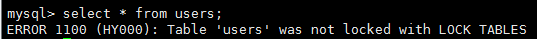

我们发现是不可以查询其他表的，这是因为当前会话已经对lock_one表加上了锁，即当前线程锁住了lock_one表，只可以操作lock_one表，就不可以查询其他的表。

5. 问题来了，会话2是否可以查询其他表呢？

```mysql
select * from users;
```


   我们发现是可以的。因为会话2和会话1是没有关系的，会话2查询会话1锁住的表都可以，查询没有锁住的 肯定是可以的。

6. 在会话1中是否可以更新（增删改）锁住的lock_one表呢？

```mysql
update lock_one set col=66 where id=1;
```

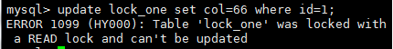

发现是不可以的，因为我们对 lock_one表加了 读锁，所以是不可以 进行写操作的。

7. 在会话2中是否可以更新（增删改）会话1中锁住的lock_one表呢？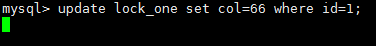

我们发现是没有执行结果的，也就是说 正在等待更新，在阻塞等待中。因为我们在会话1中对lock_one中增加了读锁，其他人只有读的操作，没有写的操作。

8. 在会话1中 对lock_one进行解锁时，会话2中的更新（增删改）操作 就会立即执行。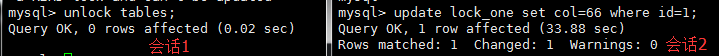

**2.写锁**

1. 在会话1中对lock_one表增加写锁

```mysql
lock table lock_one write;
```

2. 在会话1中查询该表

```mysql
select * from lock_one;
```

我们发现是可以的。

3. 在会话2中查询该表

    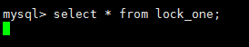

我们发现是没有执行结果的，也就是说 处于阻塞状态。因为写锁是排它锁，其他用户线程不可以读取当前锁住的表，只有解锁之后 其他用户线程才可以执行select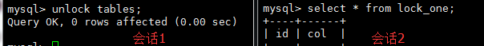

4. 在会话1中对lock_one进行写锁后，会话1会否可以查询其他表呢？

```mysql
select * from users;
```

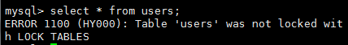

我们发现是不可以的。道理和读锁的时候一样，当前会话已经对lock_one表加上了锁，即当前线程锁住了lock_one表，只可以操作lock_one表，就不可以查询其他的表。

5. 那么在会话2中是否可以查询其他表呢？

答案肯定是可以的。因为之和锁的表有关系，和其他表没有任何关系。

6. 在会话1中是否可以进行写（增删改）操作呢？

答案一定是可以的。因为会话1对lock_one表进行了写锁操作，也就是只可以写。

7. 在会话2中是否可以进行写（增删改）操作呢？

    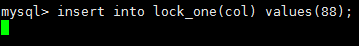

我们发现是不可以的。因为写锁是排它锁，也就是只可以当前线程操作锁住的表，其他用户线程需要等到解锁之后才可以操作该表。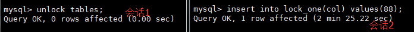

**3.总结**

1. 甲对表A加了读锁

- 甲对表A可以执行读（查询）操作，但不可以执行写（增删改）操作
- 甲对其他表不可以执行读写（增删改查）操作
- 乙对表A可以执行读（查询）操作，但不可以执行写（增删改）操作
- 乙对其他表可以执行读写（增删改查）操作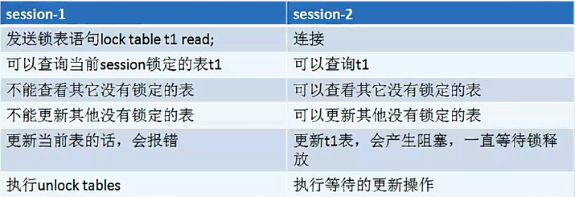

2. 甲对表A加了写锁

- 甲对表A可以执行读写（增删改查）操作
- 甲对其他表不可以执行读写（增删改查）操作
- 乙对表A不可以执行读写（增删改查）操作
- 乙对其他表可以执行读写（增删改查）操作

### 四、MyISAM存储引擎中锁特点

* 执行select语句的时候，会自动给涉及的表加上表锁，在执行更新操作时，会自动给表加上写锁

* MyISAM存储引擎比较适合作为以查询为主的表存储引擎，不适合写为主的表存储引擎，因为加写锁后，是锁住整个表，其他用户线程不能做任何操作，这样会导致大量用户线程阻塞的情况。

### 五、表锁的状态查询

1.查询指令

show status like 'table_lock%';

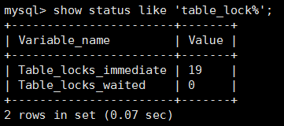

说明：

- Table_locks_immediate：表示可以立即获取锁的查询次数，每获取一次锁就增加1
- Table_locks_waited：锁等待的次数（重要，如果这个值的大，则说明锁表的次数多，需要优化，通过 show open tables，查看哪些表锁了，然后分析为什么会锁）。