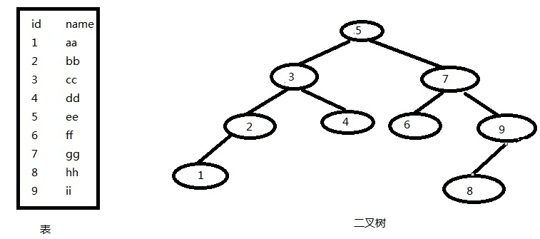
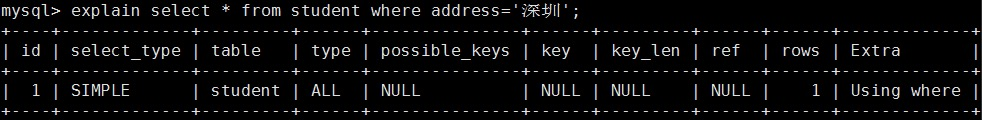
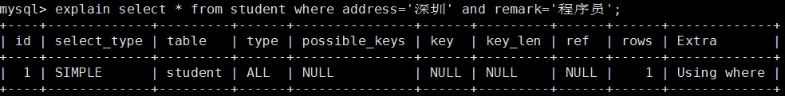
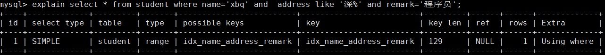
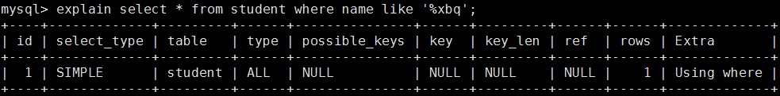
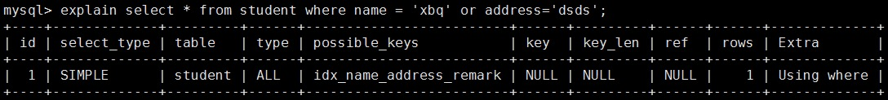

# MySQL性能优化（三）--- 索引

____

## 一、什么是索引以及索引的特性

* 索引是一种数据结构
* 索引的特点：***查找速度快，排好序，数据结构***
* 索引的数据结构类型有：***BTREE索引***和***HASH索引***，下面展示的是BTREE索引。

> **BTREE的特点实例：**
>
> > * 假设有一张表，表中的数据为下图中的左侧，则索引中数据为下图中的右侧：
> >
> > 
> >
> > * 如果查询id为9，name为ii的，在表中需要查询9次，但是在二叉树中需要查询3次。

## 二、索引的“类型”

1. **聚集索引**

> * **节点就是数据本身，即索引表中存的就是数据本身**

2. 非聚集索引

> * **节点仍然是索引节点，只不过有指向对应数据块的指针，上面所说的BTREE索引就是非聚集索引**

* *聚集索引的速度比非聚集索引快。*

## 三、索引的基础类型

1. **单列索引**

> 一个索引只包含一个列,一个表可以有多个单列索引
>
> > * **主键索引：primary key**
> >
> > 创建主键索引，有两种方式，其中t1和t2位表名，id为列：
> >
> > 1. 建表的时候创建
> >
> > ```mysql
> > create table t1 (id int primary key);
> > ```
> >
> > 2. 通过alter语句
> >
> > ```mysql
> > alter table t2 add primary key(id);
> > ```
> >
> > * **普通索引：index，最基本的索引**
> >
> > 1. 创建普通索引（create index 索引名 on 表(列)）
> >
> > ```mysql
> >  create index idx_id on t3(id);
> > ```
> >
> > 2. 通过alter语句
> >
> > ```mysql
> > alter table t4 add index(id);
> > ```
> >
> > * **唯一索引：unique**
> >
> > 1. 建表的时候创建
> >
> > ```mysql
> > create table t5 (id int unique);
> > ```
> >
> > 2. create unique index 索引名 on 表(列)
> >
> > ```mysql
> > create unique index idx_id on t5(id);
> > ```
> >
> > *注意：unique的字段可以为null，也可以重复，“”不可以重复出现。*
> >
> > * **全文索引：fulltext**
> >
> > 1. 数据库自带的全文索引，对中文支持不友好，可以借助第三方的框架，如：sphinx（斯芬克斯）、coreseek

2. **多列索引**

> **组合索引，一个组合索引包含两个或两个以上的列**
>
> * **创建：create index idx*列名1*列名2 on 表名（列名1，列名2**）
>
>     > 实例：
>     >
>     > ```mysql
>     > 建表：
>     > create table student(id int,name varchar(20),address varchar(20),remark varchar(20));
>     > ```
>     >
>     > ```mysql
>     > 建组合索引：
>     > create index idx_name_address_remark on student(name,address,remark);
>     > ```
>     >
>     > > * *查询sql是否使用到了索引，可以使用explain进行分析，后续会给出介绍。*
>
> * **在使用查询的时候遵循mysql组合索引的“最左前缀”，where时的条件要按建立索引的时候字段的排序方式，下面都是基于多列索引讲述的：**
>
>     1. 不按索引最左列开始查询
>
>         (1)   where address='深圳' 不会走索引 
>
>        
>
>         (2)  where address = '深圳' and remark='程序员' 不会走索引  
>
>        
>
>     2. 查询中某个列有范围查询，则其右边的所有列都无法使用查询（多列查询）
>
>         (1)  where name='xbq' and address like '%深%' and remark='程序员' ，该查询只会使用索引中的前两列，因为like是范围查询 
>
>        3. 查询中第一个索引字段出现like '%xxx%'或者'%xxx'，不会走索引 
>
>     4. 查询中多条件用or连接，此类型和1相似
>
>        

3. **删除索引**

> **删除索引：alter table 表名 drop index 索引名称**

4. **查询索引**

> ```mysql
> show index from t1;
> show keys from t1;
> ```

## 四、索引的优点和缺点

* **优点：**

    1. 可以通过建立唯一索引或者主键索引,保证数据库表中每一行数据的唯一性.
    2. 提高检索速度，降低磁盘读取IO

* **缺点：**

    1. 索引也需要存储，所以也需要空间，实际上索引也是一张表，保存了索引字段的值和指向实体表的指针
    2. 降低更新（增删改）表的速度，更新不仅仅只是数据本身，如果数据正好是索引字段，同时需要更新索引信息

* **tips：**

    > **索引是排序好的，不需要进行全表扫描，降低了数据排序的运算成本，也就是降低了CPU的消耗**
    >
    > **当索引字段对应的数据改变了，则索引表也会改变，例如，当图书馆中 的书柜和书，书的类型为科普类，书柜上的目录也是科普类,当此书柜中的书改变了位置的时候，则对应的书柜的目录表也要改变。**

