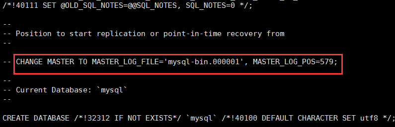
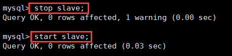

## MySQL性能优化(九) --主从复制

### 一、概念

* Mysql复制（replication）是一个异步的复制，从一个Mysql 实例（Master）复制到另一个Mysql 实例（Slave）。实现整个主从复制，需要由Master服务器上的IO进程，和Slave服务器上的Sql进程和IO进程共从完成。要实现主从复制，首先必须打开Master端的binary log（bin-log）功能，因为整个 MySQL 复制过程实际上就是Slave从Master端获取相应的二进制日志，然后再在自己slave端完全顺序的执行日志中所记录的各种操作。 （二进制日志几乎记录了除select以外的所有针对数据库的sql操作语句）

### 二、复制解决的问题

1. 数据分布 (Data distribution )
2. 负载平衡(load balancing)
3. 备份(Backups)
4. 高可用性和容错行(High availability and failover)

### 三、复制的原理

1. master将改变记录到二进制日志(binary log)中（这些记录叫做二进制日志事件，binary log events)；
2. slave将master的binary log events拷贝到它的中继日志(relay log)；
3. slave重做中继日志中的事件，将更改应用到自己的数据上。

下图描述了复制的过程：


该过程的第一部分就是master记录二进制日志。在每个事务更新数据完成之前，master在二日志记录这些改变。MySQL将事务串行的写入二进制日志，即使事务中的语句都是交叉执行的。在事件写入二进制日志完成后，master通知存储引擎提交事务。

下一步就是slave将master的binary log拷贝到它自己的中继日志。首先，slave开始一个工作线程——I/O线程。I/O线程在master上打开一个普通的连接，然后开始binlog dump process。Binlog dump process从master的二进制日志中读取事件，如果已经跟上master，它会睡眠并等待master产生新的事件。I/O线程将这些事件写入中继日志。

SQL slave thread（SQL从线程）处理该过程的最后一步。SQL线程从中继日志读取事件，并重放其中的事件而更新slave的数据，使其与master中的数据一致。只要该线程与I/O线程保持一致，中继日志通常会位于OS的缓存中，所以中继日志的开销很小。

此外，在master中也有一个工作线程：和其它MySQL的连接一样，slave在master中打开一个连接也会使得master开始一个线程。复制过程有一个很重要的限制——复制在slave上是串行化的，也就是说master上的并行更新操作不能在slave上并行操作。

### 四、配置

1. 创建一个数据库 ： create database testXbq;

2. 创建表：create table student(id int primary key auto_increment,name varchar(20));

3. 先将master上的数据复制到slave上（基于二进制日志备份（默认是关闭的）)

1）先开启二进制日志：

编辑配置文件：vi /etc/my.cnf，在里面增加

```mysql
log-bin=mysql-bin            // 二进制存放的目录和名字
binlog_format=mixed          // 
server-id=1                  // 标志 master的唯一标识
```


（2）重启mysql：  service mysql restart

（3）查看master的状态：show master status;


（4）查看目录下的二进制文件： ll /var/lib/mysql


其中，mysql-bin.index存的是：


（5）基于 位置 备份

```shell
mysqldump -uroot -p --single-transaction --master-data=2  --triggers --routines --all-databases > xbq.sql
```

// 基于独立的事务    // =2 注释掉    =1 不注释                             // 备份到当前目录下xbq.sql


查看 xbq.sql，会发现如下（或者 直接重启master后 登录mysql，执行 show master status也可以看到 从 mysql-bin.000001的579位置开始复制）：



后续的复制工作会从 mysql-bin.000001的579位置开始复制。

（6）master需要授权 一个用户给 slave，即建立一个复制账号，在master上执行（可以通过  ? grand 查看 grand的语法）：

grant replication slave on *.* to 'reppc'@'%' identified by 'xbq123';   // 一般不用root帐号，% 表示所有客户端都可能连，只要帐号，密码正确，此处可用具体客户端IP代替，如192.168.1.112，加强安全。

需要刷新权限 才可以生效： flush privileges;（此时，在salve上连接 master的数据库）

（7）重启master

（8）在slave上应用 xbq.sql，有两种方式：（master中执行下面命令,ip换成slave的ip）

方法一：远程拷贝到 slaver， scp [root@192.168.242.129](mailto:root@192.168.242.129):/usr/xbq.sql  /usr/xbq.sql ，机器上需安装openssh-client，yum install -y openssh-client

方法二：远程连接 执行sql，  mysql -h192.168.242.129 -uroot -p < /usr/xbq.sql，前提，需要在slave上给master远程连接的权限，如下：

```shell
grant all privileges on *.* to 'root'@'master的IP' identified by 'master的mysql密码' with grant option;
FLUSH PRIVILEGES;
```

4. slave 应用sql（前提：slave中已经有了master导出的sql文件，以下命令在slave中执行。如果使用 (8)中的方法二的话，忽略此步骤）

方法一： source /usr/xbq.sql

方法二： mysql -uroot -p < /usr/xbq.sql

经过上面的操作 master上的数据 就到了 slave中

5. 复制的过程：

（1）slave开始二进制日志，和 master一样的配置 ，但是 server-id 需要 =2。然后重启salve上的mysql。

验证在slave上是否可以登录master，mysql -u root -h master的IP -p ，输入密码后，可以登录 则证明可以登录。否则，需要在 master上给slave授权，如下：

```shell
grant all privileges on *.* to 'root'@'slave的IP' identified by 'slave的mysql密码' with grant option;
FLUSH PRIVILEGES;
```

（2）让slave连接master，并开始重做master二进制日志中的事件（可以通过 ? change master to 查看语法）：

```shell
change master to master_host='192.168.242.129', master_user='reppc',master_password='xbq123', master_port=3306,master_log_file='mysql-bin.000001',master_log_pos=579;
```


从 服务器的哪一个日志的哪一个位置 复制。

其中，master_host是master的IP，master_user是在master中赋予复制权限的用户，master_log_file是master中二进制文件，master_log_pos是开始复制的位置。

（3）查看IOThread和SQLThread是否成功，只有 这两个状态 都是 YES才可以复制。


（4）查看maste上的用户表 select * from mysql.user \G，看到多了一个 我们刚刚指定的用户，看到 此记录 的 reppc：Y  ，即说明该用户 具有复制的权限

此时，master已经配置ok了，查看状态：show master status;


（5）先重启slave:



(6) 查看salve的状态 show slave status ：


出现 Slave-IO-Running：YES，Slave-SQL-Running :YES ，则主从配置成功！

#### 五.测试

（1）在matser中的 student 表中新增加一条记录：

insert into student(name) values('徐邦启');

（2）在slave中查看student表：


OK！

#### 六、常用命令

1. 查看二进制日志：

方法一：mysql> show binlog events in ‘日志文件’ from 位置;

方法二：使用mysql工具查看日志文件（二进制日志中包含中各种DML和DDL）

\#mysqlbinlog --no-defaults mysql-bin.000001      查看指定文件binlog

\#mysqlbinlog --start-position=位置 日志路径，例如： mysqlbinlog -start-position=120 /var/lib/mysql/mysql-bin.000001

```shell
# 查看某个时间段的二进制日志，并且输出到指定的文件
mysqlbinlog --no-defaults --start-datetime="2018-12-12 13:00:00" --stop-datetime="2018-12-12 14:40:00" mysql-bin.000085 -vv --base64-output=decode-rows | more  >> target.txt

# 查看某个二进制日志中的指定命令，并且输出到指定的文件
mysqlbinlog --no-defaults --base64-output=decode-rows -v -v mysql-bin.000085  | sed -n '/### DELETE FROM `数据库名`.`表名`/,/COMMIT/p' > target.txt

# 将@1、@2等一系列看不懂的符号转换为SQL语句
cat target.txt | sed -n '/###/p' | sed 's/### //g;s/\/\*.*/,/g;s/DELETE FROM/INSERT INTO/g;' | sed -r 's/(@4.*),/\1;/g' | sed 's/@[0-9]*\=//g' > test.sql

# 查看某个二进制日志的某个时间段内 DELETE 语句出现的次数
mysqlbinlog --no-defaults --start-datetime="2018-12-12 13:00:00" --stop-datetime="2018-12-12 14:40:00" mysql-bin.000085 -d 数据库名 mysql-bin.000085 -v|grep UPDATE | wc -l
```

2. 查看中继日志（和查看二进制日志是同一个命令）：

mysql> show relaylog events in ‘日志文件’ from 位置;

3. 查看mysql线程列表：

mysql> processlist;

4. 查看mysql的配置文件（my.cnf）目录：whereis my.cnf

5. 查看mysql的配置文件（my.cnf）目录：mysql --verbose --help | grep -C 1 'Default opt'

6. 清空master：reset master;

### 七、说明

本文是一主一从，当然，一主多从也是一样的道理，在增加一台slave，然后在my.cnf修改，然后 change master to，在master上 修改 change master to master_host= '192.168.242.%'。

### 八、参考资料

[转载连接][https://juejin.im/post/5d196b17e51d455d6c0ad970]

