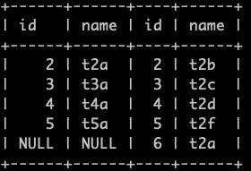

# MySQL性能优化（二）---数据类型、SQL语句、相关连接操作
___

## 一、MySQL数据类型优化原则

### 1.1 使用小数据类型

* 能够使用最小数据类型存储时，尽量使用最小数据类型存储（*前提是要评估字段值的真实数据存储范围*）


* 普通建表插入
```mysql
create table aaa(id1 int(10) zerofill,id2 int (10));
insert into aaa values(12,11);
```

> int(n) 中的 n代表宽度，表示没有设定宽度的时候，用0填充，需要配合zerofill来使用。

* varchar 存储变长的字符串，即根据存入的值的长度来动态变化

> 存储空间：
>
> 非空：65533字节
>
> 可空：65532字节
>
> 优点：节省空间，操作简单
>
> 缺点：在update的时候，如果数据的长度变化了，就会去申请空间，从而有额外的工作，对性能有影响。
>
> 应用场景：
>
> 1.字符串最大长度比平均真实值大的比较多，这个时候就会用。
>
> 2.更新频率比较低的字符串字段

* char 存储定长的字符串

```mysql
create table t (char(10) not null)
```

> 存储长度：
>
> 非空：存储255字节
>
> 可空：存储254字节
>
> 应用场景：
>
> 1.适合存储比较短的字符串
>
> 2.存储固定的长度或者存储长度比较接近的字符串 。例如：手机号、MD5加密的密码、邮编等
>
> 3.经常变更的数据（不需要释放空间重新申请，即不会产生内存碎片）
>
> 4.存储比较短的字符串值，例如：Y/N
>
> > Demo:
> >
> > ```mysql
> > create table test_char(name char(10));
> > insert into test_char values('abc'),(' abc'),('abc ');
> > select concat("'",name,"'") from test_char;
> > ```
> >
> > 
> >
> > **结论：如果插入的值末尾有空格，会自动截取掉。**

* text：存储变长的非二进制的字符串
* blog：用于存储二进制数据，大二进制数据，也就是可以存储流，图片或者音频文件
* 日期时间类型

|   类型   | 存储需求 |                   说明                   |
| :------: | :------: | :--------------------------------------: |
|   year   |  1字节   |                    年                    |
|   date   |  3字节   |                YYY-MM-DD                 |
|   time   |  3字节   |                 HH:MM:SS                 |
| datetime |  8字节   |           YYYY-MM-DD HH:MM:SS            |
|   time   |  4字节   | 从1970-1-1凌晨到现在的秒数，存储到2038年 |

### 1.2 尽量避免使用NULL

### 1.3 尽量使用简单类型


* **Tips:**

> ***建表的时候可以将为null的 赋其他默认值，如：字符串的设置''，数据类型的设为0，不要将null设为默认值。***

## 二、MySQL性能下降的原因

1. 吞吐量小，形成了瓶颈效应
2. CPU性能差
3. 内存不足，磁盘空间不足
4. 没有索引或者没有用到索引
5. 查询语句太烂，没有优化（各种join，子查询）
6. 检索返回的数据量过大
7. 返回了不必要的行和列
8. 锁或者死锁（程序设计的缺陷）
9. 配置参数没有优化

## 三、SQL手写顺序

```mysql
select distinct <select_list>
　　from <left_table>
　　<join_type> join <right_table>
　　on <join_condition>
　　group by <group_by_list>
　　having <having_condition>
　　order by <order_bu_list>
　　limit <limit_number>
```

## 四、SQL读取顺序

* from：左表和右表的笛卡尔积，产生虚拟表v1
* on：对v1进行筛选，根据join-condition过滤，产生v2
* join：如果是left join，就把左表在v2的结果通过on过滤，通过右表的外部行过滤，产生v3
* where：过滤条件，产生v4
* group by ：分组，产生v5
* having：过滤条件，产生v6
* select：load出指定的列，产生v7
* distinct：排重，产生v8
* order by：排序，产生v9
* limit：取出指定的行，并返回结果

## 五、 常用JOIN SQL

1. 左外连接
2. 右外连接
3. 内连接
4. 全连接
5. 交叉连接
6. 全外连接

## 六、实例

* **join 建表语句**

```mysql
 create database mysqltest;
 use mysqltest;
```

* **左表t1**

```mysql
create table t1(id int not null,name varchar(20));
insert into t1 values(1,'t1a');
insert into t1 values(2,'t2a');
insert into t1 values(3,'t3a');
insert into t1 values(4,'t4a');
insert into t1 values(5,'t5a');
```

* **右表t2**

```mysql
create table t2(id int not null,name varchar(20));
insert into t2 values(2,'t2b');
insert into t2 values(3,'t2c');
insert into t2 values(4,'t2d');
insert into t2 values(5,'t2f');
insert into t2 values(6,'t2a');
```

1. 笛卡尔积（相当于两个for循环）

```mysql
select * from t1,t2;
```


2. 左连接 left join left outer join


> 左表全部保留，右表关联不上的用null表示。结果 t1 中存在id为1的，t2中没有，则对应t2中的记录用null表示。
>
> 左表应该都是小表。

```mysql
select * from t1 left join t2 on t2.id=t1.id;
```


3. 右连接 right join


> 右表全部保留，左表关联不上的用null表示。

```mysql
select * from t1 right join t2 on t2.id=t1.id;
```



4. 内连接 inner join


> 两个表的公共部分。

```mysql
select * from t1 inner join t2 on t2.id=t1.id;
```


5. 查询左表中独有部分


```mysql
select * from t1 left join t2 on t2.id=t1.id where t2.id is null;
```


6. 查询右表中独有数据


```mysql
select * from t1 right join t2 on t2.id=t1.id where t1.id is null;
```


7. 全连接


> 在MySQL中没有full join

```mysql
select * from t1 left join t2 on t2.id=t1.id union select * from t1 right join t2 on t2.id=t1.id;
```


8. 查询t1和t2的独有数据部分


```mysql
select * from t1 left join t2 on t2.id=t1.id where t2.id is null union select * from t1 right join t2 on t2.id=t1.id where t1.id is null;
```


