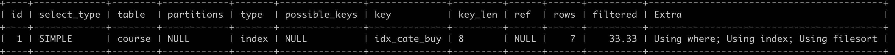
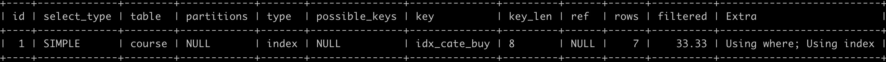
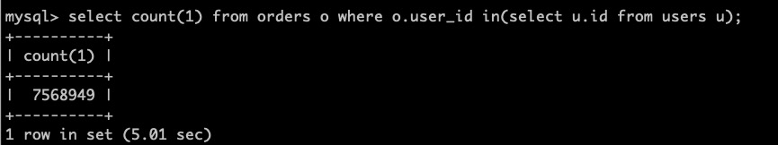
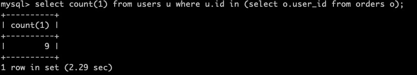
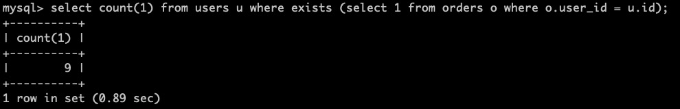

# MySQL性能优化 (五) ---using filesort、in和exists

___

## 一、order by产生using filesort详解

### 1. 首先建表和索引（mysql版本5.5)

```mysql
/*课程表*/
create table course(
	id int primary key auto_increment,/* 主键自增*/
	title varchar(50) not null,/* 标题*/
	category_id int not null,/* 属于哪个类目*/
	school_id int not null,/* 属于哪个学校*/
	buy_times int not null,/* 购买次数*/
	browse_times int not null/* 浏览次数*/
);
insert into course(title,category_id,school_id,buy_times,browse_times) values('java课程',1,1,800,8680);
insert into course(title,category_id,school_id,buy_times,browse_times) values('android课程',2,1,400,8030);
insert into course(title,category_id,school_id,buy_times,browse_times) values('mysql课程',3,2,200,2902);
insert into course(title,category_id,school_id,buy_times,browse_times) values('oracle课程',2,2,100,6710);
insert into course(title,category_id,school_id,buy_times,browse_times) values('C#课程',1,3,620,2890);
insert into course(title,category_id,school_id,buy_times,browse_times) values('PS课程',4,4,210,4300);
insert into course(title,category_id,school_id,buy_times,browse_times) values('CAD课程',5,1,403,6080);

/*在category_id和buy_times上建立组合索引*/
create index idx_cate_buy on course(category_id,buy_times);
```

### 2.order by和group by会产生using filesort有哪些

* explain select id from course where category_id>1 order by category_id;

    >**根据最左前缀原则，order by后面的的category_id会用到组合索引**
    >
    >

* explain select id from course where category_id>1 order by category_id,buy_times;

    > **根据最左前缀原则，order by后面的的category_id buy_times会用到组合索引，因为索引就是这两个字段**
    >
    > 

* explain select id from course where category_id>1 order by buy_times;

    > **根据最左前缀原则，order by后面的字段是缺少了最左边的category_id，所以会产生 using filesort**
    >
    > 

* explain select id from course where category_id>1 order by buy_times,category_id;

    > **order by后面的字段顺序不符合组合索引中的顺序，所以order by后面的不会走索引，即会产生using filesort**
    >
    > 

* explain select id from course order by category_id;

    > **根据最左前缀原则，order by后面存在索引中的最左列，所以会用到索引**
    >
    > 

* explain select id from course order by buy_times;

    > **根据最左前缀原则，order by后面的字段 没有索引中的最左列的字段，所以不会走索引，会产生using filesort**
    >
    > 

* explain select id from course where buy_times > 1 order by buy_times;

    > **根据最左前缀原则，order by后面的字段 没有索引中的最左列的字段，所以不会走索引，会产生using fillesort**
    >
    > 

* explain select id from course where buy_times > 1 order by category_id;

    > **根据最左前缀原则，order by后面的字段存在于索引中最左列，所以会走索引**
    >
    > 

* explain select id from course order by buy_times desc,category_id asc;

    > **根据最最左前缀原则，order by后面的字段顺序和索引中的不符合，则会产生using filesort**

* explain select id from course order by category_id desc,buy_times asc;

    > **这一条虽然order by后面的字段和索引中字段顺序相同，但是一个是降序，一个是升序，所以也会产生using filesort，同时升序和同时降序就不会产生using filesort了**
    >
    > 

***综上所述，3、4、6、7、9、10都会产生using filesort。***

## 二、in和exists哪个性能更优

* sql脚本

```mysql
/*建库*/
create database testdb6;
use testdb6;
/* 用户表 */
drop table if exists users;
create table users(
	id int primary key auto_increment,
	name varchar(20)
);
insert into users(name) values ('A');
insert into users(name) values ('B');
insert into users(name) values ('C');
insert into users(name) values ('D');
insert into users(name) values ('E');
insert into users(name) values ('F');
insert into users(name) values ('G');
insert into users(name) values ('H');
insert into users(name) values ('I');
insert into users(name) values ('J');

/* 订单表 */
drop table if exists orders;
create table orders(
	id int primary key auto_increment,/*订单id*/
	order_no varchar(20) not null,/*订单编号*/
	title varchar(20) not null,/*订单标题*/
	goods_num int not null,/*订单数量*/
	money decimal(7,4) not null,/*订单金额*/
	user_id int not null    /*订单所属用户id*/
)engine=myisam default charset=utf8 ;

/* 创建存储过程 */
create procedure batch_orders(in max int)
begin
declare start int default 0;
declare i int default 0;
set autocommit = 0;  
while i < max do
   set i = i + 1;
   insert into orders(order_no,title,goods_num,money,user_id) 
   values (concat('NCS-',floor(1 + rand()*1000000000000 )),concat('订单title-',i),i%50,(100.0000+(i%50)),i%10);
end while;
commit;
end 
```


* ***call batch_orders(10000000);*** 

    > ***在mysql中在执行这个存储过程，会自动插入数据***

* 上面的sql中 订单表中(orders)存在user_id，而又有用户表(users)，所以我们用orders表中user_id和user表中的id来in和exists。

### 对比结果

1. where后面是小表

    （1）select count(1) from orders o where o.user_id in(select u.id from users u);	

    （2）select count(1) from orders o where exists (select 1 from users u where u.id = o.user_id);	

2. where后面是大表

    （1）select count(1) from users u where u.id in (select o.user_id from orders o);

    （2）select count(1) from users u where exists (select 1 from orders o where o.user_id = u.id);

### 分析

* 我们用下面的这两条语句分析：

```mysql
select count(1) from orders o where o.user_id in(select u.id from users u);
select count(1) from orders o where exists (select 1 from users u where u.id = o.user_id);
```

> 1. **in：先查询in后面的users表，然后再去orders中过滤，也就是先执行子查询，结果出来后，再遍历主查询，遍历主查询是根据user_id和id相等查询的。**
>
>     >  **即查询users表相当于外层循环，主查询就是外层循环**
>
> **小结：in先执行子查询，也就是<font color=red>in()</font>所包含的语句。子查询查询出数据以后，将前面的查询分为n次普通查询(n表示在子查询中返回的数据行数)**
>
> 2. **exists：主查询是内层循环，先查询出orders，查询orders就是外层循环，然后会判断是不是存在order_id和 users表中的id相等，相等才保留数据，查询users表就是内层循环**
>
>     > **这里所说的外层循环和内层循环就是我们所说的嵌套循环，而嵌套循环应该遵循“外小内大”的原则，这就好比你复制很多个小文件和复制几个大文件的区别**
>
> **小结：如果子查询查到数据，就返回布尔值true；如果没有，就返回布尔值false。返回布尔值true则将该条数据保存下来，否则就舍弃掉。也就是说exists查询，是查询出一条数据就执行一次子查询**

### 结论

* <font color=red>***小表驱动大表。***</font>

* <font color=red>***in适合于外表大而内表小的情况，exists适合于外表小而内表大的情况。***</font>

