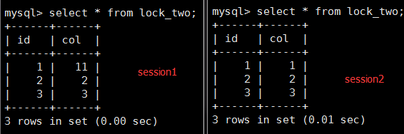
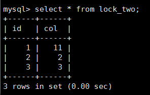
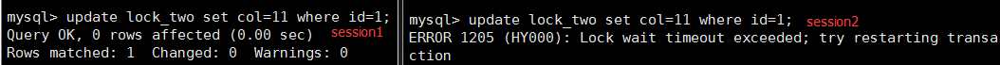
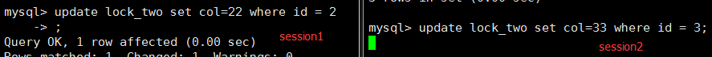
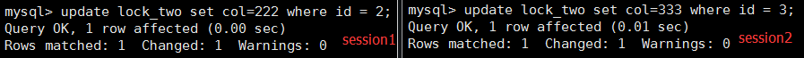
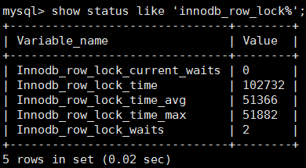

## MySQL性能优化（八）-- 锁机制之行锁

### 一、行锁概念及特点

1. 概念：给单独的一行记录加锁，主要应用于innodb表存储引擎
2. 特点：在innodb存储引擎中应用比较多，支持事务、开销大、加锁慢；会出现死锁；锁的粒度小，并发情况下，产生锁等待的概率比较低，所以支持的并发数比较高。

### 二、数据库事务

1. 概念：事务是一系列操作组成的工作单元，改工作单元内的操作时不可分割的，也就是说要么全部执行，要不全部不执行。
2. 特性：ACID

* 原子性：事务是最小的单元，不可分割，要么都做，要么都不做
* 一致性：事务执行前和执行后的数据要保证正确性，数据完整性没有被破坏。
* 隔离性：在并发事务执行的时候，一个事务不会对其它事务产生影响。
* 持久性：一个事务一旦提交，它对数据库中的数据改变就应该是永久性的。

### 三、多个事务并发执行问题及解决方案

1. **问题**

* 丢失更新：在没有事务隔离的情况下，两个事务同时更新一条数据，后一个事务会覆盖前面事务的更新，导致前面的事务丢失更新。
* 脏读：事务A先更新数据，但是没有提交，事务B读到了事务A没有提交的数据。
* 不可重复读：事务A中，先读到一条数据，事务A还没有结束，此时，事务B对该条数据进行了修改操作，事务A又读到了这条数据，事务A两次读到的数据不同。
* 幻读：事务A先读到一批数据，假设读到10条，事务B插入了一条数据，此时，事务A又读这一批数据，发现多了一条，好像幻觉一样。

2. **解决方案--数据库隔离机制**

    1. 未提交读：这是数据库最低的隔离级别，允许一个事务读另一个事务未提交的数据。

    > ***解决了丢失更新和脏读，但是会出现不可重复读和幻读***

    2. 提交读：一个事务更新的数据在提交之后才可以被另一个事务读取，即一个事务不可以读取到另一个事务未提交的数据。

    > ***解决了丢失更新和脏读，但是会出现不可重复读和幻读***

    3. 可重复读：这是数据库默认的事务隔离级别，保证一个事务在相同的条件下前后两次读取的数据是一致的。

    > ***解决了丢失更新、脏读和不可重复读，但是会出现幻读***

    4. 序列化：这是数据库最高的隔离级别。事务串行执行，不会交叉执行。

    > ***解决了所有问题***

    注：乐观锁可以解决幻读

### 四、行锁的特性

查看mysql事务隔离级别：show variables like 'tx_iso%';

前提：set autocommit=0; // 设置自动提交事务为手动提交 

```mysql
/* 行锁案例*/
create table lock_two(
    id int,
    col int
)engine=innodb;

insert into lock_two(id,col) values (1,1);
insert into lock_two(id,col) values (2,2);
insert into lock_two(id,col) values (3,3);
```

1. 在session1中执行update : update lock_two set col=11 where id=1;

    <1> 分别在session1和session2中查询lock_two，看id为1的记录的col是否修改了。

    发现session1 的记录修改了，session2中的记录没有被修改。

    <2> 在session1中执行commite后，然后再在session2中查询：

    

    发现session2中的表数据改变了。

2. 在session1中执行update：update lock_two set col=11 where id=1，不执行commit;   在session2中执行uodate ：update lock_two set col=11 where id=1，不执行commit;



​	发现session2中的update发生阻塞，并且超过一段时间报错。

3. 在session1中执行update：update lock_two set col=22 where id = 2; 不执行commit   在session2中执行另一条update：update lock_two set col=33 where id = 3;



​	此时，session2中的update发生阻塞，在没发生错误的情况下，session1执行commit，session2中的update会马上执行。

4. 在lock_two中创建索引

```mysql
create index idx_id on lock_two(id);
create index idx_col on lock_two(col);
```

然后重复第3步，



发现session2可以更新，不会产生阻塞。因为用上了索引，相当于行锁。

**结论：如果没有用上索引，行锁变成表锁**

### 五、手动锁一行记录格式

```mysql
begin;
select * from lock_two where id=2 for update;
```

1. 在session1中执行上面语句，在ssesion2中可以查看，但是不可以修改 sesion1中的for update 的记录。
2. 当session1中执行commit后，seesion2中的update立刻执行。

### 六、间隙锁

1. 定义

* 在范围查找的情况下， innodb会给范围条件中的数据加上锁，无论数据是否真实存在。

2. 例子

    在session1中update：`update lock_two set col=666 where id>2 and id<8;`

    *1)* 在session2中执行insert：`insert into lock_two values(9,99);`

    插入执行成功！

    *2)* 在session2中执行insert：`insert into lock_two values(7,77);`

    插入阻塞，一段时间后报错！

    执行select：`select * from lock_two where id=4;`

    查询成功！

**建议**：在innodb中，因为有间隙锁的存在，最好在where中少使用这种范围查找。

### 七、查看行锁的信息

```mysql
show status like 'innodb_row_lock%';
```



说明：

- Innodb_row_lock_current_waits ：当前正在等待的数量
- Innodb_row_lock_time: 从启动到现在锁定的总时长，单位是ms
- Innodb_row_lock_time_avg :锁等待的平均时长
- Innodb_row_lock_time_max：等待锁时间最长的一个时间
- Innodb_row_lock_waits：总共的等待次数

