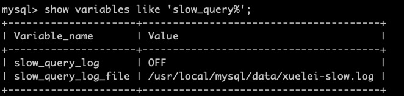

## MySQL性能优化（六） ---慢查询

### 一、慢查询的用途

* 它能记录下所有执行超过long_query_time时间的SQL语句，帮我们找到执行慢的SQL，方便我们对这些SQL进行优化。

### 二、查看是否开启慢查询

* show variables like 'slow_query%';

> **slow_query_log = off，表示没有开启慢查询**
>
> **slow_query_log_file 表示慢查询日志存放的目录**

### 三、开启慢查询

* **需要的时候才开启，因为很耗性能，建议使用即时性的**

1. 即时性的，重启mysql之后失效，常用的

    ```mysql
    set global slow_query_log=1;   or
    set global slow_query_log=ON;
    ```

    开启之后 我们会发现 /var/lib/mysql下已经存在 localhost-slow.log了，未开启的时候默认是不存在的。

2. 永久性

    在/etc/my.cfg文件中的[mysqld]中加入：

    ```shell
    slow_query_log=ON
    slow_query_log_file=/var/lib/mysql/localhost-slow.log
    ```

### 四、设置慢查询记录的时间

* 查询慢查询记录的时间：show variables like 'long_query%'，默认是10秒钟，意思是大于10秒才算慢查询。

    **我们现在设置慢查询记录时间为1秒：set long_query_time=1;**

* **执行select count(1) from order o where o.user_id in (select u.id where users);**
因为我们开启了慢查询，且设置了超过1秒钟的就为慢查询，此sql执行了6.91秒，所以属于慢查询。

