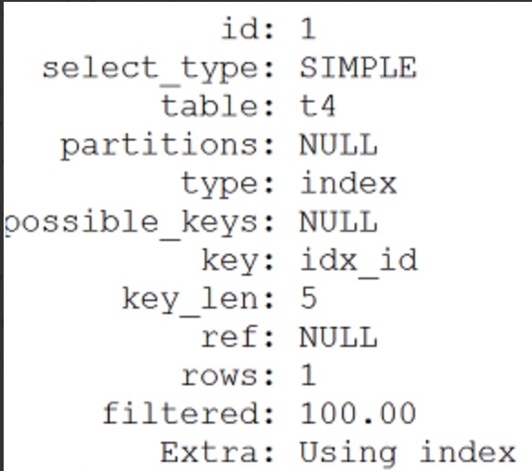

# MySQL性能优化(四)   ---MySQL explain详解

___

> MySQL中的explain命令显示了mysql如何使用索引来处理select语句以及连接表。explain显示的信息可以帮助选择更好的索引和写出更优化的查询语句。

## 一、格式

* explain + select 语句；

```mysql
explain select * from tb_student;
```

## 二、5.5与5.7版本explain的区别

* 5.7之后的版本默认会有 partitions 和 filtered两列，但是5.5版本中是没有的。
    1. 使用explain partitions select ……来显示带有partitions 的列
    2. 使用explain extended select ……来显示带有filtered的列

## 三、explain的作用

* 描述MySQL如何执行查询操作、执行顺序，使用到的索引，以及MySQL成功返回结果集需要执行的行数。

* 可以帮助我们分析 select 语句,让我们知道查询效率低下的原因,从而改进我们的查询，让查询优化器能够更好的工作

* 查询优化器的作用：

    > 1. **优化select 语句，分析哪些是常量表达式（例如id=1），以及分析哪些表达式可以直接转换成常量的**
    > 2. **对where条件进行简化和转换，如去掉无用条件，调整条件结构等**
    > 3. **读取涉及的表的统计信息，并计算分析（例如返回的行数，索引信息等），最终得出执行计划**

## 四、执行计划(QEP)包含的信息



	1. **id**：标识符，表示执行顺序

 	2. **select _type**：查询类型
 	3. **table**：输出行所引用的表
 	4. **partitions**：使用的哪个分区，需要结合表分区才可以看到
 	5. **type**：表示按某种类型来查询，例如按照索引类型查找，按照范围查找。从最好到最差的连接类型为const、eq_reg、ref、range、indexhe和all
 	6. **possible_keys**：可能用到的索引，保存的是索引名称，如果是多个索引的话，用逗号隔开
 	7. **key**：实际用到的索引，保存的是索引名称，如果是多个索引的话，用逗号隔开
 	8. **key_len**：表示本次查询中，所选择的索引长度有多少字节
 	9. **ref**：显示索引的哪一列被使用了，如果可能的话，是一个常数
 	10. **rows**：显示mysql认为执行查询时必须要返回的行数
 	11. **filtered**：通过过滤条件之后对比总数的百分比
 	12. **extra**：额外的信息，例如：using file sort ，using where， using join buffer，using index等

## 五、执行计划中各个参数详解

### 1. Id

* 表示**select**标识符，同时表明执行顺序，也就是说id是一个查询的序列号，查询序号即为sql语句执行的顺序。

    1. *当id值相同时，按从上到下的顺序执行*
    2. *当id全部不同时，按id从大到小执行*
    3. *当id部分不同时，先执行id大的，id相同的，按从上到下的顺序执行*

### 2. select_type

* **simple**：表示简单的select，没有union和子查询
* **primary**：最外面的查询 或者 主查询，在有子查询的语句中，最外面的select查询就是primary
* **subquery**：子查询
* **union**：union语句的第二个或者说是后面那一个select
* **union** **result**：union之后的结果
* **dependent** **unoin**：unoin 中的第二个或随后的 select 查询，依赖于外部查询的结果集
* **dependent** **subquery**：子查询中的第一个 select 查询，依赖于外部 查询的结果集
* **derived**：衍生表（5.7版本中不存在这一个）

### 3. table

* 通常是表名，或者表的别名，或者一个为查询产生临时表的标示符（如派生表、子查询、集合）

### 4. partitions

* 使用的哪些分区（对于非分区表值为null），在5.5版本中需要加上explain partitions select .....

### 5. type

1. **const**：表中最多有一个匹配行，const用于比较primary key 或者unique索引。因为只匹配一行数据，所以很快
2. **eq_ref**：唯一性索引扫描，对于每个来自于前面的表的记录，从该表中读取唯一一行
3. **ref**：非唯一性索引扫描，对于每个来自于前面的表的记录，所有匹配的行从这张表取出
4. **ref_or_null**：类似于ref，但是可以搜索包含null值的行，例如：select * from student where address='xxx' or address is null，需要在address建立索引。
5. **index_merge**：查询语句用到了一张表的多个索引时，mysql会将多个索引合并到一起
6. **range**：按指定范围（如in、<、>、between and等，但是前提是此字段要建立索引）来检索，很常见。如：select * from student where id < 5，id上要有索引。
7. **index**：全”表“扫描，但是是在索引树中扫描，通常比ALL快，因为索引文件通常比数据文件小，index扫描是通过二叉树的方式扫描，而all是扫描物理表。（也就是说虽然all和index都是读全表，但index是从索引中读取的，而all是从硬盘中读的）。例如：select name from student，但name字段上需要建立索引，也就是查询的字段属于索引中的字段。
8. **all**：全表扫描，扫描完整的物理表，此时就需要优化了。

### 6. possible_keys

* 指出 MySQL 能在该表中可能使用的索引，显示的是索引的名称，多个索引用逗号隔开，如果没有，则为null。

### 7. key

* MySQL决定实际用到的索引，显示的是索引的名称，多个索引用逗号隔开，如果没有，则为null

### 8. key_len

* 当用到组合索引的时候判断索引是否完全用上。

> 实例：假设student表中有id int,name char(20)  DEFAULT NULL,address varchar(20) DEFAULT NULL,remark varchar(20) NOT NULL 字段，建立的索引是 idx_address_remark（在address和remark上建立的组合索引）
>
> 查询的sql是：select * from student where address='深圳' and remark='java coder'，此时，执行计划中的key_len是 （20*3+1+2）+ （20*3+2）= 125，那么这个是怎么得来的呢？
>
> 解析：20表示建表的时候 varchar(20) ，3表示utf8字符集占用3个字节，1表示MySQL需要1个字节表示null，2表示变长字段（varchar是变长的）。  
>
> 假设drop掉刚刚建立的索引，新建索引 idx_name_address（在name和address上建立组合索引）
>
> 查询的sql是：select * from student where name='xbq' and address='深圳'，此时，执行计划中的key_len是 （20*3+1）+ （20*3+2）= 123，那么这个值是怎么得来的呢？
>
> 解析：20表示建表的时候 char(20) ，3表示utf8字符集占用3个字节，1表示MySQL需要1个字节标识null，即 20*3+1，后面的同样的道理。

* key_len只计算where条件用到的索引长度，而排序和分组就算用到了索引，也不会计算到key_len中。

> **计算key_len的公式：**
>
> > ```shell
> > varchr(10)变长字段且允许NULL = 10*( character set：utf8=3,gbk=2,latin1=1) + 1(NULL) + 2(变长字段)
> > varchr(10)变长字段且不允许NULL = 10*( character set：utf8=3,gbk=2,latin1=1) + 2(变长字段) 
> > char(10)固定字段且允许NULL = 10*( character set：utf8=3,gbk=2,latin1=1)+1(NULL) 
> > char(10)固定字段且不允许NULL = 10*( character set：utf8=3,gbk=2,latin1=1)
> > ```

### 9. ref

* 显示索引的哪一列被使用了，如果可能的话，是一个常数

### 10. rows

* 显示mysql认为执行查询时必须要返回的行数，可结合type和key分析，没有用上索引的情况下，会全表扫描。rows的值越小越好，说明检索的数据少

### 11. filtered

* 给出了一个百分比的值，这个百分比值和rows列的值一起使用，可以估计出那些将要和执行计划中的前一个表（前一个表就是指id列的值比当前表的id小的表）进行连接的行的数目。
* 这一列在5.5版本中，需要加上 explain extended select ....。

### 12. extra

* 此字段显示一些额外的信息，但是**此字段的部分值具有优化的参考意义**。
    1. **using** **where**：表示查询使用了where 语句来处理结果
    2. **using index**：表示使用了覆盖索引。这个值重点强调了只需要使用索引就可以满足查询表的要求，不需要直接访问表数据。
    3. **using join buffer**：这个值强调了在获取连接条件时没有使用索引，并且需要连接缓冲区来存储中间结果。如果出现了这个值，那应该注意，根据查询的具体情况可能需要添加索引来改进性能
    4. **using filesort**：这是 order by 语句的结果。这可能是一个CPU密集型的过程。using filesort表示出现了文件内排序，表示很不好的现象，必须要优化，特别是大表，可以通过选择合适的索引来改进性能，用索引来为查询结果排序。
    5. **using temporary**：mysql需要创建一张临时表来保存中间结果。 也就是说，需要先把数据放到临时表中，然后从临时表中获取需要的数据。出现这种临时表，也是必须需要优化的地方，特别是数据量大的情况。两个常见的原因是在来自不同表的列上使用了distinct，或者使用了不同的 order by 和 group by 列。