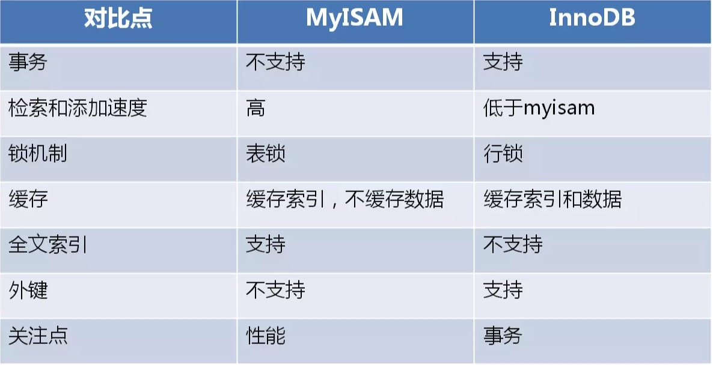

# MySQL性能优化(一) ---存储引擎和三范式

___

## 一、MySQL存储引擎

* 存储引擎说白了就是如何存储数据、如何为存储的数据建立索引和如何更新、查询数据等技术的实现方法。因为在关系数据库中数据的存储是以表的形式存储的，所以存储引擎也可以称为表类型（即存储和操作此表的类型）。MySQL5.5以后默认使用**InnoDB**存储引擎。

* 下图是MySQL中各种存储引擎的对比。


### 1.1 MyISAM

* 这种引擎是mysql最早提供的。它不支持事务，也不支持外键，尤其是访问速度快。这种引擎又可以分为静态MyISAM、动态MyISAM 和压缩MyISAM三种：

1. **静态MyISAM**：如果数据表中的各数据列的长度都是预先固定好的，服务器将自动选择这种表类型。因为数据表中每一条记录所占用的空间都是一样的，所以这种表存取和更新的效率非常高。 当数据受损时，恢复工作也比较容易做。这种存储方式的优点是存储非常迅速，容易缓存，出现故障容易恢复；缺点是占用的空间通常比动态表多。
2. **动态MyISAM**：如果数据表中出现varchar、xxxtext或xxxBLOB字段时，服务器将自动选择这种表类型。相对于静态MyISAM，这种表存储空间比较小，但由于每条记录的长度不一，所以 多次修改数据后，数据表中的数据就可能离散的存储在内存中，进而导致执行效率下降。同时，内存中也可能会出现很多碎片。因此，这种类型的表要经常用optimize table命令或者myisamchk -r命令 或 优化工具来整理碎片、改善性能，并且出现故障的时候恢复相对比较困难。
3. **缩MyISAM**：以上说到的两种类型的表都可以用myisamchk工具压缩。这种类型的表进一步减小了占用的存储，但是这种表压缩之后不能再被修改。另外，因为是压缩数据，所以这种表在读取的时候要先时行解压缩。但是，不管是何种MyISAM表，目前它都不支持事务，行级锁和外键约束的功能。

### 1.2 Merge

* 这种类型是MyISAM类型的一种变种。合并表是将几个相同的MyISAM表合并为一个虚表。常应用于日志和数据仓库。

### 1.3 InnoDB

* InnoDB表类型可以看作是对MyISAM的进一步更新产品，它提供了事务、行级锁机制和外键约束的功能。对比MyISAM的存储引擎，InnoDB写的处理效率差一些，并且会占用更多 的磁盘空间以保留数据和索引。

> 多用于并发的情况，支持行级锁

### 1.4 Memory

* 这种类型的数据表只存在于内存中。它使用HASH索引，所以数据的存取速度非常快。因为是存在于内存中，所以这种类型常应用于临时表中，但是一旦服务器关闭，表中的数据就会丢失，但表还会继续存在。默认情况下，memory数据表使用散列索引，利用这种索引进行“相等比较”非常快，但是对“范围比较”的速度就慢多了。因此，散列索引值适合使用在"="和"<=>"的操作符中，不适合使用在"<"或">"操作符中，也同样不适合用在order by字句里。如果确实要使用"<"或">"或betwen操作符，可以使用btree索引来加快速度。

* 存储在MEMORY数据表里的数据行使用的是长度不变的格式，因此加快处理速度，这意味着不能使用BLOB和TEXT这样的长度可变的数据类型。VARCHAR是一种长度可变的类型，但因为它在MySQL内部当作长度固定不变的CHAR类型，所以可以使用。
* 使用USING HASH/BTREE来指定特定到索引：create index mem_hash using hash on tab_memory(city_id);

### 1.5 Achieve

* 这种类型只支持select 和 insert语句，而且不支持索引。常应用于日志记录和聚合分析方面。

## 二、存储引擎如何选择

* 是否支持事务
* 检索和添加速度
* 锁机制
* 缓存
* 是否支持全文索引
* 是否支持外键

## 三、 MyISAM和InnoDB对比



* 两种都输目前最常用的引擎结构
* MyISAM：读事务要求不高，以查询和插入为主，可以使用这个引擎来创建表，例如各种统计表。
* InnoDB： 对事务要求高，保存的是重要的数据，例如交易数据，支付数据等，对用户重要的数据，建议使用InnoDB。

## 四、对存储引擎的操作

### 4.1 查看数据库的默认存储引擎

> 命令 *show engines;* 或者 *show variables like 'default_storage_engine';*


### 4.2 查看表的存储引擎

> 显示表的创建语句：*show create table **tablename**;*


> 显示表的当前状态值：*show table status like  '**tablename**';*


### 4.3 设置或修改表的存储引擎

* 创建数据库表时设置存储存储引擎的基本语法是：
```mysql
create table tableName(
    columnName(列名1) type(数据类型) attri(属性设置),
    columnName(列名2) type(数据类型) attri(属性设置)，
    ....) engine = engineName
```

* 修改存储引擎，可以用命令 *Alter table **tableName** engine = **engineName***

## 五、配置和文件相关

1. 配置文件默认位置

> Linux: /etc/my.cnf
>
> Windows: my.ini

2. 数据文件位置

> 查看数据文件位置的命令： *show variables like '**%datadir%**' ;*
>
> 数据文件格式：
>
> * InnoDB：frm（存储的表结构）、ibd（存储的数据和索引）
> * MyISAM：frm（存储的表结构）、MYD（存储的数据）、MYI（存储的索引）

## 六、数据库表设计

### 6.1 第一范式

* 概念：**列不可分**。每一列都是不可分割的基本数据项。

* 例子：假设我们有一个学生表，字段包括：id,name,age,contact，如下：

|  id  | Name | Age  |       Contact        |
| :--: | :--: | :--: | :------------------: |
|  1   |  张  |  18  | Phone:123123, QQ:123 |
|  2   |  李  |  19  |  Phone:123, QQ:234   |

* 当我们需要根据**QQ**来查询学生的时候，就查询不出，所以以上的设计就不符合**1NF**。我们可以将contact字段拆分为phone和QQ，如下:

|  id  | Name | Age  | Phone  | QQ   |
| :--: | :--: | :--: | :----: | ---- |
|  1   |  张  |  18  | 123123 | 123  |
|  2   |  李  |  19  |  123   | 234  |

* 这样就满足1NF了。

### 6.2 第二范式

* 概念：1NF的基础上面，非主属性完全依赖于主关键字。

* 例子：学生表：(学号, 姓名, 年龄, 课程名称, 成绩, 学分) ，从字段可以看出，此表联合主键是（学号，课程名称）。

* 存在如下决定关系：

    > 1. (学号, 课程名称) → (姓名, 年龄, 成绩, 学分)
    > 2. (课程名称) → (学分)
    > 3. (学号) → (姓名, 年龄)

* 其中，姓名、年龄、学分是部分依赖于主键的，而成绩是完全依赖于主键的，存在部分依赖关系，所以不满足第二范式。

***这会造成如下问题：***

（1） 数据冗余：

​           同一门课程由n个学生选修，"学分"就重复n-1次；同一个学生选修了m门课程，姓名和年龄就重复了m-1次。

（2）更新异常：

​			若调整了某门课程的学分，数据表中所有行的"学分"值都要更新，否则会出现同一门课程学分不同的情况。

（3）插入异常：

​			假设要开设一门新的课程，暂时还没有人选修。这样，由于还没有"学号"关键字，课程名称和学分也无法记录入数据库。

（4）删除异常：

​			假设一批学生已经完成课程的选修，这些选修记录就应该从数据库表中删除。但是，与此同时，课程名称和学分信息也被删除了。很显然，这也会导致插入异常。

* 问题就在于存在非主属性对主键的部分依赖。

***解决办法：把原表(学号, 姓名, 年龄, 课程名称, 成绩, 学分)分成三个表：***

> **学生：Student(学号, 姓名, 年龄)；**
>
> **课程：Course(课程名称, 学分)；**
>
> **选课关系：SelectCourse(学号, 课程名称, 成绩);**

### 6.3 第三范式

* 概念：2NF的基础上，属性不依赖于其它非主属性 , 消除传递依赖。第三范式又可描述为：表中不存在可以确定其他非关键字的非关键字段。
* 学生表：(学号, 姓名, 年龄, 所在学院, 学院地点, 学院电话)，主键必然是学号。

**由于主键是单一属性，所以非主属性完全依赖于主键，所以必然满足第二范式。但是存在如下传递依赖：**

> **(学号) → (所在学院) → (学院地点, 学院电话)**

*学院地点和学院电话传递依赖于学号，而学院地点和学院电话都是非关键字段，即表中出现了“某一非关键字段可以确定出其它非关键字段”的情况，于是违反了第三范式。*

***解决办法：把原表分成两个表***

> **学生：(学号, 姓名, 年龄, 所在学院)；**
>
> **学院：(学院, 地点, 电话)。**