# redis的其它使用
___

##  1.分布式锁

###  1.1 基本使用

- 分布式的应用通常会遇到并发问题，逻辑上可以使用setnx来控制，然后处理自己的业务逻辑，最后在调用del指令释放锁。

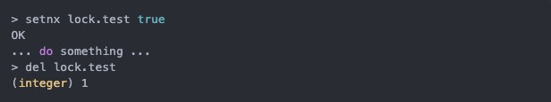

- 以上是常规指令，会有一个问题，如果逻辑执行过程中出现异常，导致没有执行到del指令，最后会陷入死锁。

###  1.2 过期时间

因此，更进一步的做法是获取到锁以后，在给锁设置一个过期时间，这样在处理过程中出现异常，没有执行del命令，锁也会在过期时间内释放。

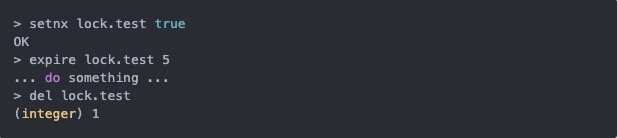

###  1.3 原子性问题

- 实现以上逻辑后，仍存在问题，比如在执行setnx指令之后，但在expire指令时服务器出现异常，没有给锁设置上过期时间，锁依然会陷入死锁的状态，一直不会释放。

- 如何解决呢？可能你会想到事务，但在这里不行，因为expire是依赖于setnx的执行结果的，如果没有抢到锁，expire不应该被执行。事务里没有if-else的逻辑，要么全部执行，要么一个都不执行。

- 在Redis 2.8 版本中，作者加入了set指令的扩展参数，使得setnx和expire指令可以一起执行。

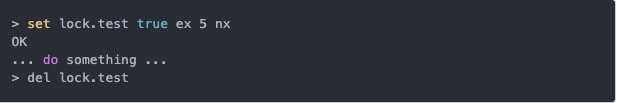    
    

### 1.4 超时问题

- Redis分布式锁并不解决锁超时的问题，所以不建议在获取分布式锁后处理耗时较长的逻辑。因为逻辑执行得太长，锁到期自动释放，就会出现问题。
- 有一个稍微安全点的方案：在抢锁时，set指令的value参数设置为一个随机数，释放锁时先匹配value是否一致，再进行删除key。这种方式可以确保当前连接的操作，不会被其他连接释放，除非是过期自动释放。
- 以上的匹配value和删除key不是原子性的，所以需要使用lua脚本，来保证连续多个指令的原子性执行。但是这也不是一个完美的方案，只是相对安全一点。它始终没能解决锁超时，其他线程“乘虚而入”的问题。

### 1.5 RedLock

  ​      在分布式版本的算法里我们假设我们有N个Redis master节点，这些节点都是完全独立的，我们不用任何复制或者其他隐含的分布式协调算法。我们已经描述了如何在单节点环境下安全地获取和释放锁。因此我们理所当然地应当用这个方法在每个单节点里来获取和释放锁。在我们的例子里面我们把N设成5，这个数字是一个相对比较合理的数值，因此我们需要在不同的计算机或者虚拟机上运行5个master节点来保证他们大多数情况下都不会同时宕机。一个客户端需要做如下操作来获取锁：

1. 获取当前时间（单位是毫秒）。
2. 轮流用相同的key和随机值在N个节点上请求锁，在这一步里，客户端在每个master上请求锁时，会有一个和总的锁释放时间相比小的多的超时时间。比如如果锁自动释放时间是10秒钟，那每个节点锁请求的超时时间可能是5-50毫秒的范围，这个可以防止一个客户端在某个宕掉的master节点上阻塞过长时间，如果一个master节点不可用了，我们应该尽快尝试下一个master节点。
3. 客户端计算第二步中获取锁所花的时间，只有当客户端在大多数master节点上成功获取了锁（在这里是3个），而且总共消耗的时间不超过锁释放时间，这个锁就认为是获取成功了。
4. 如果锁获取成功了，那现在锁自动释放时间就是最初的锁释放时间减去之前获取锁所消耗的时间。
5. 如果锁获取失败了，不管是因为获取成功的锁不超过一半（N/2+1)还是因为总消耗时间超过了锁释放时间，客户端都会到每个master节点上释放锁，即便是那些他认为没有获取成功的锁。

## 2. 消息队列

### 2.1 基本使用

- 基于Redis的list数据结构，利用lpush和rpop的指令组合，可以模拟队列。

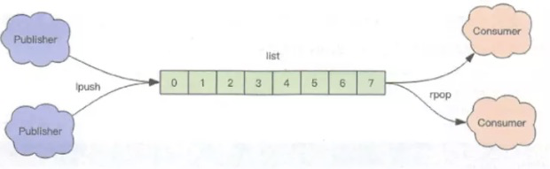

**队列空了怎么办？**

> 在rpop返回空时，sleep(1000)。可以这么 做，但是这导致消费的延迟，Redis提供了更好的方案：阻塞读（blpop/brpop），用这个指令替代逻辑里的rpop即可。
>

**Redis主动断开空闲连接怎么处理？**

> 使用了阻塞读以后，线程会一直阻塞在那里，如果一直没有数据，这个连接就会成了闲置连接，如果时间过久，Redis会主动断开连接，从而减少闲置资源占用。此时blpop/brpop会抛出异常，所以客户端需要捕捉该异常，并重试。
> 

### 2.2 延迟队列

- 最近有个业务需求：当某个行为触发了，则在10s后执行一段逻辑。

- 看到「10s后执行」这种典型的场景，个人的第一反应便是延迟队列。在Redis中，可以通过(zset)有序集来实现。将消息序列化为value，将执行时间作为score，然后轮询zset获取到期的任务进行处理。

- 多进程同时消费的场景中，Redis的zrem方法是关键，通过zrem来决定唯一的属主，它的返回值决定了是否有抢到任务。（心跳应用）

- 使用lua脚本，将zrangebyscore和zrem操作一同发送到服务端执行，可以减少争抢任务时的浪费。

### 2.3 消息多播

​    上面讨论的是Redis作为消息队列的基本使用，实际情况Redis仍有很多不足，其中一个就是它不支持多播机制。
​    消息多播是指生产者生产一次消息，由中间件将消息复制到多个消息队列，每个队列都有相应的消费者进行消费。

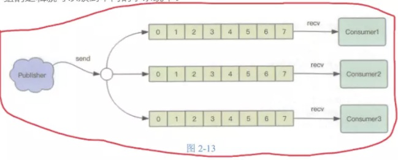

#### 2.3.1 PubSub

- 为了支持多播，Redis引入了新的模块去支持：PubSub，即发布者/订阅者模式。如何使用这里就不说了，文档很详细。下面总结下缺点：

1. 如果一个消费者都没有的情况下，消息会直接丢弃；

2. 如果消费者连接断开了，当它重连上以后，断开期间的消息会丢失；

3. 如果Redis宕机，PubSub消息不会持久化，消息直接丢弃；

#### 2.3.2Stream

- Redis 5.0 新增了一个数据 Stream，它是一个抢到的支持多播的可持久化消息队列，作者坦言它极大地借鉴了Kafka的设计。

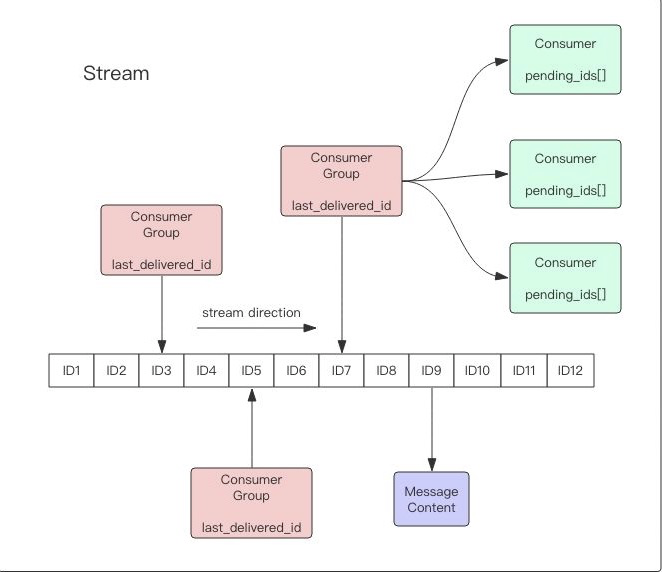

- Stream的消费模型借鉴了Kafka的消费分组的概念，弥补了PubSub不能持久化消息的缺陷。Stream又不同于Kafka，Kafka可以分Partition，而Stream不行。

## 3. 位图
- 给个场景：记录用户一年的签到情况，签到为1，没签为0。
- 如果用key/value的方式存，一年365天，当用户量上亿，所需要的存储空间是惊人的。为了解决这一问题，Redis提供了位图数据结构，上面的场景（可以引申存储bool型数据的其他场景），每天的签到记录只占1个位，365个位对应46个字节，大大节省存储空间。

### 3.1 基本使用

- 位图不是特殊的数据结构，它的内容其实就是普通字符串，也就是byte数组。对字符串的指令get/set，是对整个内容的操作，而对其中的位操作Redis提供了getbit/setbit的指令。

- 字符“he”的ASCII码与位的对应关系：

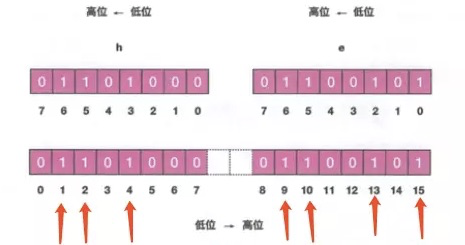

通过位操作设置“he”字符：

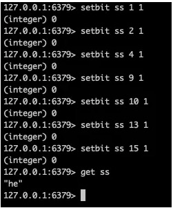

### 3.2 统计和查找

- 除了设置和获取位图的值以外，Redis还提供了bitcount和bitpos分别用于统计和查找。比如：

1. 通过bitcount统计用户一共签到了多少天，可指定范围[start, end]；
2. 通过bitpos查找用户从那一天开始第一次签到，可指定范围[start, end]；
- 但遗憾的是，start和end参数是字节索引，也就是指定的位范围必须是8的倍数，而不能任意指定。因此，我们无法直接计算某个月内用户签到了多少天。
具体操作就不说了，看文档就好。

## 4.布隆过滤器

- 通过位图来节省空间，谈到这种方式，怎么能不谈布隆过滤器。布隆过滤器是什么，以及原理这里就不说了，只说跟Redis相关的。
- Redis官方提供的布隆过滤器到了Redis 4.0 提供了插件功能才正式登出。两个基本指令，bf.add和bf.exists。如果需要一次添加多个，就需要使用到bf.madd，同样的，一次查询多个元素是否存在，就需要用到bf.mexists指令。

**什么时候用布隆过滤器呢？**
*判断某个值存在，会出现误判；判断某个值不存在，100%准确。基于这个特性去思考，就很容易找到使用场景啦，比如：*

1. 爬虫系统对URL去重，爬过的网页不爬；
2. 邮箱系统的垃圾邮件过滤功能；
3. NoSQL数据库，常用布隆过滤器过滤掉不存在的row，减少数据库的IO请求数量。
如何控制低误判率？
Redis中提供了bf.reserve指令，可设置key，error_rate和initial_size，设置的error_rate越低，需要的空间越大。

## 5.附近的店/人/车

- Redis 3.2 *版本以后增加了地理位置*Geo模块，可以实现类似摩拜单车的“附近的车”、美团和饿了么的“附近的餐馆”这样的功能。
- 位置数据通常使用二维的经纬度表示，经度范围[-180, 180]，纬度范围[-90, 90]。试想下如果使用关系型数据库存储（元素 id, 经度 x, 纬度 y），该如何计算？
- 假设(x0, y0)是用户，r是半径，使用一条SQL就可以圈出来。

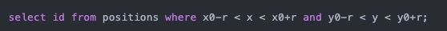

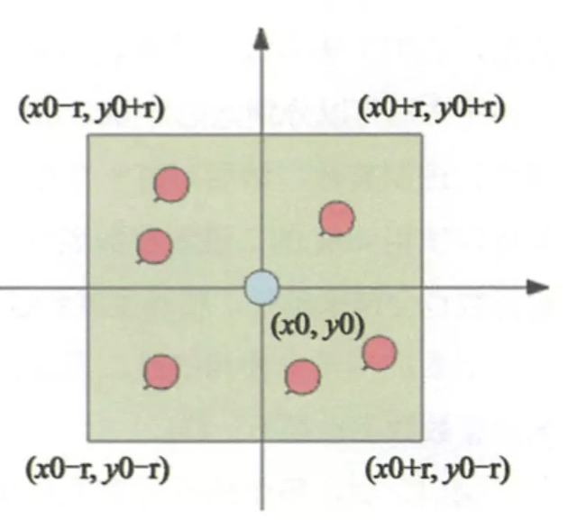

- 可以对经纬度坐标加上索引进行优化，但数据库查询性能毕竟有限，可能不是一个很好的方案。
- 业界比较通用的地理位置距离排序算法是GeoHash算法，它是将二维的经纬度数据映射到一维的整数。映射的算法和用法这里就不具体展开了。下面是两个使用注意事项：

1. 
一维映射是有损的
在使用Redis的Geo查询时，时刻想着它的内部结构实际上是一个zset(skiplist)。通过zset的score排序就可以得到坐标附近的其他元素，通过score还原成坐标值就可以得到元素的原始坐标。但需要注意，通过映射再还原回来的值会出现较小的差别，原因是二维坐标进行一维映射是有损的。
2. Geo数据单独Redis实例部署更加
Redis的Geo数据结构，数据会全部放到一个zset集合中。如果在Redis集群环境，集合可能从一个节点迁移到另一个节点，如果单个key的数据过大，会对集群迁移工作造成较大影响。因此，Geo的数据建议使用单独Redis实例部署，不适用集群环境。

## 6. 限流

###   6.1 简单限流

- 限流的场景非常常见，控制用户行为，如发帖、回复、点赞等。简单的限流策略：限定用户的某个行为在指定的时间内只允许发生n次，这里我们可以使用zset数据结构的score值，存储毫秒时间戳，就可以很方便的取某个时间窗口内用户的行为次数。

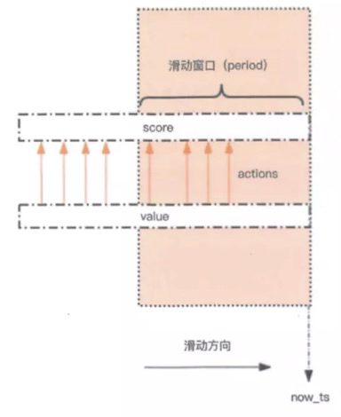

- 此方案有个缺点，因为它要记录时间窗口内所有的行为记录，如果这个量很大，此方案就不合适了，因为会消耗大量的存储空间。

### 6.2 漏斗限流

- Redis 4.0 提供了一个限流Redis模块，叫Redis-Cell。该模块使用了漏斗算法，并提供了原子的限流指令。
- 该模块只有1条指令 cl.throttle ，它的参数和返回值都略显复杂，接下来让我 们来看看这个指令具体该如何使用。

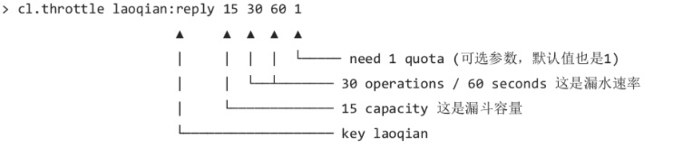

- 上面这个指令的意思是允许「用户回复行为」的频率为每 60s 最多 30 次 (漏水速率)，漏斗的初始容量为 15，也就是说一开始可以连续回复 15 个帖子， 然后才开始受漏水速率的影响。

## 7. 参考资料

这个完全够了：http://redisdoc.com/index.html